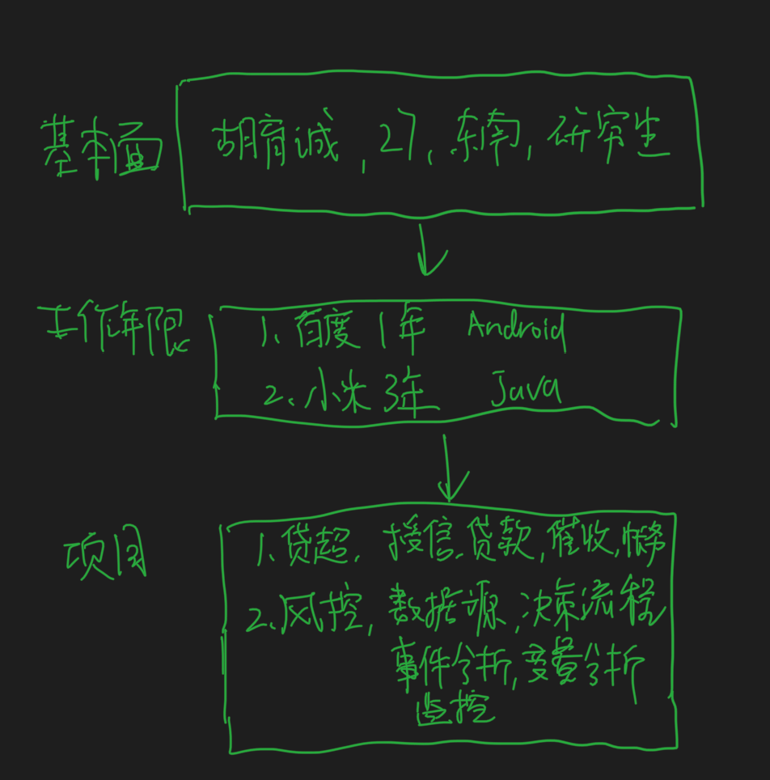

#思路
项目在面试中查漏补缺,大公司项目最重要
算法是保底操作,常规,大重要非常重要
基础在平时锻炼,小公司喜欢搞,查漏补缺即可
下次面试一开始就复习八股文
[msb 70道hr面试题.doc]
#问题回答模型
1.不要,呃,干净利落,需要多练习
1.回答问题时,总分思路,并在回答过程中埋技术点等面试官上钩
2.问答类型,springboot自动装配? 1.定义,2.技术点,3.举例子
2.突出技术名词（核心概念，接口，类，关键方法）,选择自己熟悉的部分,避开自己不熟悉的部分
3.我很厉害,体现方式:清楚总体,清楚细节,实践过
4.面试官拿着题库问,自己不要被动回答,自己主动把问题和周边回答全面,总,分,深入
4.收集优化的案例,讲完结合案例讲,强化自己的优势,自己是有实战经验的
5.面试的时候说答案,提前整理好答案的思路
5.监测回答问题的主动性,监测回答问题使用的案例,监测回答问题的清晰程度
6.面试要突出自己的技术体系
#常见问题
##自我介绍

我是胡育诚,28岁,东南大学软件工程研究生毕业

工作四年,第一年在百度从事android开发,在小米转做后端开发,工作3年

在小米金融参与小米金融贷款平台开发,
最近一两年在小米金融参与风控平台开发

工作中常用redis,mysql,es中间件
##为什么换工作?
1.业务比较稳定,目前主要是对外输出
##如何看待自己的职业生涯?
1.家庭缘分
2.以提升自我为主,包括工作,业务,定位,输出
##最大挑战
OLAP平台
第一季度需要提供数据给领导
1.业务需求评估
2.调研方案选型
3.问题调研,专业人士最佳实践
4.问题排查
5.3000指标,11维度,7%的
##最有成就感到事情
这个问题，核心不在成就是什么，而是你是如何取得的这个成就，也就是过程

1.第一次找实习被刷了很多次
2.面试对比寻找差异,
3.调整方案,对小公司直接用ipad展示项目,大公司加强基础分析项目难点,对面试官沟通
4.最终拿到了好几个offer
##失败的事情
```asp
1、了解求职者的工作能力是否出众和解决问题的能力；

2、了解求职者能否总结失败教训；
3、能否及时发现错误并挽救；

4、了解求职者的工作价值观和综合能力
5、重点放在你从失败经历中学到什么，而不是你怎么失败的/你失败的原因
```
1.审批系统开发,错误估算排期,未提前了解审批流相关业务,对已有项目不了解
2.审批系统2.0,正确估计
##工作上的短板优势
对公司动态了解不多,对行业发展了解不多

善于利用身边资源,及时沟通反馈,
善于利用业务时间进行学习
##为什么选择这里?
业务:中间件部门,
阿里技术:github,

##为啥换地方?
1.自己是南方人,想回南方
##有什么问题
1.团队多少人?
2.团队构成,部门定位，团队成员有多少人？核心工作有哪些
3.会有部门调整吗?
4.规模如何?量级如何?
##个人优点缺点
```asp
面试本质上只有三个问题:
Can you do the job? 这活你能干吗？（考核能力）
Will you love the job? 这活你爱干吗？（考核意愿）
Can we tolerate working with you? 我们能和你共事吗？（考核团队合作）
```
1.好奇心
2.勤奋
3.善于发现和学习优秀的人

1.了解你的资质与应聘职位理想人选的要求是否符合
2.缺点:
有太注重细节的倾向,精力容易分散,浪费一些时间,也在看书籍,运用2/8原则,合理划分时间,每日日志对比
抽象事物不感兴趣,对数学不喜欢,喜欢工程学开发岗位,之前机器学习比较热门,学了一段时间但是感觉兴趣不大
对市场和社会发展不敏感,投资比特币,狗币,最新很多市场动态,同学选择了风口公司岗位,
和同事相处慢热,
##你为公司带来了什么?
```asp
1.接入了一个资金方,一个推荐活动,协议后台
2.审批系统
3.监控系统开发,部署4个服务,在线分析系统,搭建prometheus监控系统
```
为啥不是你做风控?
从一个部门调整到另一个部门
##工资50W理由
1.能力匹配
2.基础扎实,业余时间充分学习
3.技术驱动,利用业余时间跟进公司技术动态,和相关领域优秀研发沟通交流
##项目难点
这个问题，其实不是问项目的难度，也不是需要高大上的技术，只是从一个你较为熟悉的项目开始，介绍你对整个方案的思考与总结，看看你平时是不是只会埋头苦干。
#代码质量
##方案设计
扩展性
##开发
文档&单元测试
产品线风格
findbugs
阿里代码规范
##review
##merge
gitlab ci,sonar
jacoco
##上线
上线观察
##review
###可读性
注释,变量命名,类命令
###鲁棒性
单元测试覆盖,参数边界条件
###监控
###扩展性
###性能
内存,并发,安全,
#回答模型
##知识型
总分
ioc
aop
##方案型
需求背景
方案
问题
优化
