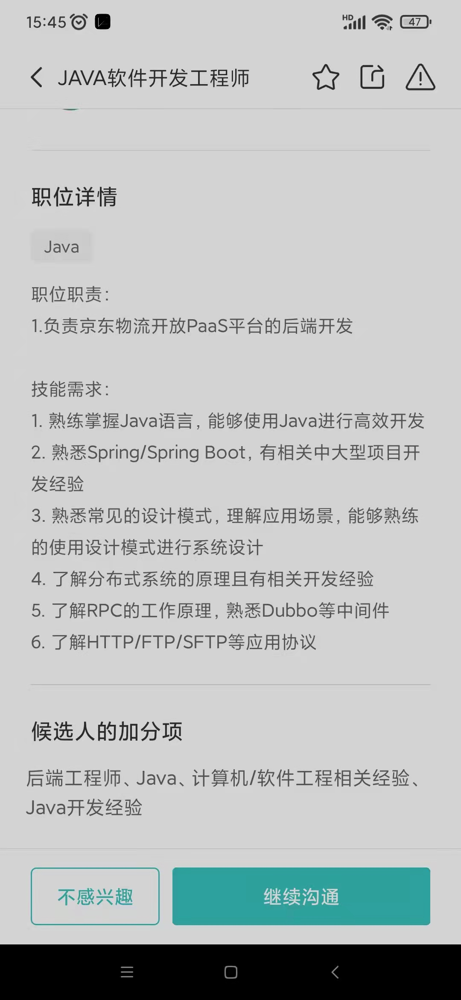

#要求

#面试
1.业务监控项目warden梳理,定时任务
2.id-generator生成器,雪花算法,机器码问题
3.on where区别
4.觉得不熟练,代码少,举例子贷款超市
5.mysql读写流程
6.四个隔离级别 
8.明确职责,项目介绍条理性,项目整理
9.HBASE sql
10.list转map的问题?
11.监控系统告警升级会怎么样?
12.描述项目要清晰,
13.面试官瞎猜，自己定位没明确
14.被面试官牵着走,应该牵着面试官走
15.面试模型
