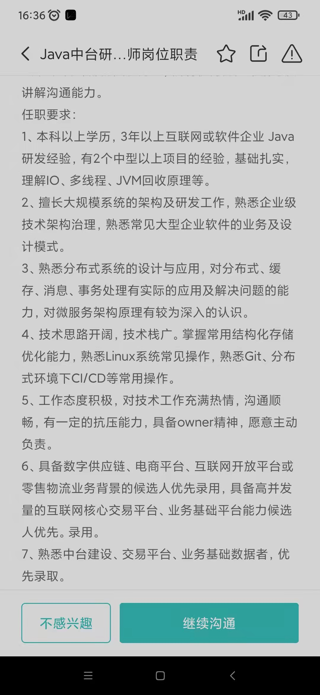

#要求
熟悉linux命令行操作
熟悉hbase

#1面面试
1.自我介绍工作和项目,done
2.算法题,done
3.Stringbuffer stringbuilder,done
4.Flink难点,丰富
5.项目吞吐,丰富,项目经历简洁一些,done
6.mysql性能优化,加多例子
7.有什么想问的? done
8.征信机构多少家? done
9.流量峰值多少?继续加强数据 ,done
#2面面试
