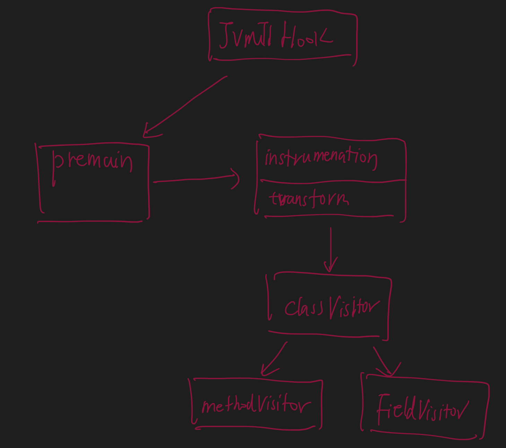

#原理
##拓扑

1.-javaagent
2.premain
3.Instrumentation,ClassFileTransformer,transform
4.ManiFest
5.我们会在JVM C agent 加载后的入口方法Agent_OnLoad处注册各个事件的钩子（hook）方法。当 Java 虚拟机触发了这些事件时，便会调用对应的钩子方法。
#Java Instrument的Agent实现
##Instrument agent对象模型
[agent源码分析](https://juejin.cn/post/6844903612985032711#heading-9)
[](https://tech.meituan.com/2019/11/07/java-dynamic-debugging-technology.html)
[](https://time.geekbang.org/column/article/41186)
[](https://time.geekbang.org/column/article/10216)
#应用
性能监控
Java debug tool
```asp
-javaagent:/Users/chris/Library/Caches/IntelliJIdea2019.1/captureAgent/debugger-agent.jar
```
#远程调试
[](https://www.cnblogs.com/kendoziyu/p/15181039.html)
[参考demo项目]
