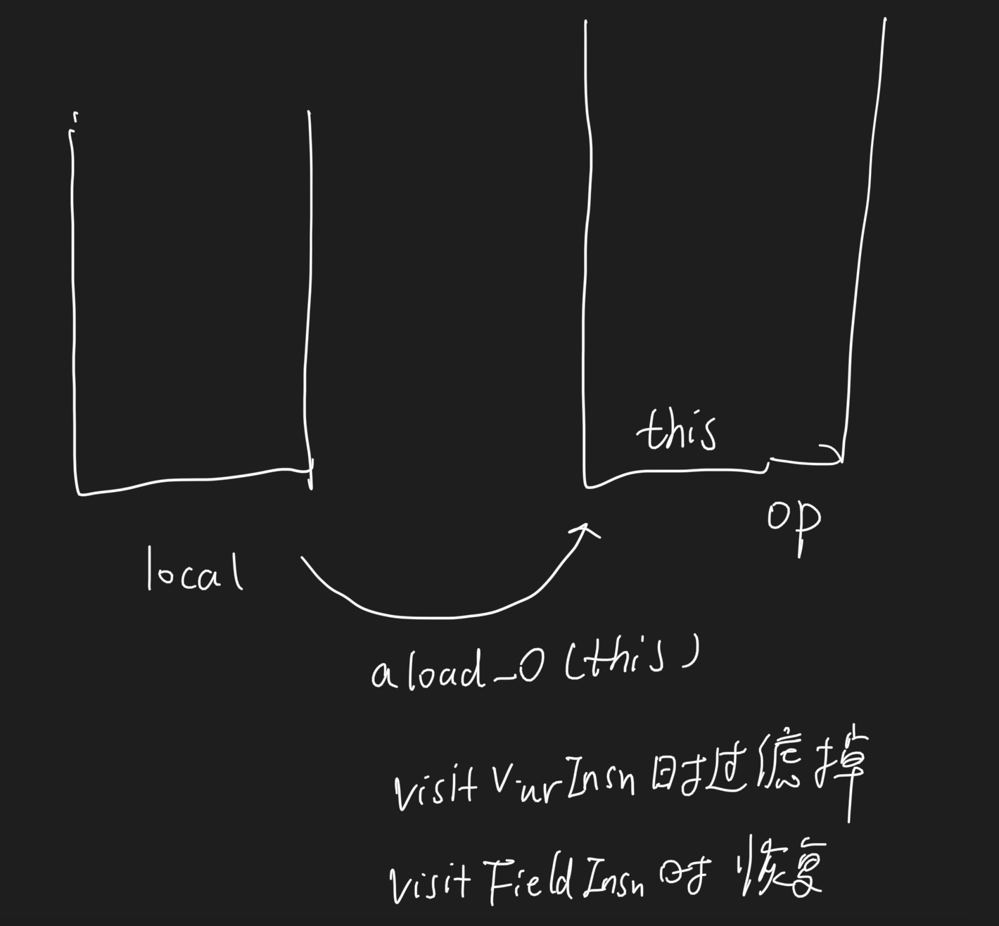

#ASM
##是什么ASM
java字节码操作库
##事件模型(访问者模式)
[z_02_设计模式_04_访问者模式.md]
##拓扑
###ClassReader
被访问者
###ClassWriter
访问者,自定义脱敏DesClassVisitor
```asp
常见方法:
visit:匹配到配置文件的类时,记录
visitAnnotation:类级别注解,申明了注解时,记录
visitField:属性字段
visitMethod:自定义方法访问者,遇到tostring生成自定义MethodVisitor
```
###MethodVisitor
```asp
常见方法:
visitVarInsn:访问局部变量
visitFieldInsn:访问属性变量,对属性变量脱敏
visitMethodInsn:访问INVOKEVIRTUAL, INVOKESPECIAL, INVOKESTATIC指令
```


##注意事项
###最大数和操作数栈的最大深度计算
[](https://time.geekbang.org/column/article/82761)

```asp
COMPUTE_FRAMES: ASM 自动计算方法的栈桢
COMPUTE_MAXS: Flag to automatically compute the maximum stack size and the maximum number of local variables of methods
```
```asp
由于本地变量表的最大数和操作数栈的最大深度是在编译时就确定的，所以在使用 ASM 进行字节码操作后需要调用 ASM 提供的 visitMaxs 
方法来设置 maxLocal 和 maxStack 数。不过，ASM 为了方便用户使用，已经提供了自动计算的方法，在实例化 ClassWriter 操作类的时候传入 
COMPUTE_MAXS 后，ASM 就会自动计算本地变量表和操作数栈
```
###有什么难点?字节码脱敏常量池错误

1.arthas 反编译字节码class文件,发现tostring中 throw new OutOf异常,看不到tostring的字节码
2.对比正常和异常的class文件,发现一个tostring只有属性变量,一个有实例方法,猜测是实例方法的问题
3.本地复现,发现实例方法果然报错,拿到日志脱敏源码,只对属性变量脱敏,并没有处理方法,即使没脱敏也不应该报错
4.控制变量,缩小范围,最后发现复写MethodVisitor时,visitVarInsn方法过滤了ALOAD_0,导致实例方法获取不到this,invoke出错,而访问visitFieldInsn时主动ALOAD_0,所以没出错
5.之前考虑为了避免tostring调用实例方法,除去了this指针,恢复this指针,避免脱敏导致的业务报错,使用lombok的@exclude(tostring方法)
###tostring只支持field,不支持get,is方法
不能对get,is方法也脱敏,否则调用时只能获取脱敏的字段
###classloader双亲委派问题
双亲委派问题,asm本地是appclassloader
但要反射的类不是appclassloader加载的,
需要通过Thread.getContextClassLoader()获取

###脱敏pojo多样性
第三方的thrift的pojo
mybatis生成的pojo
自定义的pojo

###脱敏内容多样性
mobile,银行卡,地址:正则匹配
json:暴力脱敏,
