##class文件来源形式
Java虚拟机 实现可以从文件系统读取和从JAR(或ZIP)压缩包中提取class文 件。  
除此之外，也可以通过网络下载、从数据库加载，甚至是在运 行中直接生成class文件。  
Java虚拟机规范(和本书)中所指的class文 件，并非特指位于磁盘中的.class文件，而是泛指任何格式符合规范 的class数据。  
##class文件数据类型
u1、u2和u4三种数据类型来表示1、 2和4字节无符号整数
相同类型的多条数据一般按表(table)的形式存储在class文件 中。  
表由表头和表项(item)构成，表头是u2或u4整数。假设表头是n，后面就紧跟着n个表项数据
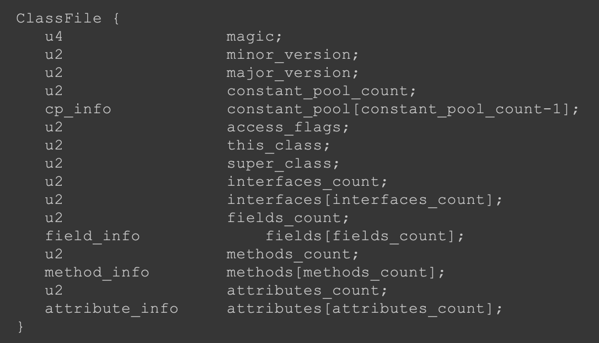

###魔数
很多文件格式都会规定满足该格式的文件必须以某几个固定 字节开头，这几个字节主要起标识作用，叫作魔数
PDF文件以4字节“%PDF”(0x25、0x50、0x44、0x46)开头，ZIP 文件以2字节“PK”(0x50、0x4B)开头。class文件的魔数 是“0xCAFEBABE”
###版本号
假 设某class文件的主版本号是M，次版本号是m，那么完整的版本号 可以表示成“M.m”的形式。  

###常量池
常量池占据了class文件很大一部分数据，里面存放着各式各样 的常量信息，包括数字和字符串常量、类和接口名、字段和方法名
getConstantInfo索引查找常量
getNameAndType获取字段或方法的名字和描 述符

####常量结构
由于常量池中存放的信息各不相同，所以每种常量的格式也 不同

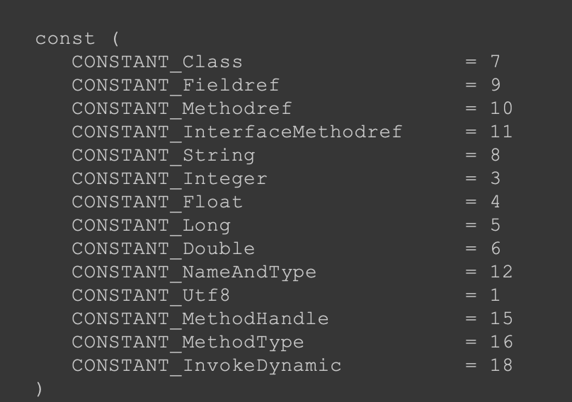
####数字结构
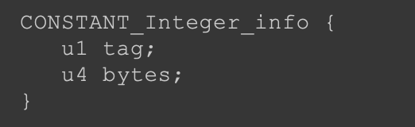
读取一个uint32数据，然后把它转型成int32类型  
但实际上比int更小的boolean、byte、short和char类型的常量也放在 CONSTANT_Integer_info中
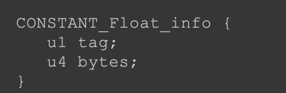
CONSTANT_Float_info使用4字节存储IEEE754单精度浮点数常量
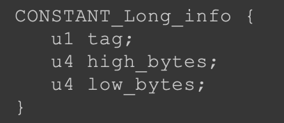
CONSTANT_Long_info使用8字节存储整数常量  
先读取一个uint64数据，然后把它转型成int64类型
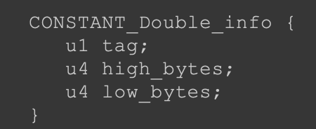
最后一个数字常量是CONSTANT_Double_info，使用8字节存储IEEE754双精度浮点数
####Utf8
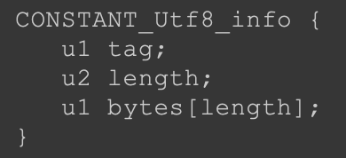
ONSTANT_Utf8_info常量里放的是MUTF-8编码的字符串,Java序列化机制也使用了MUTF-8编码
####string
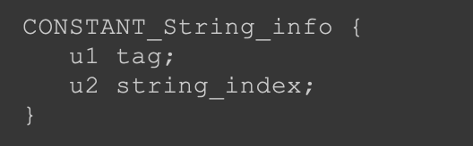
CONSTANT_String_info常量表示java.lang.String字面量，结构如下
可以看到，CONSTANT_String_info本身并不存放字符串数据， 只存了常量池索引，这个索引指向一个CONSTANT_Utf8_info常 量
####CONSTANT_Class_info
CONSTANT_Class_info常量表示类或者接口的符号引用
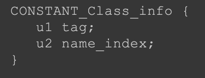
类和超类索引，以及 接口表中的接口索引指向的都是CONSTANT_Class_info常量
####字段/方法名
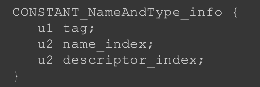
CONSTANT_NameAndType_info给出字段或方法的名称和描述 符  
字段或方法名由name_index给出，字段或方法的描述符由 descriptor_index给出。name_index和descriptor_index都是常量池索 引，  
指向CONSTANT_Utf8_info常量。字段和方法名就是代码中出 现的(或者编译器生成的)字段或方法的名字
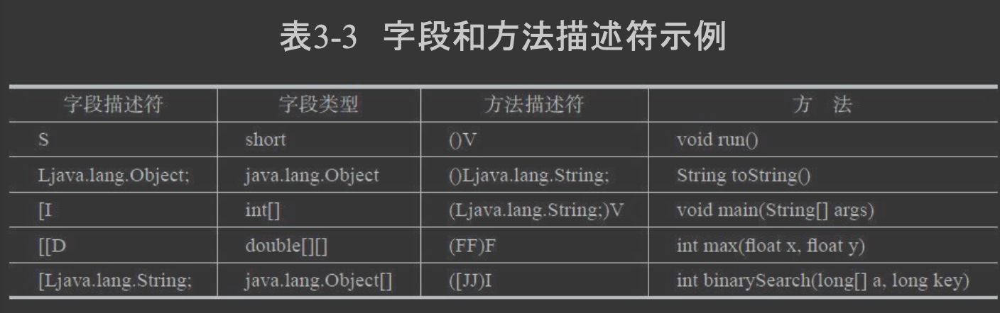
####字段&方法符号引用
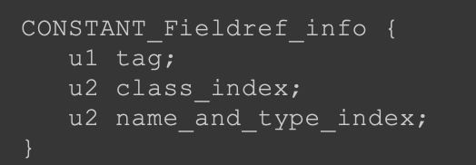
CONSTANT_Fieldref_info表示字段符号引用， CONSTANT_Methodref_info表示普通(非接口)方法符号引用，   
CONSTANT_InterfaceMethodref_info表示接口方法符号引用
###关系
常量池分为字面量(literal)和符号引用 (symbolic reference)。字面量包括数字常量和字符串常量，符号引 用包括类和接口名、字段和方法信息等。
除了字面量，其他常量都 是通过索引直接或间接指向CONSTANT_Utf8_info常量

###类访问标志
指 出class文件定义的是类还是接口，访问级别是public还是private
###类和超类索引
分别给出类名 和超类名。class文件存储的类名类似完全限定名，但是把点换成了 斜线
###接口索引表
表中存放的也是常量池索 引，给出该类实现的所有接口的名字
###字段表
和类一样，字段和方法也有自己的访问标志。访问标志之后是 一个常量池索引，给出字段名或方法名，然后又是一个常量池索 引，
给出字段或方法的描述符，最后是属性表
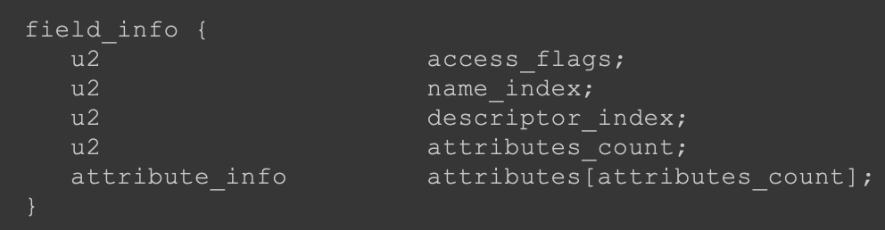
###方法表
类似字段表
##class文件字节流读取
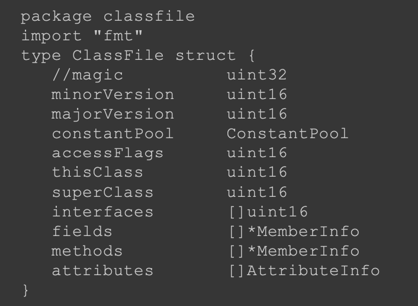
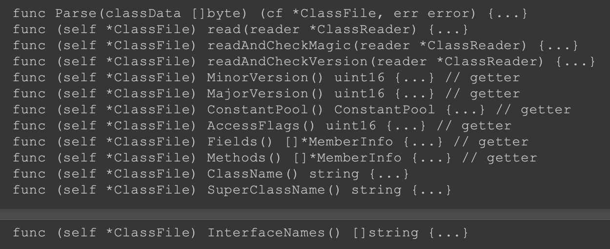
