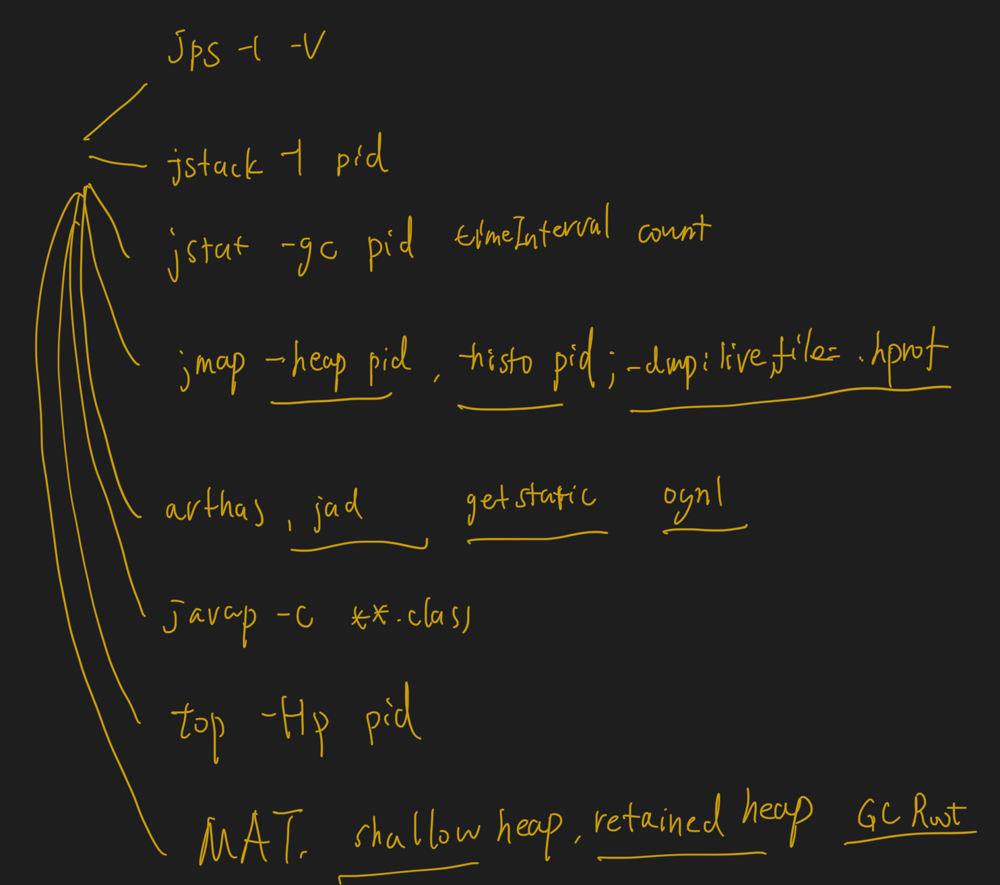

#运维命令

##启动参数
###规范
```asp
▪-
– 标准参数，所有JVM都应该支持 
▪ -X
– 非标，每个JVM实现不同 
▪ -XX
– 不稳定参数，下个版本可能取消
```
###本地内存&元数据区
-XX:MaxMetaspaceSize=size
-XX:MaxDirectMemorySize=size
###垃圾回收器
-XX:+UseConcMarkSweepGC

###对象布局&指针压缩
-XX:ObjectAlignmentInBytes(内存对齐)
-XX:+UseCompressedOops(普通对象指针压缩)
-XX:+UseCompressedClassPointers：允许类指针压缩
当Java堆小于32G时，这两个参数默认开启
当Java堆大于等于32G时，这两个参数都会被关闭：
###堆区大小&内存分配
java  -Xmx20m     -Xms20m        -Xmn10m
-XX:SurvivorRatio=ratio
-XX:MaxTenuringThreshold(minor gc多少次到old区<=15)
-XX:PretenureSizeThreshold,=3m,(默认0,对象>3m直接到old区,只对Serial和ParNew生效)
###日志调优
-XX:+PrintFlagsInitial
-XX:+PrintFlagsFinal
-XX:+PrintGCDetails
java -XX:+PrintCommandLineFlags -version//查看默认垃圾回收器
java -XX:+PrintFlagsFinal -version | grep -A 20 MaxMetaspaceSize//查看元数据区大小
man java | grep -A 30 Xss//查看栈大小

##进程
jps：Lists the instrumented Java Virtual Machines (JVMs) on the target system
jps -l java进程和包名
jps -v 启动参数详情
##线程堆栈
jstack - Prints Java thread stack traces for a Java process
jstack -l 10244生成pid=10244的线程堆栈日志
##gc
jstat - Monitors Java Virtual Machine (JVM) statistics
jstat -gc 21891 250 7每隔250ms查看pid=21891的gc情况，共7次

jinfo- Generates configuration information
jinfo -flag MaxTenuringThreshold 10244查看进程10244信息
##内存dump
jmap - Prints shared object memory maps or heap memory details for a process
生成实时dump文件

System.getProperties().put("sun.misc.ProxyGenerator.saveGeneratedFiles", "true");//java动态代理，保存字节码文件到磁盘
        System.setProperty(DebuggingClassWriter.DEBUG_LOCATION_PROPERTY, "/Users/chris/Downloads/test/spring/com/tutorialspoint/$Proxy123.class");//查看CGLib字节码

#运维工具
VisualVM
MAT
arthas
JMAP
JSTACK
JPS
##MAT实战
[](https://help.eclipse.org/latest/index.jsp?topic=/org.eclipse.mat.ui.help/welcome.html)
[](https://juejin.cn/post/6911624328472133646#heading-14)
###shallow heap
这个对象实际占用的堆大小
###retained heap
如果这个对象被删除了（GC回收掉），能节省出多少内存
[](https://blog.csdn.net/wwlwwy89/article/details/74330544)
#编译
检测热点代码：-XX:CompileThreshold = 10000
##注解处理器
javac -processor
[T02_compile_04_annotations.java]
#加载
-XX: +TraceClassLoading
#OOM

#垃圾回收器
##Serial / Serial Old
UseSerialGC = Serial + Serial Old
##ParNew
UseParNewGC = ParNew + Serial Old
UseConcurrentMarkSweepGC = ParNew + CMS + Serial Old

-XX:ParallelGCThreads,垃圾收集的线程数

–"CMS" is used most of the time to collect the tenured generation.
"Serial Old"(full gc) is used when a concurrent mode failure occurs

##Parallel Scavenge +(Parallel Old)

UseParallelGC = Parallel Scavenge + Serial Old
UseParallelOldGC = Parallel Scavenge + Parallel Old

-XX:+UseAdptiveSizePolicy
XX:MaxGCPauseMillis
XX:GCRatio
##CMS
Eden与Survivor区的比例(-XX:SurvivorRation
新生代的大小(-Xmn)
晋升老年代对象年龄(-XX:PretenureSizeThreshold)
##G1
– XX:G1HeapRegionSize
取值1 2 4 8 16 32
##ZGC
-XX:+UseZGC
#调优
计算型任务还是响应型任务

▪ 系统上线前，
– 预估预优化JVM的各种垃圾回收选择 

▪ 系统上线后，
– 优化运行JVM的运行环境，解决JVM运行中出现的问题
