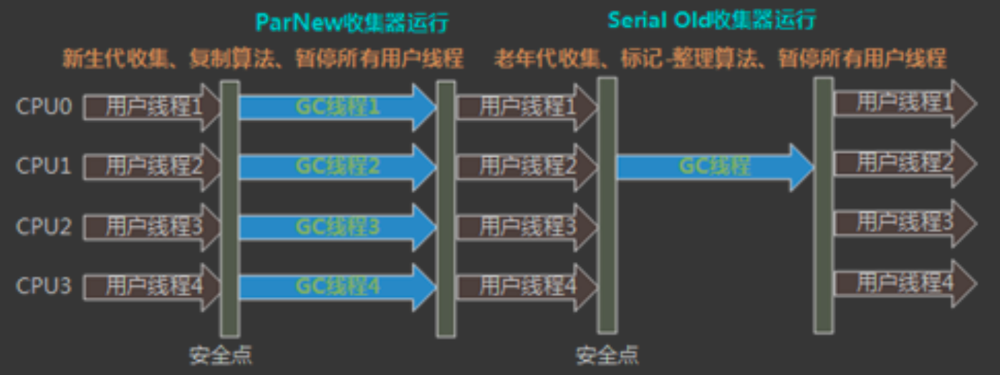

[面试题](https://blog.51cto.com/u_14962799/2721861#1315G1SATBCMS_458)
#说说对jvm的理解
画图
##总
jvm是虚拟机,字节码指令集(汇编语言),内存管理:栈 堆 方法区等,屏蔽了底层操作系统的差异性,实现了一套jvm指令的跨平台执行
jvm管理了class文件的加载classloader,编译javac,jit,运行时,jvm内存管理,垃圾回收GC,本地方法调用JNI,监控JMX
常用的java,大数据语言scala,安卓kotlin都编译成class文件,在jvm上执行,
常见jvm实现，Hotspot，淘宝TaobaoVM
##分,具体来说:
###编译
```asp
前端编译javac:
javac将源码编译成.class文件,常见的语法糖在这里完成,泛型,拆箱,lambda方法
常见的插件注解处理器在这里完成,lombok生成set,get
```
```asp
后端编译:
解释器:
jvm指令边解释边执行,为了跨平台为直接编译为本地目标代码
JIT编译器:
热点代码翻译成本地代码执行,客户端编译器C1,服务端编译器C2
热点代码探测,代码优化:方法内联,逃逸分析,栈上分配,同步消除
```
###加载
[z_1_加载_类加载器_加载器类型_双亲委派.md]
```asp
bootstrap,jre/lib/rt.jar,java.lang,nio,concurrent
ext,jre/lib/ext.jar
app,classpath
自定义,tomcat,WebAppClassLoader,每个Context 对应一个 WebappClassloader, 主要用于加载 WEB-INF/lib 与 WEB-INF/classes 下面的资源
```
class加载,[z_1_加载_02_Class_加载_链接_初始化_初始化顺序.md]
```asp
加载,二进制字节流,磁盘,内存,网络,proxy动态代理生成class中加载
连接:
- 验证:class版本,继承关系是否有final/private,
- 准备:分配内存
- 解析:符号引用转直接引用,内存地址
初始化:clinit,准备了类的变量初始值后，虚拟机会把该类的虚方法表也一同初始化
```
###运行时
```asp
私有区:
虚拟机栈,每一个线程对应一个虚拟机栈,每个方法对应一个栈帧,每个栈帧上包含操作数栈,局部方法表,动态连接(多态,运行时符号引用转直接引用),方法返回地址,指令集基于栈
本地方法栈,jvm通过jni支持对其他语言的通信,调用c,c++时hotspot会开辟本地方法栈,用于native方法出栈入栈,仍是同一个线程,指令集基于寄存器
pc计数器,指向当前线程执行的字节码行号
```
[](z_3_运行时_02_操作数栈_局部变量表_指令概述_方法重载_多态.md)
[深入理解java虚拟机8.2.3]
```asp
共享
heap堆区:对象,字符串
方法区:直接内存
```
###内存管理
```asp
标记算法:
可达性分析
CG ROOTS, oop map

回收算法:
标记-清理
复制
整理
```
```asp
回收理论:分代回收,局部回收
实现:oopmap,安全点,安全区,记忆集卡表,三色标记,颜色指针
垃圾回收器组合: cms+parnew,s+s,ps+p o,g1,zgc
```
#对象的创建过程
[z_3_运行时_04_对象头markword_对象布局.md]
类指针
```asp
1. class loading,classloader双亲委派加载
2. class linking (verification,方法签名,属性签名, preparation,分配内存, resolution,符号引用到直接引用)
3. class initializing,clinit初始化静态变量,静态代码块,映射虚函数表
4. 申请对象内存,对象头markword赋值,
5. 成员变量赋默认值,
6. 调用构造方法<init>
1. 成员变量顺序赋初始值 
2. 执行构造方法语句
```
#GC相关
##为啥区分新生代&老年代?为啥新生代分三块?为啥方法区从堆区到了直接内存?
画图
```asp
新生代&老年代
总:存活时间不一样,垃圾回收的效率不同,需要不同垃圾回收器
分:parNew复制,cms整理,不绝对(大对象)
```
画图
```asp
新生代三块
总:复制算法,需要可以被复制的空闲块,提高内存利用率,经验发现10%存活,空闲块10%,第二次垃圾回收还需要空闲块
分:
```
[z_4_内存管理_02_gc_垃圾回收理论_标记算法_回收算法_垃圾回收器_分代回收_局部回收.md]

画图
```asp
直接内存
总:回收效率低,full gc停顿大,  大小难以确定

分:
为永久代设置空间大小是很难确定的。
在某些场景下，如果动态加载类过多，容易产生 Perm 区的 OOM。比如某个实际 Web 工
程中，因为功能点比较多，在运行过程中，要不断动态加载很多类，经常出现致命错误。
“Exception in thread‘dubbo client x.x connector'java.lang.OutOfMemoryError:PermGen space”
而元空间和永久代之间最大的区别在于：元空间并不在虚拟机中，而是使用本地内存。
因此，默认情况下，元空间的大小仅受本地内存限制。
对永久代进行调优是很困难的。主要是为了降低 Full GC
```
[z_4_内存管理_00_分代内存_分块内存_方法区_直接内存.md]
###总
###分
##oom时新生代最多90%?
###直接内存oom
物理内存排查
##jvm有哪些垃圾回收器，实际中如何选择?

[z_0_jvm_常用命令_运维_oom排查_性能优化.md]
[z_4_内存管理_03_gc_垃圾回收器_CMS_G1_ZGC.md]
CMS+parNew标记清理连续的内存,物理内存已经很大了128G的堆,停顿很久,微服务
parallel scavenge + parallel old,数仓job,flink job为了吞吐
G1,并行处理,并发,和线程交替执行,响应和吞吐综合
ZGC,低延时高吞吐
###Serial / Serial Old收集器
适用于Client模式下的虚拟机，获得最高的单线程收集效率

###ParNew + CMS

多线程外其余行为均和Serial收集器一模一样,arNew收集器是许多运行在Server模式下的虚拟机中首选的新生代收集器，因为它是除了 Serial收集器外，唯一一个能与CMS收集器配合工作的

```asp
对CPU资源非常敏感
无法处理浮动垃圾，可能出现Concurrent Model Failure失败而导致另一次Full GC的产生
```
###Parallel Scavenge + Parallel Old(吞吐量优先)

flink job
XX:MaxGCPauseMillis 控制最大的垃圾收集停顿时间
XX:GCRatio 直接设置吞吐量的大小
###G1
面向服务端应用的垃圾收集器

```asp
并行与并发:G1能充分利用多CPU、多核环境下的硬件优势，使用多个CPU来缩短Stop-The-World停顿 时间。部分收集器原本需要停顿Java线程来执行GC动作，G1收集器仍然可以通过并发的方式让Java程序 继续运行。

分代收集:G1能够独自管理整个Java堆，并且采用不同的方式去处理新创建的对象和已经存活了一段时 间、熬过多次GC的旧对象以获取更好的收集效果。

空间整合:G1运作期间不会产生空间碎片，收集后能提供规整的可用内存。 

可预测的停顿:G1除了追求低停顿外，还能建立可预测的停顿时间模型。能让使用者明确指定在一个长度为M毫秒的时间段内，消耗在垃圾收集上的时间不得超过N毫秒。
```
##介绍一下垃圾回收算法?
##并行和并发,吞吐量的区别?
```asp
1，并行(Parallel):多个垃圾收集线程并行工作，此时用户线程处于等待状态 
2，并发(Concurrent):用户线程和垃圾收集线程同时执行 
3，吞吐量:运行用户代码时间/(运行用户代码时间+垃圾回收时间)
```
##垃圾收集器什么时候产生FGC?如何避免
CMS并发清理时,内存分配失败
```asp
1. 加大JVM内存
2. 加大Young的比例 
3. 提高Y-O的年龄
4. 提高S区比例
5. 避免代码内存泄漏
```
##JVM 8为什么要增加元空间，带来什么好处?
[z_4_内存管理_00_分代内存_分块内存_方法区_直接内存.md]
```asp
spring cglib动态代理,运行时生成,不确定方法区内存大小
gc回收效率低,类加器回收,class不被使用
```
#项目中遇到的jvm问题
##简述一下内存溢出的原因，如何排查线上问题
```asp
1.监控,falcon,prometheus
2.jmap -histo pid查看实例排序
3.jstack 查看堆栈信息
4.jmap -histo dump堆栈,查看新生代和老年代比例和垃圾回收器,分析JVM参数设置是否合理
5.MAT,查看大对象和 gc root链路
```
##warden过半个月出现服务不可用
jmap dump日志,MAT排查大对象,发现lambda表达式class很多

##prometheus新生代频繁gc告警(重点说)
调整新生代内存后十几小时周期性新生代gc,老年代gc,cpu飙升300%
查看prometheus监控,memory,cpu都是一起周期性
dump jvm快照发现有很多指标对象,几百万个,top -Hp pid查看cpu使用高的线程,
jstack堆栈,发现cpu很高时,有一个prometheus meter的排序方向
然后本地复现,发现prometheus micromter库生成都会对指标排序去重,

##日志脱敏tostring导致常量池解析异常
toString时常量池解析异常
指令行数,jclasslib找对应指令,发现是tostring中invokevirtual指令isSet报错
isSet不会进行脱敏,也不能脱敏,否则调用时是脱敏的数据,破坏业务

##项目由CMS升级到G1导致内存占用增大30%以上
决策引擎对外部署,外部使用java 1.8默认G1垃圾回收器
##NoClassDefFoundError vs ClassNotFoundException
NoClassDefFoundError:[类加载.解析]阶段,在运行时我们想调用某个类的方法或者访问这个类的静态成员的时候，发现这个类不可用，
此时Java虚拟机就会抛出NoClassDefFoundError错误
class类加载的解析阶段，会将符号引用 转 直接引用(多态过程)，找不到这个代理类的tostring方法

ClassNotFoundException:编译错误,路径中找不到类
