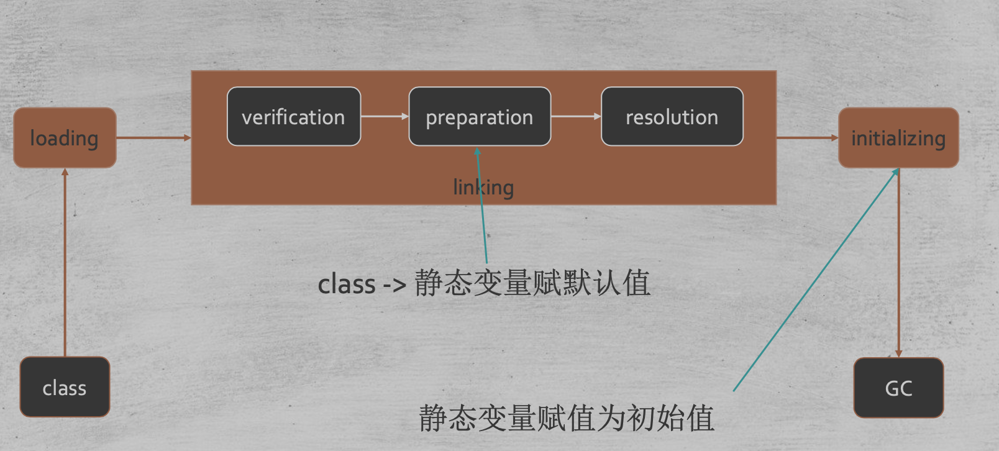

#流程图

1.加载类:加载二进制文件存储为classFile  
2.验证类:验证classFile中属性签名,方法签名是否符合语法  
3.准备:给变量和方法准备内存空间,静态变量设定为默认值  
4.解析类:将符号引用变为直接引用  
5.初始化:执行cinit方法,设定为人工指定值
#初始化
```asp
new,getstatic putstatic invokestatic指令,访问final变量除外
– java.lang.reflect对类进行反射调用时
– 初始化子类的时候，父类首先初始化
– 虚拟机启动时，被执行的主类必须初始化
– 动态语言支持java.lang.invoke.MethodHandle解析的结果为 REF_getstatic REF_putstatic REF_invokestatic的方法句柄时，该类必须初 始化
```
##执行顺序
静态>实例化
静态变量和静态代码块在clinit中执行,按申明顺序执行
变量和代码块在init中执行,按申明顺序执行
构造函数最后执行
