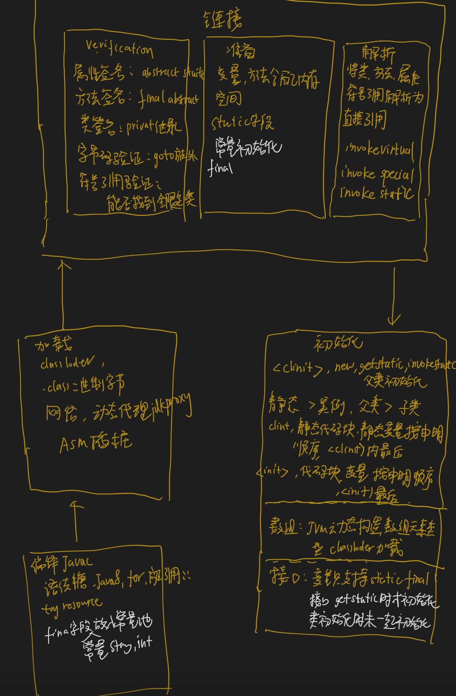
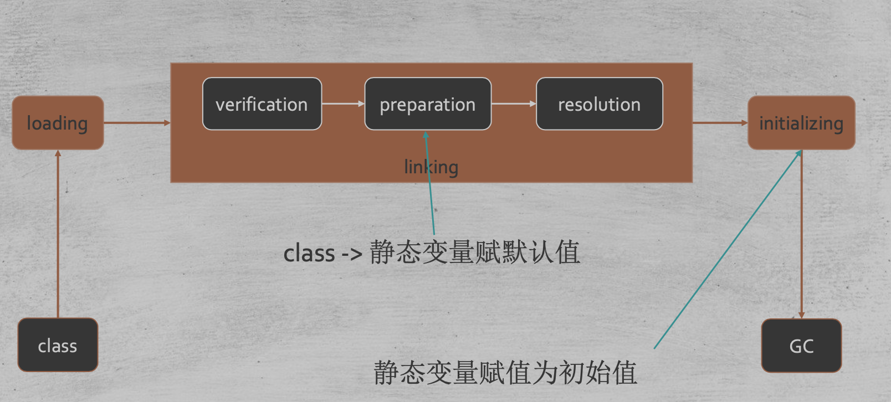
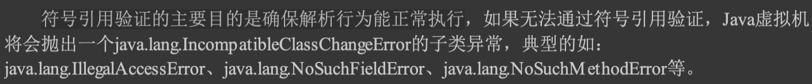
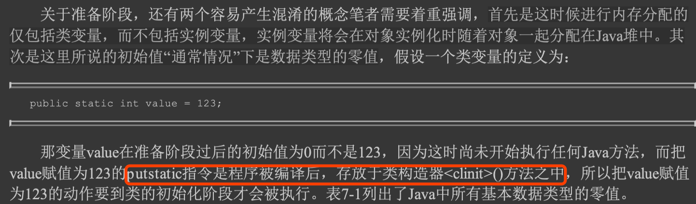
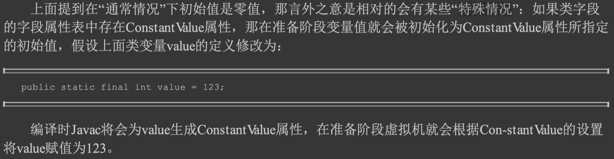

#临界知识
运行期类加载,加载二进制文件
指令都在方法中执行
class初始化执行顺序

#类加载流程

1.加载类:加载二进制文件存储为classFile  
2.验证Verification:验证classFile中属性签名,方法签名是否符合语法,验证文件是否符合JVM规定,
3.准备:给变量和方法准备内存空间,静态变量设定为默认值  
4.解析:将类、方法、属性等符号引用解析为直接引用 ,常量池中的各种符号引用解析为指针、偏移量等内存地址的直接引用
5.初始化:调用类初始化代码 <clinit>，给静态成员变量赋初始值
##加载
```asp
1)通过一个类的全限定名来获取定义此类的二进制字节流。
2)将这个字节流所代表的静态存储结构转化为方法区的运行时数据结构。
3)在内存中生成一个代表这个类的java.lang.Class对象，作为方法区这个类的各种数据的访问入 口。
```
##验证
Class文件并不一定只能由Java源码编译而来，它可以使用包括靠键盘0和1直接在二进制编辑器中敲出 Class文件在内的任何途径产生。
文件格式验证、元数据验证、字节 码验证和符号引用验证
###文件格式验证
```asp
是否以魔数0xCAFEBABE开头。 
·主、次版本号是否在当前Java虚拟机接受范围之内。 
·常量池的常量中是否有不被支持的常量类型(检查常量tag标志)。 
·指向常量的各种索引值中是否有指向不存在的常量或不符合类型的常量。 
·CONSTANT_Utf8_info型的常量中是否有不符合UTF-8编码的数据。 
·Class文件中各个部分及文件本身是否有被删除的或附加的其他信息
```
###元数据验证
```asp
第二阶段是对字节码描述的信息进行语义分析，以保证其描述的信息符合《Java语言规范》的要
求，这个阶段可能包括的验证点如下:
·这个类是否有父类(除了java.lang.Object之外，所有的类都应当有父类)。
·这个类的父类是否继承了不允许被继承的类(被final修饰的类)。
·如果这个类不是抽象类，是否实现了其父类或接口之中要求实现的所有方法。
·类中的字段、方法是否与父类产生矛盾(例如覆盖了父类的final字段，或者出现不符合规则的方 法重载，例如方法参数都一致，但返回值类型却不同等)
```

###字节码验证(StackMapTable)
```asp
保证任何跳转指令都不会跳转到方法体以外的字节码指令上
保证方法体中的类型转换总是有效的，例如可以把一个子类对象赋值给父类数据类型，这是安全 的，但是把父类对象赋值给子类数据类型，甚至把对象赋值给与它毫无继承关系、完全不相干的一个 数据类型，则是危险和不合法的。
```
```asp
类型推导->类型检查

属性描述了方法体所有的基本块(Basic Block，指按照控制流拆分 的代码块)开始时本地变量表和操作栈应有的状态，在字节码验证期间，Java虚拟机就不需要根据程 序推导这些状态的合法性，只需要检查StackMapTable属性中的记录是否合法即可
在JDK 6之后的Javac编译器和Java虚拟机里进行了一项联合优化,把尽可能 多的校验辅助措施挪到Javac编译器里进行
```
###符号引用验证
```asp
符号引用中通过字符串描述的全限定名是否能找到对应的类。
·在指定类中是否存在符合方法的字段描述符及简单名称所描述的方法和字段。
·符号引用中的类、字段、方法的可访问性(private、protected、public、<package>)是否可被当 前类访问。
```
符号引用验证的主要目的是确保解析行为能正常执行，如果无法通过符号引用验证，Java虚拟机将会抛出异常如下

##准备
类中定义的变量(即静态变量，被static修饰的变量)分配内存并设置类变量初 始值的阶段
首先是这时候进行内存分配的 仅包括类变量，而不包括实例变量，实例变量将会在对象实例化时随着对象一起分配在Java堆中。其 次是这里所说的初始值“通常情况”下是数据类型的零值

##解析
invokeinterface,invokevirtual,invokespecial,invokestatic,符号引用进行解析
动态解析,invokedynamic
###符号引用
```asp
符号引用(Symbolic References):符号引用以一组符号来描述所引用的目标，符号可以是任何 形式的字面量，只要使用时能无歧义地定位到目标即可。
符号引用与虚拟机实现的内存布局无关，引 用的目标并不一定是已经加载到虚拟机内存当中的内容。各种虚拟机实现的内s存布局可以各不相同，
 但是它们能接受的符号引用必须都是一致的

```
###直接引用
```asp
直接引用(Direct References):直接引用是可以直接指向目标的指针、相对偏移量或者是一个能 间接定位到目标的句柄。
直接引用是和虚拟机实现的内存布局直接相关的，同一个符号引用在不同虚 拟机实例上翻译出来的直接引用一般不会相同
```
##初始化
```asp
·<clinit>()方法与类的构造函数(即在虚拟机视角中的实例构造器<init>()方法)不同，它不需要显式地调用父类构造器，Java虚拟机会保证在子类的<clinit >()方法执行前，
父类的<clinit >()方法已经执行 完 毕 。 java中第一个执行的clinit是java.lang.object

<clinit >()方法对于类或接口来说并不是必需的，如果一个类中没有静态语句块，也没有对变量的 赋值操作，那么编译器可以不为这个类生成<clinit >()方法

·Java虚拟机必须保证一个类的<clinit >()方法在多线程环境中被正确地加锁同步，如果多个线程同 时去初始化一个类，那么只会有其中一个线程去执行这个类的<clinit >()方法，
其他线程都需要阻塞等 待，直到活动线程执行完毕<clinit >()方法。如果在一个类的<clinit >()方法中有耗时很长的操作，那就
可能造成多个进程阻塞
```
###特殊情况(常量)

#class二进制文件来源
可以来自磁盘文件、 网络、数据库、内存或者动态产生,用户可以通过Java预置的或自定义类加载器，让某个本地的应用程序在运行时从网络 或其他地方上加载一个二进制流作为其程序代码的一部分
如动态代理技术proxy,
#class初始化时机

```asp
- new,getstatic putstatic invokestatic指令,(被final修饰、已在编译期把结果放入常量池的静态字段除外)
– java.lang.reflect对类进行反射调用时
– 初始化子类的时候，父类首先初始化
– 虚拟机启动时，被执行的主类必须初始化
```
##被动引用
对于静态字段,只有直接定义这个字段的类才会被初始化，
因此通过其子类来引用父类中定义的静态字段，只会触发 父类的初始化而不会触发子类的初始化
[T01_load_static]
```asp
会触发T01_load_static$SubClass的加载,不会触发他的初始化
[Loaded jvm.T01_load_static$SuperClass from file:/Users/chris/workspace/xsource/jvm/target/classes/]
[Loaded jvm.T01_load_static$SubClass from file:/Users/chris/workspace/xsource/jvm/target/classes/]
```
[T01_load_static_arr],会触发jvm.T01_load_static$SuperClass加载,不会触发初始化
[T01_load_static_final],常量会内联到本类的常量池
#class初始化执行顺序
静态>实例化,父类->子类
静态变量和静态代码块在clinit中执行,按申明顺序执行
变量和代码块在init中执行,按申明顺序执行
构造函数内部逻辑最后执行
#接口初始化
无需初始化时,会去除初始化过程
接口的实现类在初始化时也一样不会执行接口的<clinit>()方法
只有当接口定义的变量被使用时，接口才会被初始化

接口的加载过程与类加载过程稍有不同，针对接口需要做一些特殊说明:接口也有初始化过程， 这点与类是一致的，上面的代码都是用静态语句块“static{}”来输出初始化信息的，而接口中不能使
用“static{}”语句块，但编译器仍然会为接口生成“<clinit>()”类构造器，用于初始化接口中所定义的 成员变量。接口与类真正有所区别的是前面讲述的六种“有且仅有”需要触发初始化场景中的第三种:
当一个类在初始化时，要求其父类全部都已经初始化过了，但是一个接口在初始化时，并不要求其父 接口全部都完成了初始化，只有在真正使用到父接口的时候(如引用接口中定义的常量)才会初始 化

#数组加载
数组类本身不通过类加载器创建，它是由Java虚拟机直接在 内存中动态构造出来的
但数组类与类加载器仍然有很密切的关系，因为数组类的元素类型最终还是要靠类加载器来完成加载
