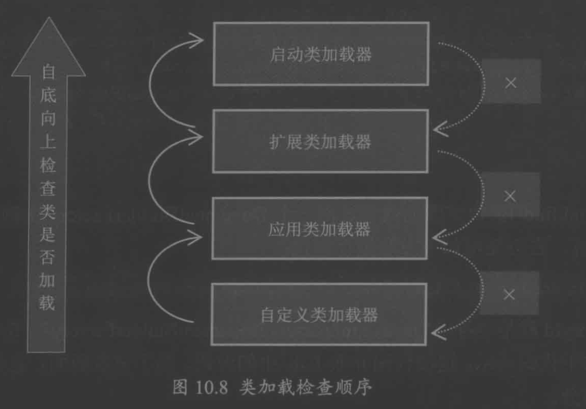

#临界知识
类加载器
一个加载器对应一个namespace
类加载器之间有层次关系,层次关系向上寻找
全盘委派(全盘委派是指当一个ClassLoader装载一个类时，除非显示地使用另一个ClassLoader，则该类所依赖及引用的类也由这个ClassLoader载入)
#类加载器类型

##bootstrap

/jre/lib/rt.jar
##Extension
/jre/lib/ext.jar
##app
classpath下
##custom
#类加载触发时机
调用类方法/属性
调用实例创建过程
  
#双亲委派&双亲委派破坏
##机制

1.findLoadedClass未找到
2.parent.loadClass递归1,2步
3.直到bootstrap还没找到,从顶部开始尝试加载
4.findClass加载,加载异常会被try catch,findClass最终由defineClass来实现,defineClass最终把二进制流转换为Class类对象
5.直到最底层classloader

```asp
protected Class<?> loadClass(String name, boolean resolve)
        throws ClassNotFoundException
    {
        synchronized (getClassLoadingLock(name)) {
            // First, check if the class has already been loaded
            Class<?> c = findLoadedClass(name);
            if (c == null) {
                try {
                    if (parent != null) {
                        c = parent.loadClass(name, false);
                    } else {
                        c = findBootstrapClassOrNull(name);
                    }
                } catch (ClassNotFoundException e) {
                }

                if (c == null) {
                    c = findClass(name);
                }
            }
            if (resolve) {
                resolveClass(c);
            }
            return c;
        }
    }
```
```asp
protected Class findClass(String name)
            throws ClassNotFoundException {
        if (name.endsWith("_Stub")) {
            ClassWriter cw = new ClassWriter(0);
            byte[] b = cw.toByteArray();
            return defineClass(name, b, 0, b.length);
        }
        return super.findClass(name);
    }
```
双亲委派:
1.上层classloader不应该加载下层classloader中的class
2.下层不想访问上层classloader是否有class然后再决定加载
##双亲委派机制由来
处于安全考虑,string总是由bootstrap生成

##打破双亲委派
###复写loadclass
破坏classloader加载顺序
1.改变loadclass,详见[jvm.MyLoader]
###spi问题
spi的加载器是bootstrap,bootstrap不知道具体实现类的加载路径(只加载rt.jar),需要使用下层classloader进行加载,
创建thread时设置一个ClassLoader,可以通过thread.getContextClassLoader获取


###热加载
需要使用自定义类加载器加载class,并使用新的class进行invoke
tomcat热加载
```asp
为啥需要热加载:要保证每个应用程序的类库都是独立的，保证相互隔离 
tomcat打破了双亲委派吗?
也不尽然，核心的Java的加载还是遵从双亲委派 。
Tomcat中 各个web应用自己的类加载器(WebAppClassLoader)会优先加载，打破了双亲委派机制。加载不到时再交给commonClassLoader走双亲委托 .

```

```asp
如果发现有文件发生变化，热加载开关开启
关闭Context容器
重启Context容器
因为一个Context容器对应一个类加载器。
所以在销毁Context容器的时候也连带着将其类加载器一并销毁了。Context在重启的过程中也会创建新的类加载器来加载我们新建的文件
```
[](https://juejin.cn/post/6844903887648849928)
[](https://blog.csdn.net/yangshangwei/article/details/106536300)
#相等类判断
isAssignableFrom()
instanceof
