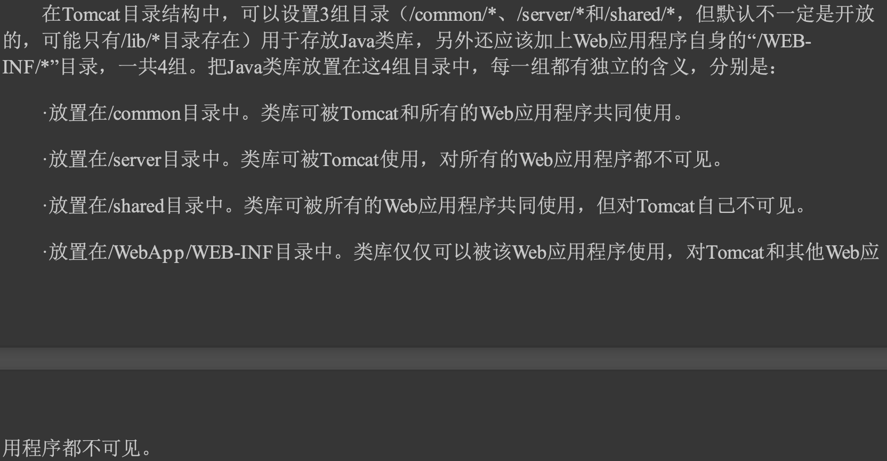

#tomcat类加载架构

1.每个web应用依赖库隔离,避免版本冲突和依赖问题
2.可以支持web应用依赖库共享,减少方法区过度膨胀
3.支持热部署和热加载


Common类加载器、Catalina类加载器(也称为Server类 加载器)、Shared类加载器和Webapp 类加载器则是Tomcat 自己定义的类加载器，它们分别加
载 /common/* 、 /server/* 、 /shared/* 和 /webapp/WEB-INF/* 中的类库
```asp
从图9-1的委派关系中可以看出，Common类加载器能加载的类都可以被Cat alina类加载器和Shared 类 加 载 器 使 用 ， 
而 C a t a l i n a 类 加 载 器 和 Sh a r e d 类 加 载 器 自 己 能 加 载 的 类 则 与 对 方 相 互 隔 离 。
 We b A p p 类 加 载 器 可 以 使 用 Sh a r e d 类 加 载 器 加 载 到 的 类 ， 但 各 个 We b A p p 类 加 载 器 实 例 之 间 相 互 隔 离 。 而
Jasp erLoader的加载范围仅仅是这个JSP文件所编译出来的那一个Class文件，它存在的目的就是为了被 丢弃:当服务器检测到JSP文件被修改时，
会替换掉目前的Jasp erLoader的实例，并通过再建立一个新 的JSP类加载器来实现JSP文件的HotSwap功能
```
