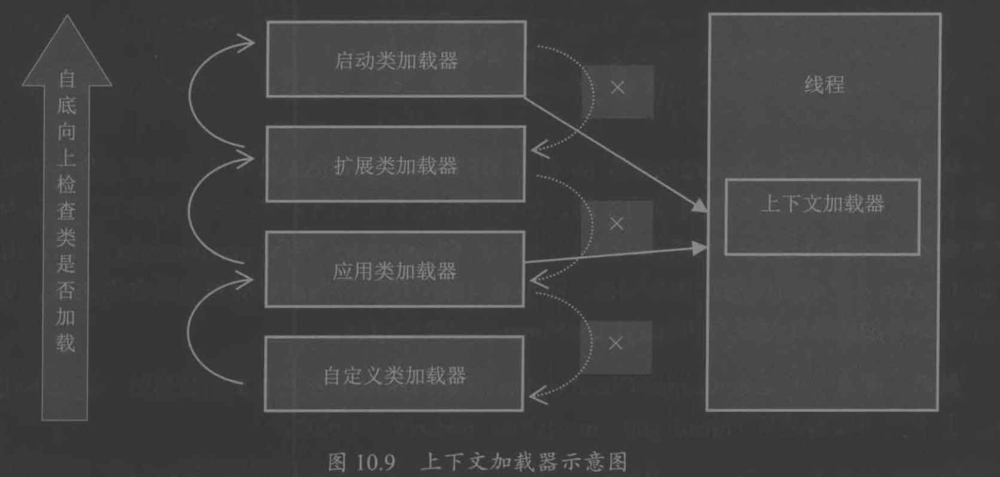

#临界知识
类加载器
一个加载器对应一个namespace
类加载器之间有层次关系,层次关系向上寻找
全盘委派(全盘委派是指当一个ClassLoader装载一个类时，除非显示地使用另一个ClassLoader，则该类所依赖及引用的类也由这个ClassLoader载入)
#类加载器类型
loadclass
findclass
#类加载触发时机
调用类方法/属性
调用实例创建过程
#类加载过程
1.加载类:加载二进制文件存储为classFile  
2.验证类:验证classFile中属性签名,方法签名是否符合语法  
3.准备:给变量和方法准备内存空间  
4.解析类:将符号引用变为直接引用  
5.初始化:执行cinit方法  
#双亲委派&双亲委派破坏

双亲委派:
1.上层classloader不应该加载下层classloader中的class
2.下层不想访问上层classloader是否有class然后再决定加载
##spi问题
spi的加载器是bootstrap,具体实现类不应该使用bootstrap加载,如何获取下层classloader?
创建thread时设置一个ClassLoader,可以通过thread.getContextClassLoader获取

##破坏classloader加载顺序
改变loadclass,详见[jvm.MyLoader]
#热加载
需要使用自定义类加载器加载class,并使用新的class进行invoke
