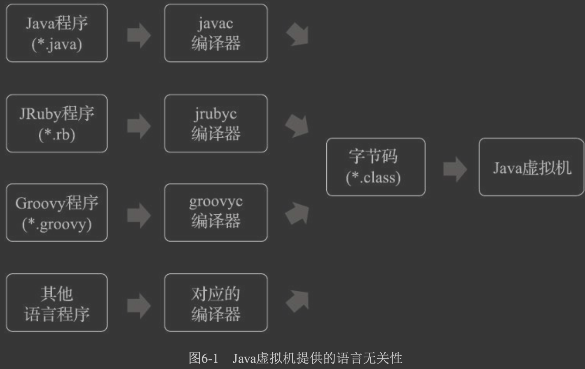
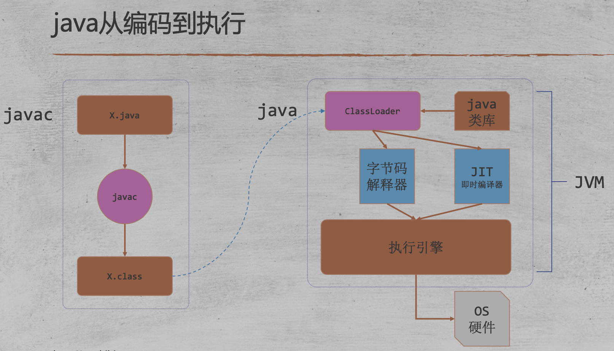
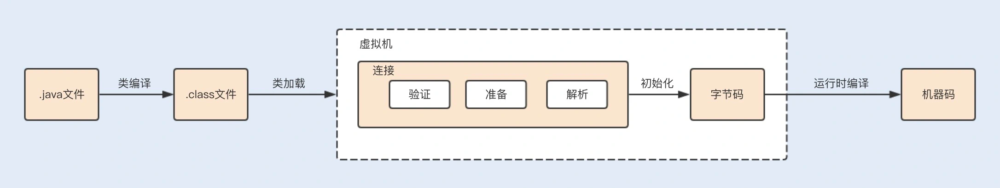

#临界知识
语法糖原理,泛型
checked exception
符号表
默认构造器
#拓扑关系




#前端编译器javac(*.java文件转变成*.class文件的过程)
javac(java),scala编译器,kotlin编译器
```asp
Javac这类前端编译器对代码的运行效率几乎没 有任何优化措施可言
Java虚拟机设计团队选择把对性能的优化全部集中到运 行期的即时编译器中，这样可以让那些不是由Javac产生的Class文件
(如JRuby、Groovy等语言的Class 文件)也同样能享受到编译器优化措施所带来的性能红利

Java中即时编译器在运行期的优 化过程，支撑了程序执行效率的不断提升;而前端编译器在编译期的优化过程，则是支撑着程序员的 编码效率和语言使用者的幸福感的提高

在Java语言中，Javac编译器完成了程序代码经过词法分析、语法分析到抽象语法树，再遍历语法 树生成线性的字节码指令流的过程。因为这一部分动作是在Java虚拟机之外进行的，
而解释器在虚拟 机的内部，所以Java程序的编译就是半独立的实现
```
##编译原理
###词法分析、语法分析,构造出抽象语法树
词法分析:(com.sun.tools.javac.parser.Scanner),
抽象语法树:(Abstract Syntax Tree，AST)
语法分析:com.sun.tools.javac.parser.Parser
###填充符号表
在Java编译器中，每声明一个标识符时，就通过Symbol及其子类来表示
符号,变量名,方法名
TypeSymbol，VarSymbol，MethodSymbol
###语义分析
类型检查(int,boolean,char转换)、控制流检查(if,else)、数据流检查


####标注检查
```asp
变量使用前是否已被声明、变量与赋值之间的数据类型是否能够匹配
在标注检查中，还会顺便进行 一个称为常量折叠(Constant Folding)的代码优化，这是Javac编译器会对源代码做的极少量优化措施 之一(代码优化几乎都在即时编译器中进行)
```
####数据及控制流分析
它可以检查出诸如程序局部变量 在使用前是否有赋值、方法的每条路径是否都有返回值、是否所有的受查异常都被正确处理了等问 题。
变量的不变性仅仅由Javac编 译器在编译期间来保障，这就是一个只能在编译期而不能在运行期中检查的例子
[深入理解java虚拟机10.2.4]
####语法糖
####字节码生成

##编译器注解(lombok)
##语法糖
###泛型
类型擦除式泛型,考虑到向前兼容性问题

#即时编译器(JIT编译器，Just In Time Compiler)
运行期把jvm字节码转变成本地机器码的过程

#AOT编译器(Ahead Of Time Compiler)
直接把程序编译成与目标机器指令集相关的二进制代码的过程

#其他语言编译器
```asp
对于一门具体语言的实现来说， 词法、语法分析以至后面的优化器和目标代码生成器都可以选择独立于执行引擎，形成一个完整意义 的编译器去实现，
这类代表是C/C++语言。也可以选择把其中一部分步骤(如生成抽象语法树之前的 步骤)实现为一个半独立的编译器，这类代表是Java语言。
又或者把这些步骤和执行引擎全部集中封 装在一个封闭的黑匣子之中，如大多数的JavaScrip t执行引擎

在Java语言中，Javac编译器完成了程序代码经过词法分析、语法分析到抽象语法树，再遍历语法 树生成线性的字节码指令流的过程。
因为这一部分动作是在Java虚拟机之外进行的，而解释器在虚拟 机的内部，所以Java程序的编译就是半独立的实现
```
