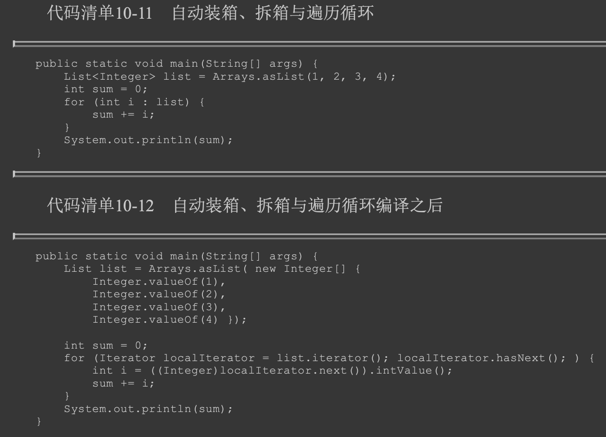

#什么是语法糖?
用更容易的表达方式使用程序功能,底层还是原来的程序功能
##泛型
类型擦除式泛型
在编译后的字节码文件中，全部泛型都被替换 为原来的裸类型(Raw Type，稍后我们会讲解裸类型具体是什么)了，并且在相应的地方插入了强制 转型代码，
因此对于运行期的Java语言来说，ArrayList<int>与ArrayList<String>其实是同一个类型##装箱拆箱
[T02_compile_03_suger_generic]
##遍历循环
##拆箱装箱

