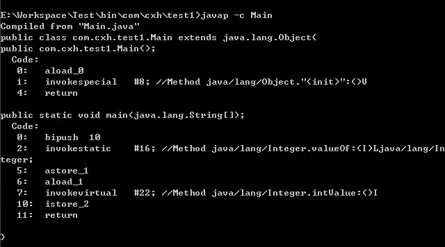

#什么是语法糖?
用更容易的表达方式使用程序功能,底层还是原来的程序功能
##泛型
类型擦除式泛型
在编译后的字节码文件中，全部泛型都被替换 为原来的裸类型(Raw Type，稍后我们会讲解裸类型具体是什么)了，并且在相应的地方插入了强制 转型代码，
因此对于运行期的Java语言来说，ArrayList<int>与ArrayList<String>其实是同一个类型##装箱拆箱
[T02_compile_03_suger_generic]
##遍历循环
##拆箱装箱

###原理
装箱:Integer.valueOf
拆箱:Integer.intValue

###缓存
integer:-128~127
Integer、Short、Byte、Character、Long这几个类的valueOf方法的实现是类似的
Double、Float的valueOf方法的实现是类似的,在某个范围内的整型数值的个数是有限的，而浮点数却不是
###==
当 "=="运算符的两个操作数都是 包装器类型的引用，则是比较指向的是否是同一个对象，而如果其中有一个操作数是表达式（即包含算术运算）则比较的是数值（即会触发自动拆箱的过程）
###Long.equal
不会进行类型转换
```asp
public boolean equals(Object obj) {
        if (obj instanceof Long) {
            return value == ((Long)obj).longValue();
        }
        return false;
    }
```
##lambda
->
```asp
Thread thread = new Thread(() -> {
	System.out.println("hello world");
});
```
::
```asp
System.out::println
```
