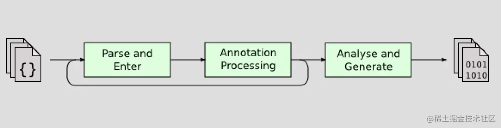
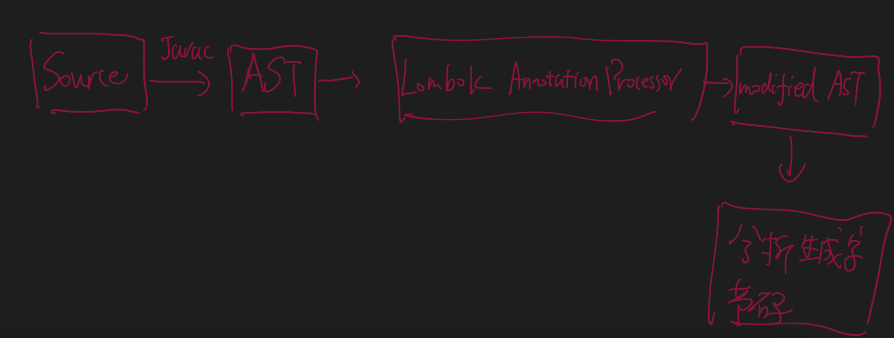

#原理
插入式注解处理器

有了编译器注解处理的标准API后，程序员的代码才有可能干涉编译器的行为，由于语法树中的 任意元素，甚至包括代码注释都可以在插件中被访问到，
所以通过插入式注解处理器实现的插件在功 能上有很大的发挥空间。
1.Javac 解析成抽象语法树之后(AST)
2.Lombok 根据自己的注解处理器，动态的修改 AST，增加新的节点(所谓代码)
#案例
##lombok

