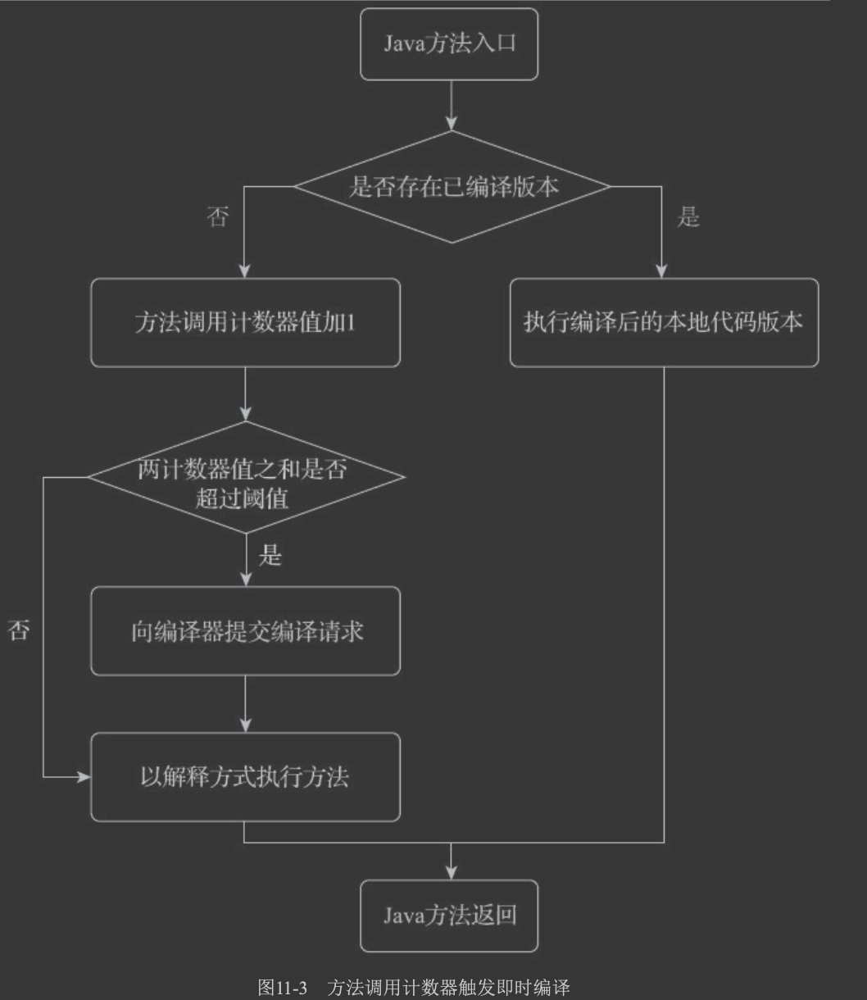

#后端编译
译器无论在何时、在何种状态下把Class文件转换成与本地基础设施(硬件指令集、操作系统)相 关的二进制机器码，它都可以视为整个编译过程的后端
#即时编译器
##客户端编译器C1
##服务端编译器C2
#解释器
#混合模式
解释器与编译器搭配使用的方式在虚拟机 中被称为“混合模式”(Mixed Mode)
用户也可以使用参数“-Xint”强制虚拟机运行于“解释模 式”(Interpreted Mode)，这时候编译器完全不介入工作，全部代码都使用解释方式执行
##分层编译
```asp
第0层。程序纯解释执行，并且解释器不开启性能监控功能(Profiling)。 ·第1层。使用客户端编译器将字节码编译为本地代码来运行，进行简单可靠的稳定优化，不开启
性能监控功能。
·第2层。仍然使用客户端编译器执行，仅开启方法及回边次数统计等有限的性能监控功能。
·第3层。仍然使用客户端编译器执行，开启全部性能监控，除了第2层的统计信息外，还会收集如 分支跳转、虚方法调用版本等全部的统计信息。
·第4层。使用服务端编译器将字节码编译为本地代码，相比起客户端编译器，服务端编译器会启 用更多编译耗时更长的优化，还会根据性能监控信息进行一些不可靠的激进优化。
```
##热点探测
当虚拟机运行参数确定的前提下，这两个计数器都有一个明确的阈 值，计数器阈值一旦溢出，就会触发即时编译

###方法调用计数器
###回边计数器

#提前编译器
优势:不占用程序运行资源
劣势:不能利用动态执行情况进行针对性优化,不知道热点代码,不好进行cpu缓存,寄存器分配
#问题
##为何HotSpot虚拟机要使用解释器与即时编译器并存的架构?
##为何HotSpot虚拟机要实现两个(或三个)不同的即时编译器?
##哪些程序代码会被编译为本地代码?如何编译本地代码?
##如何从外部观察到即时编译器的编译过程和编译结果?

