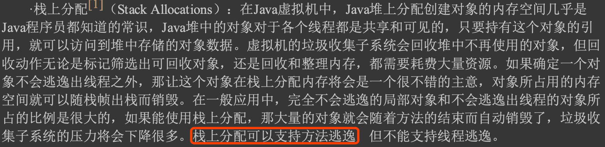
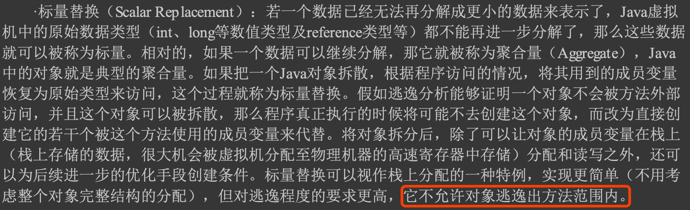

#方法内联
方法内联的优化行为理解起来是没有任何困难的，不过就是把目标方法的代码原封不动地“复 制”到发起调用的方法之中，避免发生真实的方法调用而

#逃逸分析
一直到JDK 7时这项优化才成为服务端编译器默认开启的选项。如果有需 要，或者确认对程序运行有益，用户也可以使用参数-XX:+DoEscap eAnaly sis来手动开启逃逸分析，
开启之后可以通过参数-XX:+PrintEscapeAnalysis来查看分析结果。
##从不逃逸
##方法逃逸
当一个对象在方法里面被定义后，它可能被外部方法所引用，例如作为调用参数传递到其他方法中，这种称为方法逃逸
##线程逃逸
#逃逸优化
##栈上分配

##标量替换

##同步消除
线程同步本身是一个相对耗时的过程，如果逃逸分析 能够确定一个变量不会逃逸出线程，无法被其他线程访问，那么这个变量的读写肯定就不会有竞争， 对这个变量实施的同步措施也就可以安全地消除掉
#公共子表达式消除
[深入理解java虚拟机11.4.4]
#数组边界检查消除
