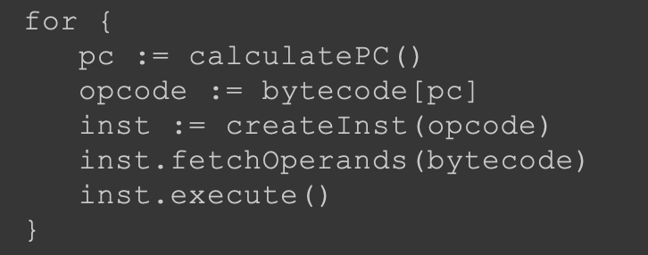

##临界知识
一个局部变量定义了但没有赋初始值，那它是完全不能使用
32位数据类型所占 的栈容量为1，64位数据类型所占的栈容量为2
invokevirtual参与多态,字段不参与多态
动态语言,变量无类型而变量值才有类型
静态分派
##帧数据结构
[深入理解java虚拟机,8.5.3,指令执行]


###局部变量表
```asp
果执行的是实例方法(没有被static修饰的方法)，那局部变量表中第0位索 引的变量槽默认是用于传递方法所属对象实例的引用，
在方法中可以通过关键字“this”来访问到这个隐 含的参数。其余参数则按照参数表顺序排列

们已经知道类的字段变量有两次赋初始值的过程，一次在准 备阶段，赋予系统初始值;另外一次在初始化阶段，赋予程序员定义的初始值。
因此即使在初始化阶 段程序员没有为类变量赋值也没有关系，类变量仍然具有一个确定的初始值，不会产生歧义。
但局部 变量就不一样了，如果一个局部变量定义了但没有赋初始值，那它是完全不能使用的
```
###操作数栈
```asp
32位数据类型所占 的栈容量为1，64位数据类型所占的栈容量为2
```
###动态连接
```asp
静态解析:
我们知道Class文件的常量池中存 有大量的符号引用，字节码中的方法调用指令就以常量池里指向方法的符号引用作为参数。这些符号 引用一部分会在类
加载阶段或者第一次使用的时候就被转化为直接引用，这种转化被称为静态解析(复写)

另外一部分将在每一次运行期间都转化为直接引用，这部分就称为动态连接(多态)

```
###方法返回地址
```asp
正常退出:
第一种方式是执行引擎遇到任意一个方法 返回的字节码指令，这时候可能会有返回值传递给上层的方法调用者(调用当前方法的方法称为调用 者或者主调方法)，
方法是否有返回值以及返回值的类型将根据遇到何种方法返回指令来决定
方法正常退出时，主调方法的PC计数器的值就可以作为返回地址
```
```asp
异常退出:
返回地址是要通过异常处理器表来确定的
```
恢复上层方法的 局部变量表和操作数栈，把返回值(如果有的话)压入调用者栈帧的操作数栈中，调整PC计数器的值 以指向方法调用指令后面的一条指令等
##方法调用
###5大方法指令
[T03_runtime_04_private]
```asp
·invokestatic。用于调用静态方法。
·invokespecial。用于调用实例构造器<init>()方法、私有方法和父类中的方法。
·invokevirtual。用于调用所有的虚方法。
·invokeinterface。用于调用接口方法，会在运行时再确定一个实现该接口的对象。
·invokedynamic。先在运行时动态解析出调用点限定符所引用的方法，然后再执行该方法。前面4 条调用指令，分派逻辑都固化在Java虚拟机内部，而invokedy namic指令的分派逻辑是由用户设定的引 导方法来决定的
```
###方法重载(解析调用,静态分派,javac编译阶段确定)
[T01_load_override]
```asp
代码中故意定义了两个静态类型相同，而实际类型不 同的变量，但虚拟机(或者准确地说是编译器)在重载时是通过参数的静态类型而不是实际类型作为 
判定依据的。由于静态类型在编译期可知，所以在编译阶段，Javac编译器就根据参数的静态类型决定 了会使用哪个重载版本，因此选择了say 
Hello(Human)作为调用目标，并把这个方法的符号引用写到 main()方法里的两条invokevirt ual指令的参数中
```
[深入理解java虚拟机8.3.1]
调用目标在程序代码写好、编译器进行编译那一刻就已经确定下来
静态方法和私有方法两 大类
只要能被invokestatic和invokespecial指令调用的方法，都可以在解析阶段中确定唯一的调用版本
静态方法、私有方法、实例构造器、父类方法4种，再加上被final 修饰的方法(尽管它使用invokevirt ual指令调用)
解析调用一定是个静态的过程，在编译期间就完全确定，在类加载的解析阶段就会把涉及的符号 引用全部转变为明确的直接引用，不必延迟到运行期再去完成
[T01_load_override_seq]重载顺序
###多态,复写(动态分派)
[T01_load_dynamic]
多态根源在invokevirtual,那自然我们得出的结论就只 会对方法有效，对字段是无效的，因为字段不使用这条指令
```asp
1)找到操作数栈顶的第一个元素所指向的对象的实际类型，记作C。
2)如果在类型C中找到与常量中的描述符和简单名称都相符的方法，则进行访问权限校验，如果 通过则返回这个方法的直接引用，查找过程结束;不通过则返回java.lang.IllegalAccessError异常。
3)否则，按照继承关系从下往上依次对C的各个父类进行第二步的搜索和验证过程。
4)如果始终没有找到合适的方法，则抛出java.lang.AbstractMethodError异常。
```
```asp
在Java里面只有虚方法存在， 字段永远不可能是虚的，换句话说，字段永远不参与多态，哪个类的方法访问某个名字的字段时，该 名字指的就是这个类能看到的那个字段。
当子类声明了与父类同名的字段时，虽然在子类的内存中两 个字段都会存在，但是子类的字段会遮蔽父类的同名字段。
```
###java静态多分派,动态单分派
[T01_load_override_dynamic]
```asp
(复写)静态分派属于多分派类型

这时候选 择目标方法的依据有两点:一是静态类型是Father还是Son，二是方法参数是QQ还是360。这次选择结 果的最终产物是产生了两条invokevirt ual指令，两条指令的参数分别为常量池中指向
Fat her::hardChoice(360)及Fat her::hardChoice(QQ)方法的符号引用。因为是根据两个宗量进行选择，所以 Java语言的静态分派属于多分派类型。
```
```asp
由于编译期已经决定目标方 法的签名必须为hardChoice(QQ)，虚拟机此时不会关心传递过来的参数“QQ”到底是“腾讯QQ”还是“奇 瑞QQ”，因为这时候参数的静态类型、实际类型都对方法的选择不会构成任何影响，
唯一可以影响虚拟 机 选 择 的 因 素 只 有 该 方 法 的 接 受 者 的 实 际 类 型
Java语言的动态分派属于单分派类型
```
[T01_load_05_cover_field]
```asp
I am Son, i have $0 
I am Son, i have $4 
This gay has $2

输出两句都是“I am Son”，这是因为Son类在创建的时候，首先隐式调用了Father的构造函数，而 Father构造函数中对showMeTheMoney()的调用是一次虚方法调用，
实际执行的版本是 Son::showMeTheMoney()方法，所以输出的是“I am Son”，这点经过前面的分析相信读者是没有疑问的 了。而这时候虽然父类的money字段已经被初始化成2了，
但Son::showMeTheMoney()方法中访问的却 是子类的money 字段，这时候结果自然还是0，因为它要到子类的构造函数执行时才会被初始化。 main()的最后一句通过静态类型访问到了父类中的money ，输出了2
```

###虚方法表
查虚方法表是分派调用的一种优化手段,在每个class中建立一个虚方法表,虚方法表一般在类加载的连接阶段进行初始化，准备了类的变量初始值后，虚拟机会把
该类的虚方法表也一同初始化完毕
```asp
动态分派是执行非常频繁的动作，而且动态分派的方法版本选择过程需要运行时在接收者类型的 方法元数据中搜索合适的目标方法，因此，Java虚拟机实现基于执行性能的考虑，真正运行时一般不 会如此频繁地去反复搜索类型元数据。
面对这种情况，一种基础而且常见的优化手段是为类型在方法 区中建立一个虚方法表

虚方法表中存放着各个方法的实际入口地址。如果某个方法在子类中没有被重写，那子类的虚方 法表中的地址入口和父类相同方法的地址入口是一致的，
都指向父类的实现入口。如果子类中重写了 这个方法，子类虚方法表中的地址也会被替换为指向子类实现版本的入口地址。
在图8-3中，Son重写 了 来 自 F a t h e r 的 全 部 方 法 ， 因 此 So n 的 方 法 表 没 有 指 向 F a t h e r 类 型 数 据 的 箭 头 。 
但 是 So n 和 F a t h e r 都 没 有 重写来自Object的方法，所以它们的方法表中所有从Object继承来的方法都指向了Object的数据类型。
  为了程序实现方便，具有相同签名的方法，在父类、子类的虚方法表中都应当具有一样的索引序
号，这样当类型变换时，仅需要变更查找的虚方法表，就可以从不同的虚方法表中按索引转换出所需
的入口地址。。


```


##基于栈的指令集 vs 基于寄存器的指令集
###基于栈
```asp
iconst_1 
iconst_1 
iadd 
istore_0
```
两条iconst _1指令连续把两个常量1压入栈后，iadd指令把栈顶的两个值出栈、相加，然后把结果 放回栈顶，最后istore_0把栈顶的值放到局部变量表的
第0个变量槽中。这种指令流中的指令通常都是 不带参数的，使用操作数栈中的数据作为指令的运算输入，指令的运算结果也存储在操作数栈之中
###基于寄存器
```asp
mov eax, 1 
add eax, 1
```
mov指令把EAX寄存器的值设为1，然后add指令再把这个值加1，结果就保存在EAX寄存器里面。 这种二地址指令是x86指令集中的主流，
每个指令都包含两个单独的输入参数，依赖于寄存器来访问和 存储数据
###对比


##JVM解释器

HotSpot的模板解 释器工作的时候，并不是按照下文中的动作一板一眼地进行机械式计算，而是动态产生每条字节码对 应的汇编代码来运行
基于栈的执行引擎

每次循环都包含三个部分:计算pc、指令解码、指令执行
把指令抽象成接口，解码和执行逻辑写在具体的指令实现中。 这样编写出的解释器就和Java虚拟机规范里的伪代码一样简单


调用MemberInfo结 构体的CodeAttribute()方法可以获取它的Code属性
得到Code属性之后，可以进一步获得执行方法所需的局部变 量表和操作数栈空间，以及方法的字节码  
interpret()方法的其余代码先创建一个Thread实例，然后创建 一个帧并把它推入Java虚拟机栈顶，最后执行方法
##JVM指令
每条指令都以一个单 字节的操作码(opcode)开头，这就是字节码名称的由来。  
由于只使 用一字节表示操作码，显而易见，Java虚拟机最多只能支持256(2^8 ) 条指令
###跳转指令
###加载类指令
存储和加载类指令需要根据索引存取局部变量表，索引由单 字节操作数给出
加载指令从局部变量表获取变量，然后推入操作数栈顶
aload系列指令 操作引用类型变量、dload系列操作double类型变量、fload系列操作 float变量、iload系列操作int变量、lload系列操作long变量、xaload操 作数组
####索引隐含在操作码中
ILOAD_1:
###存储指令
存储指令把变量从操作数栈顶弹出，然 后存入局部变量表
####索引隐含在操作码中
索引隐含在操作码中
###常量指令
有一些指令需要访问运行时常量池，常量池索引由两字节操 作数给出。把这类指令抽象成Index16Instruction结构体，用Index字 段表示常量池索引
常量指令把常量推入操作数栈顶。常量可以来自三个地方:隐 含在操作码里、操作数和运行时常量池
####隐含在操作码里
aconst_null:指令把null引用推入操作 数栈顶  
ICONST_1:把int 1推入操作数栈顶
iconst_m1:指令把int型-1推入操作数栈顶
####操作数
bipush 123:指令从操作数中获取一个byte型整数，扩展成int型，然 后推入栈顶
###栈指令
直接对操作数栈进行操作，共9条:pop和pop2指令将栈 顶变量弹出，  
dup系列指令复制栈顶变量，swap指令交换栈顶的两 个变量
###数学指令
对应Java语言中的加、减、乘、除等数学运算符
数学指令包括算术指令、位移指令和布尔运算指令
###类型转换指令
###比较指令
把栈顶的两个long变量弹出，进行比较，然后把 比较结果(int型0、1或-1)推入栈顶
###控制指令
return系列指令有6条
tableswitch指令
