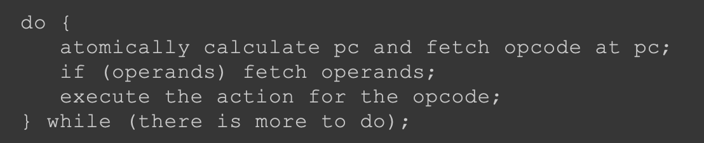

##运行时数据区结构

##java虚拟机栈数据结构
##帧数据结构
###局部变量表
###操作数栈
##局部变量表和操作数栈交互
##指令编码
每条指令都以一个单 字节的操作码(opcode)开头，这就是字节码名称的由来。  
由于只使 用一字节表示操作码，显而易见，Java虚拟机最多只能支持256(28 ) 条指令。
##常用指令
Java虚拟机使用的是变长指令，操作码后面可以跟零字节或多 字节的操作数(operand)。  
如果把指令想象成函数的话，操作数就是 它的参数。
为了让编码后的字节码更加紧凑，很多操作码本身就隐 含了操作数，  
比如把常数0推入操作数栈的指令是iconst_0

getsatic #2
该指令的操作码是0xB2，助记符是getstatic。它的操   
作数是0x0002，代表常量池里的第二个常量

操作数栈和局部变量表只存放数据的值， 并不记录数据类型。  
结果就是:指令必须知道自己在操作什么类型 的数据。  
这一点也直接反映在了操作码的助记符上。例如，iadd指 令就是对int值进行加法操作;dstore指令把操作数栈顶的double值 弹出，  
存储到局部变量表中;areturn从方法中返回引用值。也就是 说，如果某类指令可以操作不同类型的变量，则助记符的第一个字 母表示变量类型。

iload_0、iload_1、iload_2和iload_3这四条指令，只是iload指令的特 例(局部变量表索引隐含在操作码中)

常量(constants)指令、加载(loads)指令、存储(stores)指令、 操作数栈(stack)指令、数学(math)指令、转换(conversions)指令、  
比 较(comparisons)指令、控制(control)指令、引用(references)指令、 扩展(extended)指令和保留(reserved)指令
##JVM解释器

每次循环都包含三个部分:计算pc、指令解码、指令执行
把指令抽象成接口，解码和执行逻辑写在具体的指令实现中。 这样编写出的解释器就和Java虚拟机规范里的伪代码一样简单

调用MemberInfo结 构体的CodeAttribute()方法可以获取它的Code属性
得到Code属性之后，可以进一步获得执行方法所需的局部变 量表和操作数栈空间，以及方法的字节码  
interpret()方法的其余代码先创建一个Thread实例，然后创建 一个帧并把它推入Java虚拟机栈顶，最后执行方法
##JVM指令
###跳转指令
###加载类指令
存储和加载类指令需要根据索引存取局部变量表，索引由单 字节操作数给出
加载指令从局部变量表获取变量，然后推入操作数栈顶
aload系列指令 操作引用类型变量、dload系列操作double类型变量、fload系列操作 float变量、iload系列操作int变量、lload系列操作long变量、xaload操 作数组
####索引隐含在操作码中
ILOAD_1:
###存储指令
存储指令把变量从操作数栈顶弹出，然 后存入局部变量表
####索引隐含在操作码中
索引隐含在操作码中
###常量指令
有一些指令需要访问运行时常量池，常量池索引由两字节操 作数给出。把这类指令抽象成Index16Instruction结构体，用Index字 段表示常量池索引
常量指令把常量推入操作数栈顶。常量可以来自三个地方:隐 含在操作码里、操作数和运行时常量池
####隐含在操作码里
aconst_null:指令把null引用推入操作 数栈顶  
ICONST_1:把int 1推入操作数栈顶
iconst_m1:指令把int型-1推入操作数栈顶
####操作数
bipush 123:指令从操作数中获取一个byte型整数，扩展成int型，然 后推入栈顶
###栈指令
直接对操作数栈进行操作，共9条:pop和pop2指令将栈 顶变量弹出，  
dup系列指令复制栈顶变量，swap指令交换栈顶的两 个变量
###数学指令
对应Java语言中的加、减、乘、除等数学运算符
数学指令包括算术指令、位移指令和布尔运算指令
###类型转换指令
###比较指令
把栈顶的两个long变量弹出，进行比较，然后把 比较结果(int型0、1或-1)推入栈顶
###控制指令
return系列指令有6条
tableswitch指令
