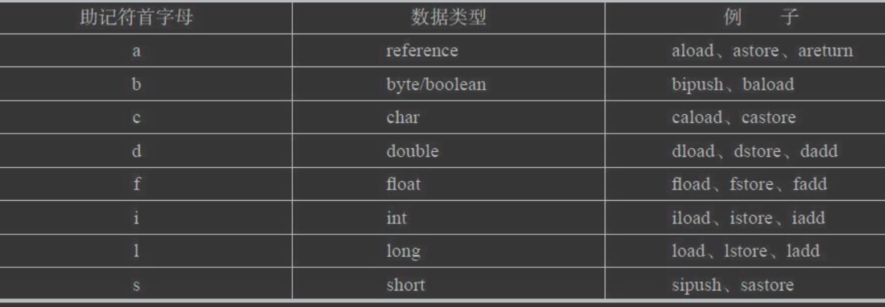

#class初始化执行顺序
静态>实例化
静态变量和静态代码块在clinit中执行,按申明顺序执行
变量和代码块在init中执行,按申明顺序执行
构造函数最后执行
#静态变量/代码块
[T03_runtime_01_static]
#实例化对象时重排序
```asp
 0 new #2 <jvm/T03_runtime_02_instance$T>
 3 dup
 4 invokespecial #3 <jvm/T03_runtime_02_instance$T.<init>>
 7 astore_1
```
如果先astore,然后invokespecial,就会发生指令乱序,有可能线程逃逸
#重要指令
store读,局部变量表<-操作数栈
load写,局部变量表->操作数栈

#加法运算
整数加法的字节码指令iadd，这条指令在运行的时候要 求操作数栈中最接近栈顶的两个元素已经存入了两个int型的数值，
当执行这个指令时，会把这两个int 值出栈并相加，然后将相加的结果重新入栈

#常用指令
Java虚拟机使用的是变长指令，操作码后面可以跟零字节或多 字节的操作数(operand)。  
如果把指令想象成函数的话，操作数就是 它的参数。
为了让编码后的字节码更加紧凑，很多操作码本身就隐 含了操作数，  
比如把常数0推入操作数栈的指令是iconst_0

getsatic #2
该指令的操作码是0xB2，助记符是getstatic。它的操   
作数是0x0002，代表常量池里的第二个常量

操作数栈和局部变量表只存放数据的值， 并不记录数据类型。  
结果就是:指令必须知道自己在操作什么类型 的数据。  
这一点也直接反映在了操作码的助记符上。例如，iadd指 令就是对int值进行加法操作;dstore指令把操作数栈顶的double值 弹出，  
存储到局部变量表中;areturn从方法中返回引用值。也就是 说，如果某类指令可以操作不同类型的变量，则助记符的第一个字 母表示变量类型。

iload_0、iload_1、iload_2和iload_3这四条指令，只是iload指令的特 例(局部变量表索引隐含在操作码中)

常量(constants)指令、加载(loads)指令、存储(stores)指令、 操作数栈(stack)指令、数学(math)指令、转换(conversions)指令、  
比 较(comparisons)指令、控制(control)指令、引用(references)指令、 扩展(extended)指令和保留(reserved)指令


##store
##load
##invoke**

##push
##inc
##lcd
##iconst
