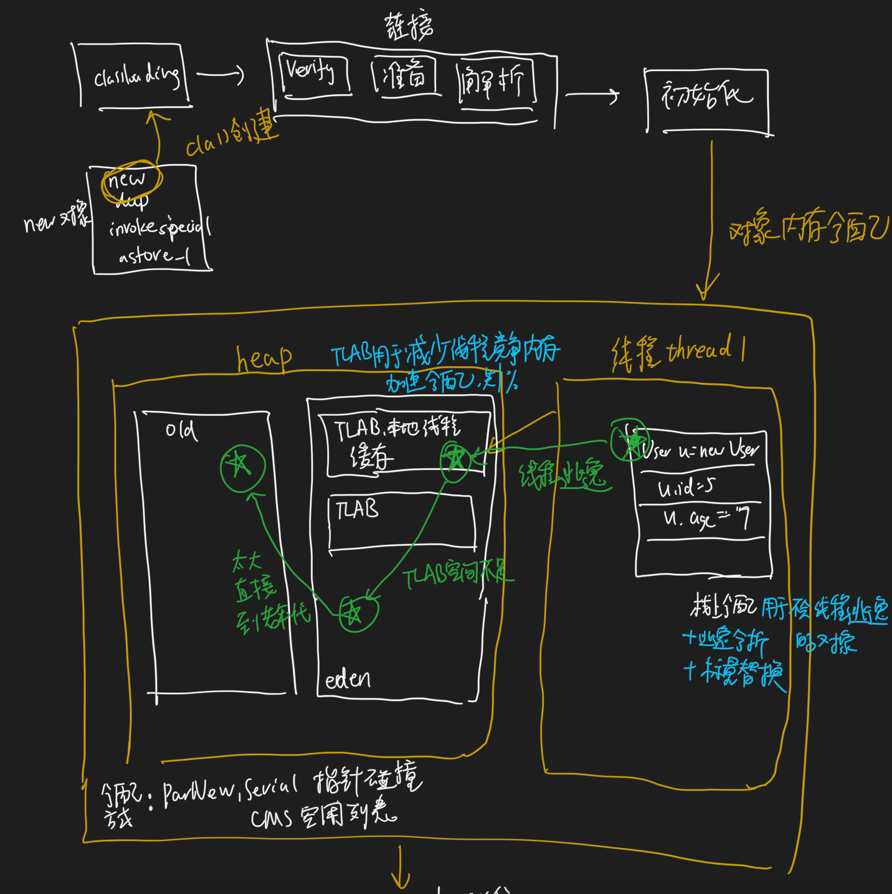
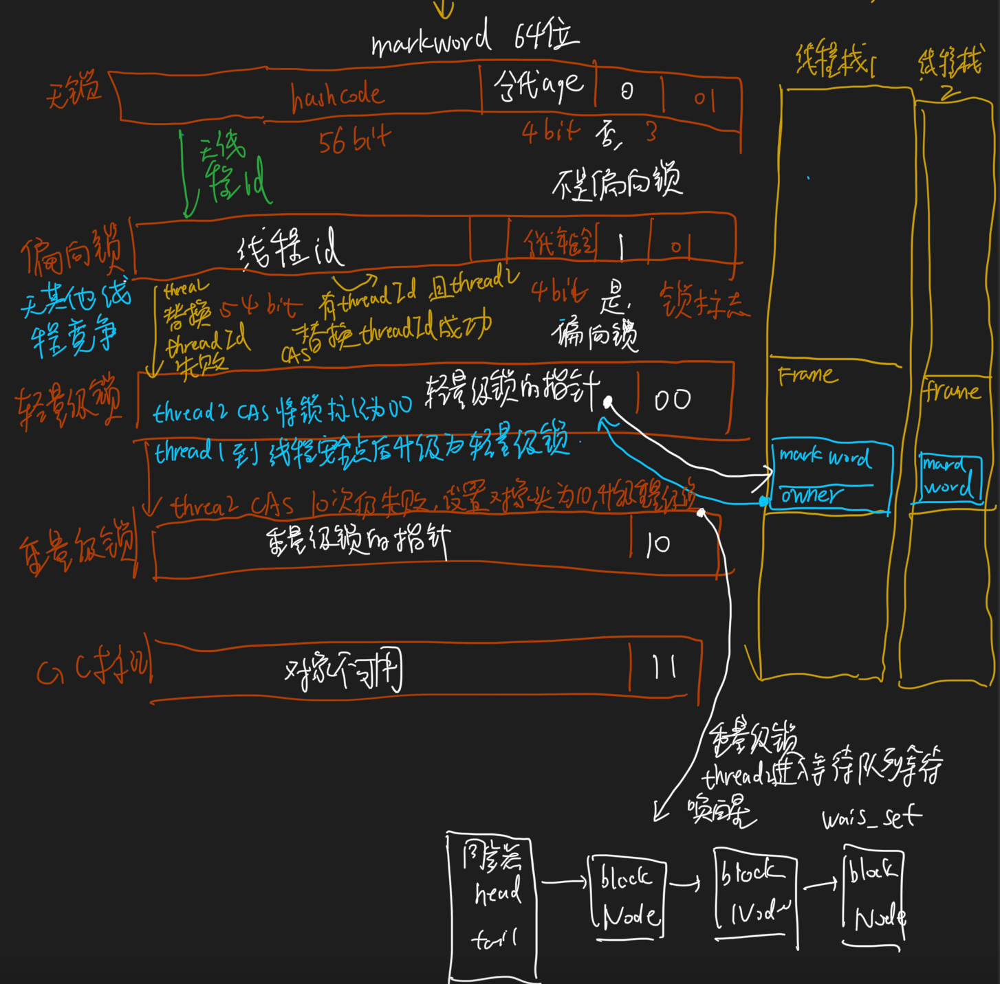
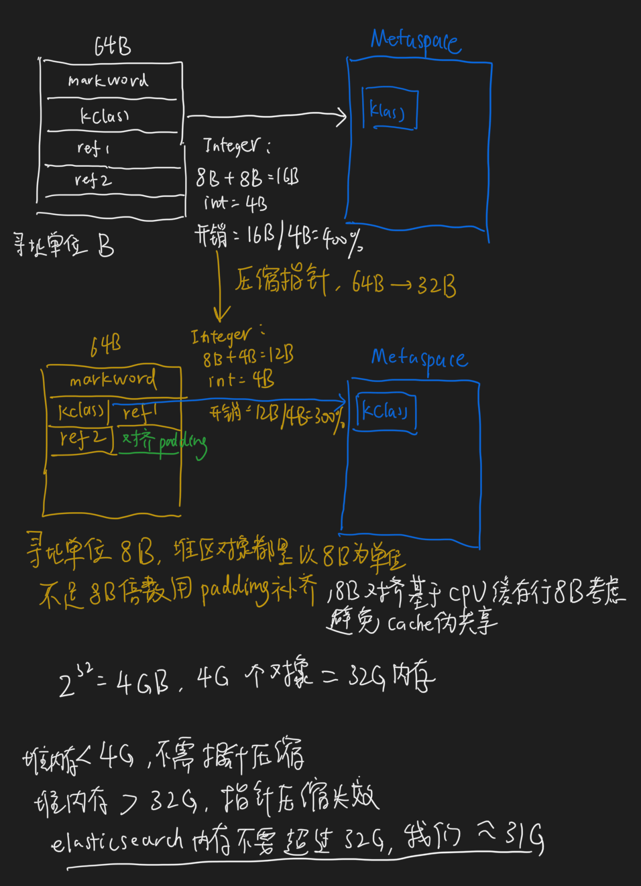
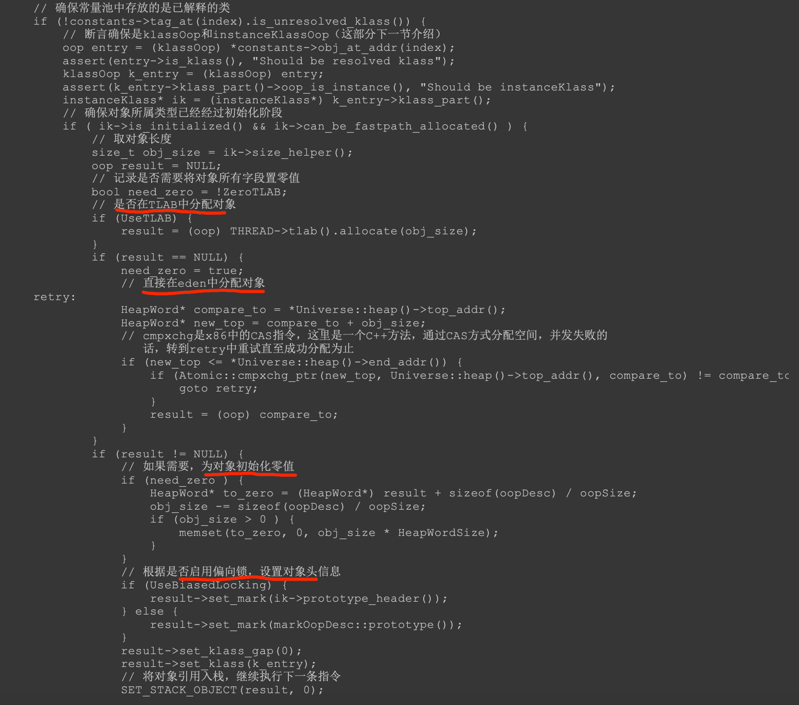
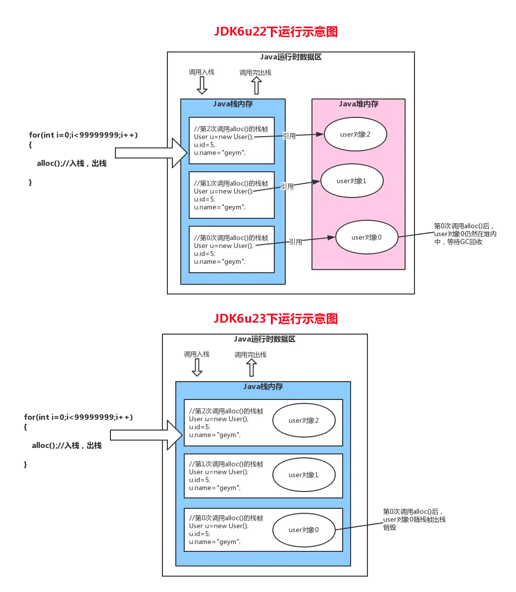
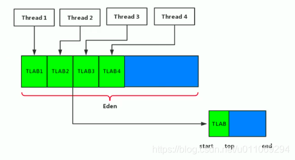
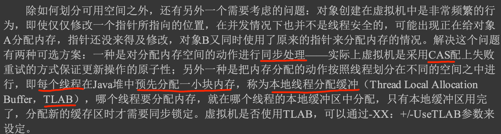
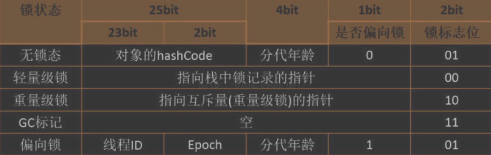
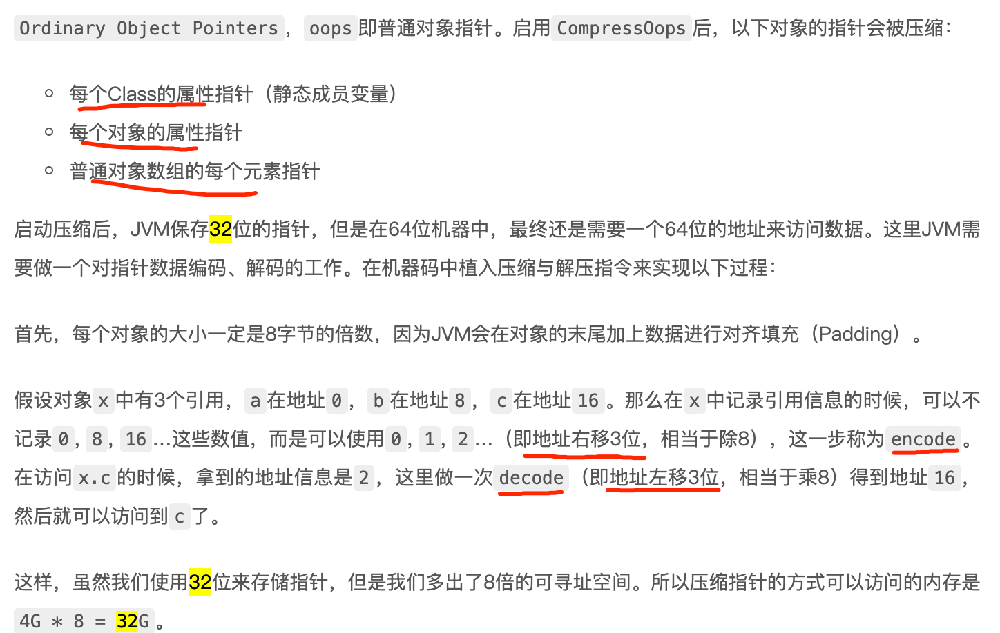

#临界知识
锁状态
GC标记



#内存
#对象创建过程(new指令)
[z_Synchronized问题清单.md]
```asp
1.首先将去检查这个指令的参数是否能在常量池中定位到 一个类的符号引用
2.检查这个符号引用代表的类是否已被加载、解析和初始化过,执行相应的类加载过程

3.为新生对象分配内存,对象所需内存的大小在类加载完成后便可完全确定,为对象分配空间的任务实际上便等同于把一块确定 大小的内存块从Java堆中划分出来
4.当使用Serial、ParNew等带压缩 整理过程的收集器时，系统采用的分配算法是指针碰撞,当使用CM S这种基于清除(Sweep)算法的收集器时,空闲列表来分配内存
5.本地线程分配缓冲,old,eden

6.内存分配完成之后，虚拟机必须将分配到的内存空间(但不包括对象头)都初始化为零值
7.Java虚拟机还要对对象进行必要的设置,类的实例、如何才能找到 类的元数据信息、对象的哈希码、对象的GC分代年龄等,偏向锁等

8.执行<init>()方法,执行invokespecial指令
```

##栈上分配

[](https://segmentfault.com/a/1190000016960388)
##TLAB

[](https://www.cnblogs.com/wuqinglong/p/14583108.html#:~:text=%E6%B3%A8%E6%84%8F%EF%BC%9A%E8%BF%99%E9%87%8CTLAB%20%E7%9A%84%E7%BA%BF%E7%A8%8B,%E5%8C%BA%E5%9F%9F%E4%B8%AD%E5%88%86%E9%85%8D%E5%86%85%E5%AD%98%E8%80%8C%E5%B7%B2%E3%80%82)
[](https://blog.csdn.net/u011069294/article/details/107326055)
XX:TLABWasteTargetPercent
###并发处理(CAS重试,TLAB)

Thread Local Allocation Buffer
```asp
内存分配完成之后，虚拟机必须将分配到的内存空间(但不包括对象头)都初始化为零值，如果 使用了TLAB的话，这一项工作也可以提前至TLAB分配时顺便进行。
这步操作保证了对象的实例字段 在Java代码中可以不赋初始值就直接使用，使程序能访问到这些字段的数据类型所对应的零值
```
###TLAB和栈上分配区别?
这是多线程Allocator的一个优化，试想，多个线程如果同时操控一个堆，如果要在堆上分配对象，那么是不是要加锁（或者原子操作）保证分配的原子性？
每分配一个对象都来个原子操作，那还怎么玩？所以TLAB就是这样一种神奇的存在，每个线程单独持有一个Allocation Buffer，自己玩自己的，当自己的buffer不够的时候，再重新搞一块buffer过来自己用（这时候需要原子操作），通过减少大量的原子操作来提高Allocator的性能
###在TLAB中创建的对象，如何被其他线程共享？
被其他线程共享
[](https://www.cnblogs.com/dyg0826/p/11039964.html)
[](https://www.zhihu.com/question/56538259/answer/149400767)
##内存管理
指针碰撞
空闲链表
#对象分配过程

[z_4_内存管理_00_内存对象分配策略_分配担保_大对象分配_空闲列表_TLAB.md]
#对象布局

##对象头(markword,哈希码,GC分代,偏向锁)


##内存指针压缩(compressed oops）
[](https://blog.wangqi.love/articles/Java/Java%E6%8C%87%E9%92%88%E5%8E%8B%E7%BC%A9.html)
[](https://cloud.tencent.com/developer/article/1863051)
[](https://time.geekbang.org/column/article/13081)

在64位JVM中，这个指针是64位的。当开启Compressed Class Pointers之后，这个指针是32位的，为了找到真正的64位地址，需要加上一个base值

UseCompressedOops
```asp
它的指针不再表示对象在内存中的精确位置，而是表示 偏移量 。这意味着 32 位的指针可以引用 40 亿个 对象 ， 而不是 40 亿个字节。最终， 
也就是说堆内存增长到 32 GB 的物理内存，也可以用 32 位的指针表示。

一旦你越过那个神奇的 ~32 GB 的边界，指针就会切回普通对象的指针。 每个对象的指针都变长了，就会使用更多的 CPU 内存带宽，也就是说你实际上失去了更多的内存。
事实上，当内存到达 40–50 GB 的时候，有效内存才相当于使用内存对象指针压缩技术时候的 32 GB 内存。

这段描述的意思就是说：即便你有足够的内存，也尽量不要 超过 32 GB。因为它浪费了内存，降低了 CPU 的性能，还要让 GC 应对大内存
```

同时在64位平台的HotSpot中使用32位指针(实际存储用64位)，内存使用会多出1.5倍左右，使用较大指针在主内存和缓存之间移动数据，占用较大宽带。

所以为了减少64位平台下内存的消耗，JVM在1.6以后默认启用指针压缩功能


##实例数据
实例数据部分是对象真正存储的有效信息，即我们在程序代码里面所定义的各种类型的字 段内容，无论是从父类继承下来的，还是在子类中定义的字段都必须记录起来
##对齐填充
每个对象都必须要8B的整数倍
##堆大小调优(4G,32G)
```asp
当堆内存小于4G时，不需要启用指针压缩，jvm会直接去除高32位地址，即使用低虚拟地址空间
 
当堆内存大于32G时，压缩指针会失效，会强制使用64位(即8字节)来对java对象寻址， 那这样的话内存占用较大，GC压力等等
```
elasticsearch 32g调优
##cpu cache伪共享
8B,padding
#对象定位
直接指针:没有间接访问,访问速度快
对象句柄:gc回收时不需要更新对象的指针,无需写屏障
#实验测试


[](https://mp.weixin.qq.com/s/kKyJgNzgub4EdG7tkblbvw)
[自己动手写java虚拟机第四章]
[](https://zhuanlan.zhihu.com/p/332248004)
## 对象大小（64位机）

### 观察虚拟机配置

java -XX:+PrintCommandLineFlags -version

### 普通对象

1. 对象头：markword  8
2. ClassPointer指针：-XX:+UseCompressedClassPointers 为4字节 不开启为8字节
3. 实例数据
   1. 引用类型：-XX:+UseCompressedOops 为4字节 不开启为8字节 
      Oops Ordinary Object Pointers
4. Padding对齐，8的倍数

### 数组对象

1. 对象头：markword 8
2. ClassPointer指针同上
3. 数组长度：4字节
4. 数组数据
5. 对齐 8的倍数

## 实验

1. 新建项目ObjectSize （1.8）

2. 创建文件ObjectSizeAgent

   ```java
   package com.mashibing.jvm.agent;
   
   import java.lang.instrument.Instrumentation;
   
   public class ObjectSizeAgent {
       private static Instrumentation inst;
   
       public static void premain(String agentArgs, Instrumentation _inst) {
           inst = _inst;
       }
   
       public static long sizeOf(Object o) {
           return inst.getObjectSize(o);
       }
   }
   ```

3. src目录下创建META-INF/MANIFEST.MF

   ```java
   Manifest-Version: 1.0
   Created-By: mashibing.com
   Premain-Class: com.mashibing.jvm.agent.ObjectSizeAgent
   ```

   注意Premain-Class这行必须是新的一行（回车 + 换行），确认idea不能有任何错误提示

4. 打包jar文件

5. 在需要使用该Agent Jar的项目中引入该Jar包
   project structure - project settings - library 添加该jar包

6. 运行时需要该Agent Jar的类，加入参数：

   ```java
   -javaagent:C:\work\ijprojects\ObjectSize\out\artifacts\ObjectSize_jar\ObjectSize.jar
   ```

7. 如何使用该类：

   ```java
      package com.mashibing.jvm.c3_jmm;
      
      import com.mashibing.jvm.agent.ObjectSizeAgent;
      
      public class T03_SizeOfAnObject {
          public static void main(String[] args) {
              System.out.println(ObjectSizeAgent.sizeOf(new Object()));
              System.out.println(ObjectSizeAgent.sizeOf(new int[] {}));
              System.out.println(ObjectSizeAgent.sizeOf(new P()));
          }
      
          private static class P {
                              //8 _markword
                              //4 _oop指针
              int id;         //4
              String name;    //4
              int age;        //4
      
              byte b1;        //1
              byte b2;        //1
      
              Object o;       //4
              byte b3;        //1
      
          }
      }
   ```

## Hotspot开启内存压缩的规则（64位机）

1. 4G以下，直接砍掉高32位
2. 4G - 32G，默认开启内存压缩 ClassPointers Oops
3. 32G，压缩无效，使用64位
   内存并不是越大越好（^-^）

## IdentityHashCode的问题

回答白马非马的问题：

当一个对象计算过identityHashCode之后，不能进入偏向锁状态

https://cloud.tencent.com/developer/article/1480590
 https://cloud.tencent.com/developer/article/1484167

https://cloud.tencent.com/developer/article/1485795

https://cloud.tencent.com/developer/article/1482500

## 对象定位

•https://blog.csdn.net/clover_lily/article/details/80095580

1. 句柄池
2. 直接指针
