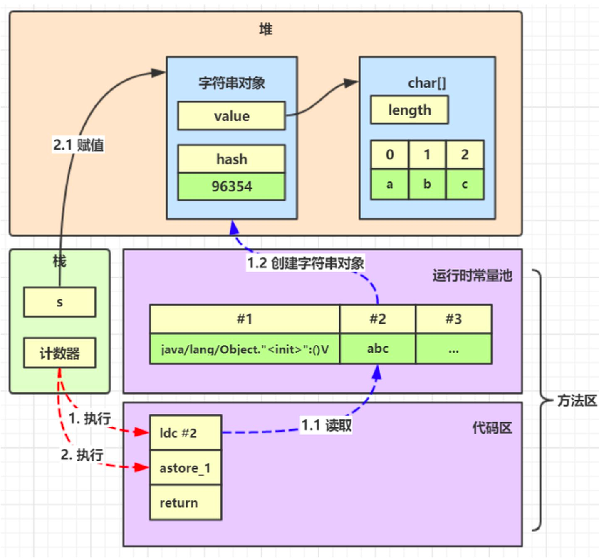
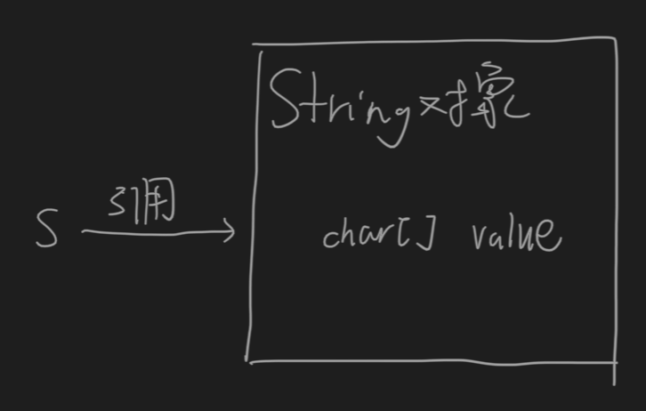
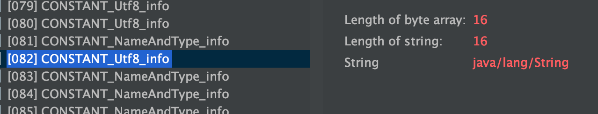
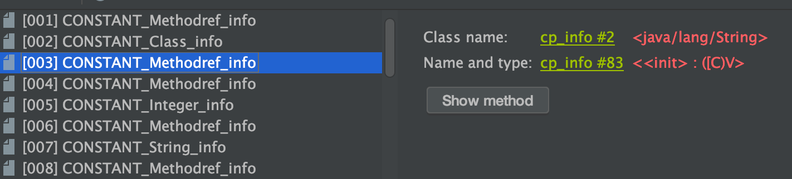
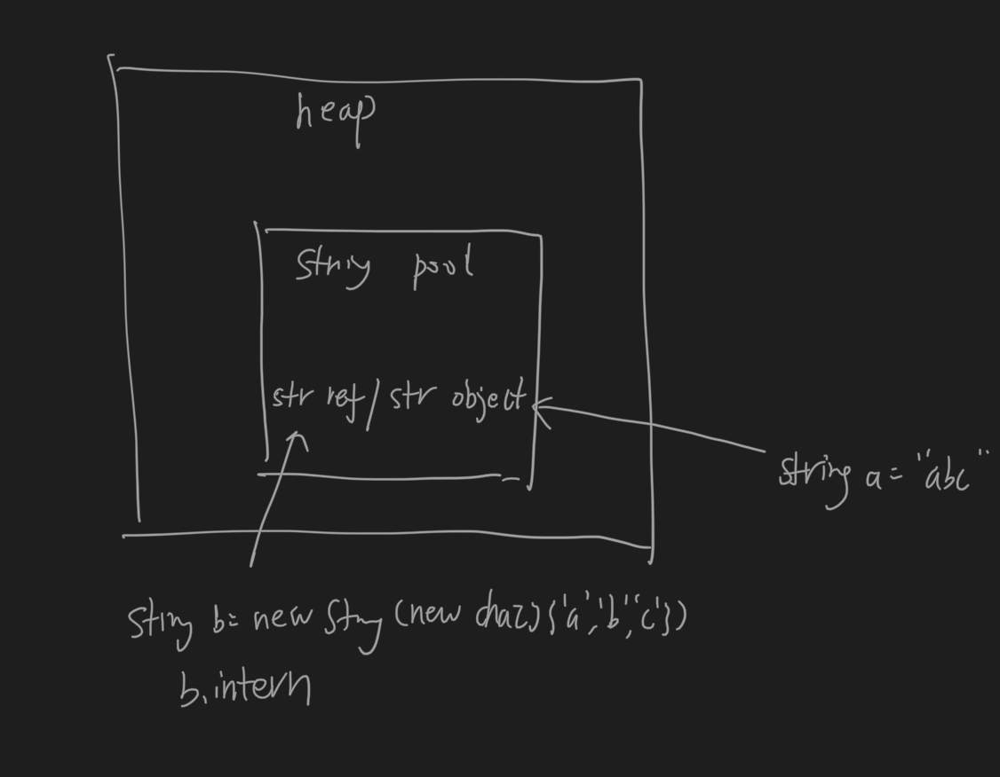
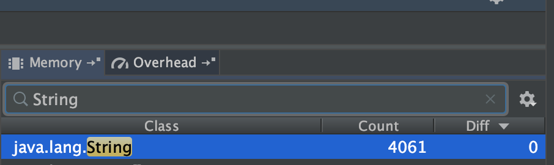
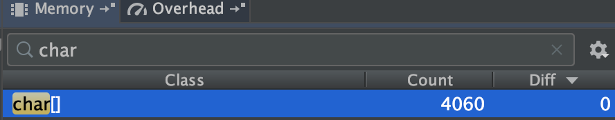
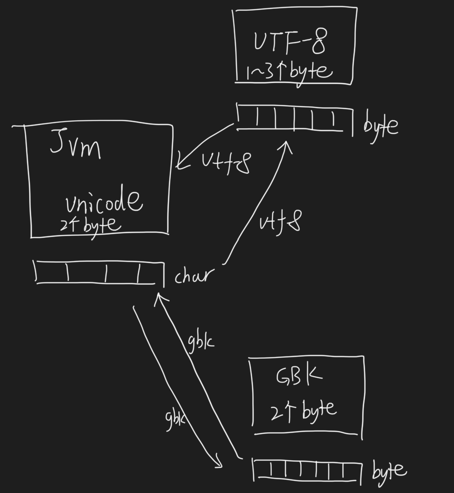
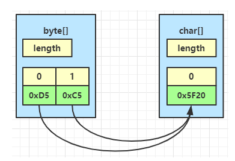
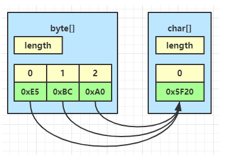

#字符串对象内部拓扑

##字符串字面量

##char数组

##字符串对象
##StringTable

#运行时常量池(native内存,class常量池,symbol table)
每个class file中的常量池constant_pool_info区域在内存中都对应一个自己的数据结构(运行时常量池symbol table)
##符号引用与字面量

字面量  

符号引用  

#字符串常量池(堆,stringTable)

##字符编码
  
gbk->unicode  
  
utf8-unicode  

