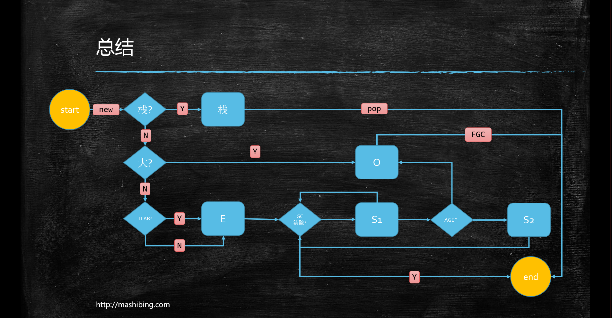
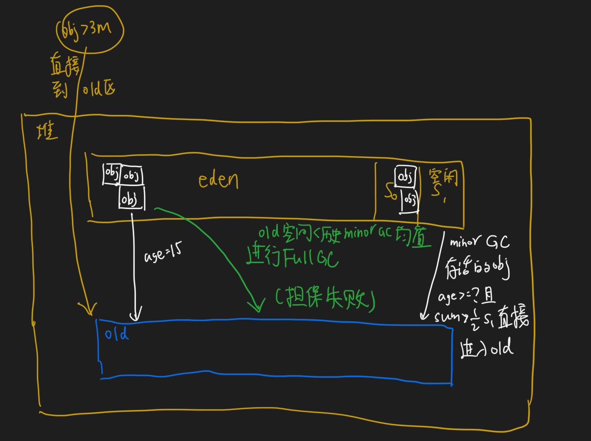
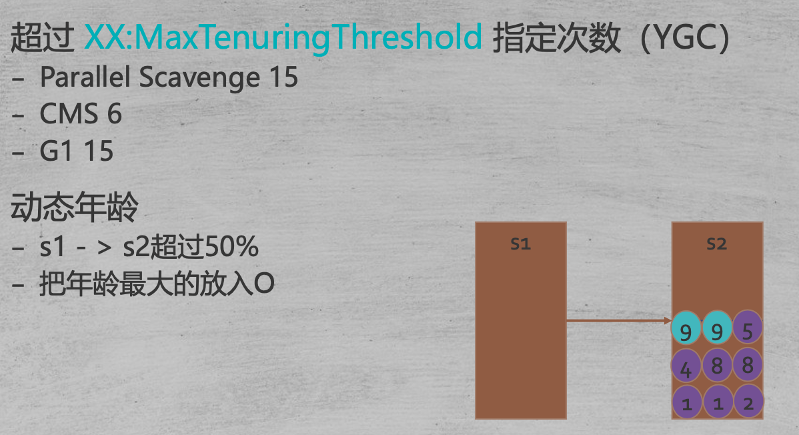
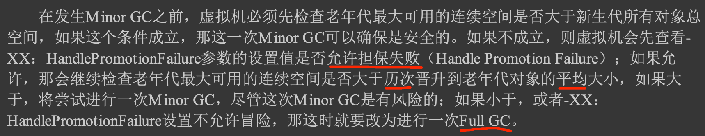

#临界知识


#内存分配策略
##对象分配区域eden vs old
对象优先在Eden分配,象大小超过一定阈值,直接分配在老年代
##大对象直接进入老年代
-XX:PretenureSizeThreshold,3MB
-XX:PretenureSizeThreshold参数只对Serial和ParNew两款新生代收集器有效
##长期存活的对象将进入老年代

虚拟机给每个对象定义了一个对 象年龄(Age)计数器，存储在对象头中
```asp
对象通常在Eden区里诞生，如果经过第一次 Minor GC后仍然存活，并且能被Survivor容纳的话，该对象会被移动到Survivor空间中，并且将其对象 年龄设为1岁。
对象在Survivor区中每熬过一次Minor GC，年龄就增加1岁，当它的年龄增加到一定程 度(默认为15)，就会被晋升到老年代中。对象晋升老年代的年龄阈值，可以通过参数-XX:
M axTenuringThreshold设置
```
##动态对象年龄判定
如果在Survivor空间中相同年龄所有对象大小的总和大于 Survivor空间的一半，年龄大于或等于该年龄的对象就可以直接进入老年代
##空间分配担保(担保失败发生Full GC -> serial old gc)
为了内存利用率， 只使用其中一个Survivor空间来作为轮换备份，因此当出现大量对象在Minor GC后仍然存活的情况 ——最极端的情况就是内存回收后新生代中所有对象都存活，
需要老年代进行分配担保，把Survivor无法容纳的对象直接送入老年代

如果出现了担保失败，那就只好老老实实地重新发起一次Full GC，这样停顿时间就很长了。虽然担保失败时绕的圈子是最大的，
只要老年代的连续空间大于新生代对象总大小或者历次晋升的平均大小，就会进行Minor GC，否则将进行Full GC
```asp
bool TenuredGeneration::promotion_attempt_is_safe(size_t max_promotion_in_bytes) const {
// 老年代最大可用的连续空间
size_t available = max_contiguous_available();
// 每次晋升到老年代的平均大小
size_t av_promo = (size_t)gc_stats()->avg_promoted()->padded_average(); // 老年代可用空间是否大于平均晋升大小，或者老年代可用空间是否大于当此GC时新生代所有对象容量 bool res = (available >= av_promo) || (available >=
max_promotion_in_bytes); return res;
}
```


