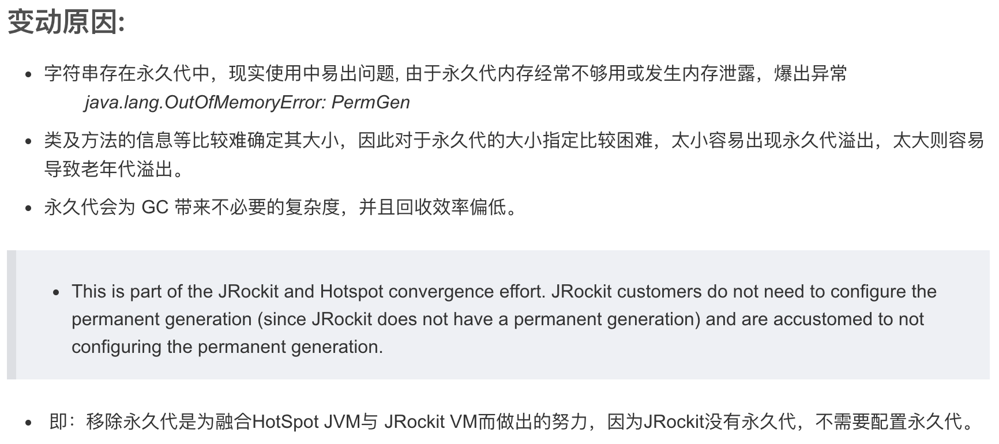
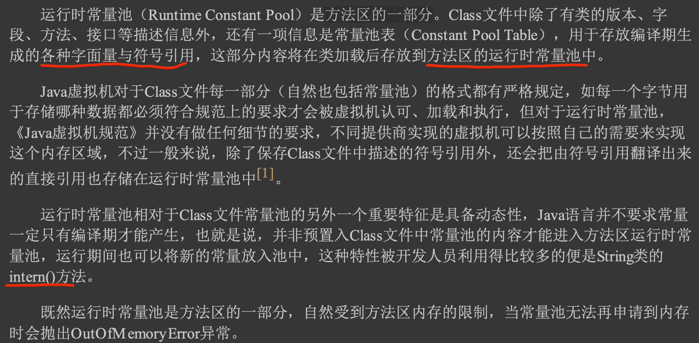

#

#方法私有区
##程序计数器
```asp
字节码的行号指示器
它是程序控制流的指示器，分支、循环、跳转、异常处 理、线程恢复等基础功能都需要依赖这个计数器来完成
一个处理器(对于多核处理器来说是一个内核)都只会执行一条线程中的指令。因 此，为了线程切换后能恢复到正确的执行位置，每条线程都需要有一个独立的程序计数器，
各条线程之间计数器互不影响，独立存储，我们称这类内存区域为“线程私有”的内存

如果线程正在执行的是一个Java方法，这个计数器记录的是正在执行的虚拟机字节码指令的地 址;如果正在执行的是本地(N at ive)方法，
这个计数器值则应为空(Undefined)
```
##Java虚拟机栈

###局部变量表
```asp
局部变量表存放了编译期可知的各种Java虚拟机基本数据类型(boolean、byte、char、short、int、 float、long、double)、对象引用(reference类型，
它并不等同于对象本身，可能是一个指向对象起始 地址的引用指针，也可能是指向一个代表对象的句柄或者其他与此对象相关的位置)和returnAddress 类型(指向了一条字节码指令的地址)
局部变量槽(Slot)
其中64位长度的long和 double类型的数据会占用两个变量槽,其余的数据类型只占用一个

局部变量表所需的内存空间在编 译期间完成分配，当进入一个方法时，这个方法需要在栈帧中分配多大的局部变量空间是完全确定 的，在方法运行期间不会改变局部变量表的大小。
请读者注意，这里说的“大小”是指变量槽的数量， 虚拟机真正使用多大的内存空间(譬如按照1个变量槽占用32个比特、64个比特，或者更多)来实现一 个变量槽，
这是完全由具体的虚拟机实现自行决定的事情。

如果线程请求的栈深度大于虚 拟机所允许的深度，将抛出StackOverflowError异常
```
###操作数栈
###动态连接
###方法出口
##本地方法栈
JINI,甚至有的Java虚拟机(譬如Hot-Spot虚拟机)直接 就把本地方法栈和虚拟机栈合二为一
##TLAB(Thread Local Allocation Buffer)

#java堆(除了JIT逃逸分析可能栈上分配)
Java 世界里“几乎”所有的对象实例都在这里分配内存
JIT逃逸分析技术,栈上分配、标量替换优化手段已经导致一些微妙 的变化悄然发生，所以说Java对象实例都分配在堆上也渐渐变得不是那么绝对了
[z_2_编译_05_后端编译_编译期优化.md]
不过无论从什么角度，无论如 何划分，都不会改变Java堆中存储内容的共性，无论是哪个区域，存储的都只能是对象的实例，
将Java 堆细分的目的只是为了更好地回收内存，或者更快地分配内存
[z_4_内存管理_02_gc_垃圾回收理论_标记算法_回收算法_垃圾回收器_分代回收_局部回收.md]
##新生代、老年代

#方法区(逻辑概念,jdk1.7永久代堆中(class,运行时常量池) -> jdk1.8，元空间直接内存中(class,运行时常量池))

##类及方法属性信息(方法区的一部分,直接内存)
元空间的大小仅受本地内存限制，通过 -XX:MetaspaceSize 和 -XX:MaxMetaspaceSize 来指定元空间的大小
MetaSpace存储类的元数据，MetaSpace直接申请在本地内存中（Native memory）

当年使用永久代来实现方法区的决定并不是一个好主意，这种设计导致了Java应用更容易遇到 内存溢出的问题
把原本放在永久代的字符串常量池、静态变量等移出，把JDK 7中永久代还剩余的内容(主要是类型信息)全部移到元空间中
```asp
方法区垃圾收集 的“性价比”通常也是比较低的:在Java堆中，尤其是在新生代中，对常规应用进行一次垃圾收集通常 可以回收70%至99%的内存空间，
相比之下，方法区回收囿于苛刻的判定条件，其区域垃圾收集的回 收成果往往远低于此。
```
##运行时常量池(方法区的一部分,直接内存)
存放编译期生 成的各种字面量与符号引用，这部分内容将在类加载后存放到方法区的运行时常量池中
```
已经没有任何字符串对象引用 常量池中的“ java”常量，且虚拟机中也没有其他地方引用这个字面量。如果在这时发生内存回收，
而且 垃圾收集器判断确有必要的话，这个“ java”常量就将会被系统清理出常量池
```


#字符串常量池(堆中)
[z_3_运行时_05_class常量池_运行时常量池_字符串对象常量池.md]
#直接内存
这样能在一些场景中显著提高性能，因为避免了 在Java堆和N at ive堆中来回复制数据。


