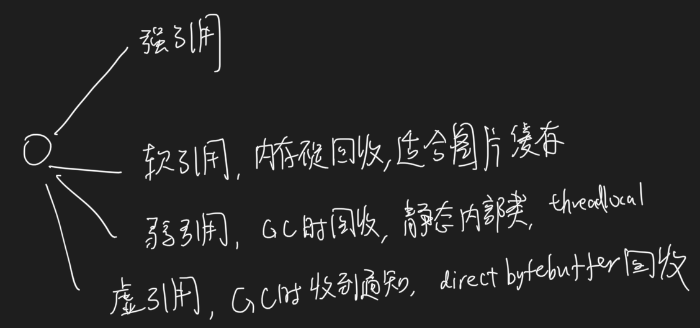

#引用

##强引用
无论任何情况下，只要强引用关系还存在，垃圾收集器就永远不会回 收掉被引用的对象
##软引用
只被软引用关联着的对象，在系统将要发生内 存溢出异常前，会把这些对象列进回收范围之中进行第二次回收，如果这次回收还没有足够的内存， 才会抛出内存溢出异常
###应用场景
软引用可以用来实现内存敏感的高速缓存,适用于网页缓存、图片缓存，防止内存溢出，在内存充足的时候，缓存对象会一直存在，
在内存不足的时候，缓存对象占用的内存会被垃圾收集器回收
##弱引用
弱引用也是用来描述那些非必须对象，但是它的强度比软引用更弱一些，被弱引用关联的对象只 能生存到下一次垃圾收集发生为止。当垃圾收集器开始工作，无论当前内存是否足够，都会回收掉只 被弱引用关联的对象。
[](https://blog.csdn.net/lp15929801907/article/details/109459513)
###应用场景
弱引用用于生命周期更短的，对内存更敏感的场景中
1.静态内部类中(普通内部类会持有this指针)，经常会使用虚引用,避免内存泄露
2.threadlocal避免key内存泄露
```asp
public class Main {
    public static void main(String[] args) {

        A a = new A();
        B b = new B(a);
        a = null;
        System.gc();
        System.out.println(b.getA());  // null
    }
}

class A {}

class B {

    WeakReference<A> weakReference;
    public B(A a) {
        weakReference = new WeakReference<>(a);
    }

    public A getA() {
        return weakReference.get();
    }
}


```
##虚引用

虚引用也称为“幽灵引用”或者“幻影引用”，它是最弱的一种引用关系。一个对象是否有虚引用的 存在，完全不会对其生存时间构成影响，也无法通过虚引用来取得一个对象实例。
为一个对象设置虚 引用关联的唯一目的只是为了能在这个对象被收集器回收时收到一个系统通知
在这个对象被垃圾收集器回收时收到一个系统通知,可以利用虚引用来做一些对象销毁前的操作，如资源释放等。
###应用场景
判断一个对象是否被垃圾回收了，跟踪对象被垃圾回收回收的活动。
直接内存的回收DirectByteBuffer
会创建一个 PhantomReference 的子类Cleaner的虚引用实例用来引用该 DirectByteBuffer 实例，Cleaner 创建时会添加一个 Runnable 实例，
当被引用的 DirectByteBuffer 对象不可达被垃圾回收时，将会执行 Cleaner 实例内部的 Runnable 实例的 run 方法，用来回收堆外资源。
```asp
private static class Deallocator
        implements Runnable
    {

        private static Unsafe unsafe = Unsafe.getUnsafe();

        private long address;
        private long size;
        private int capacity;

        private Deallocator(long address, long size, int capacity) {
            assert (address != 0);
            this.address = address;
            this.size = size;
            this.capacity = capacity;
        }

        public void run() {
            if (address == 0) {
                // Paranoia
                return;
            }
            unsafe.freeMemory(address);
            address = 0;
            Bits.unreserveMemory(size, capacity);
        }

    }
```
#二次标记回收

