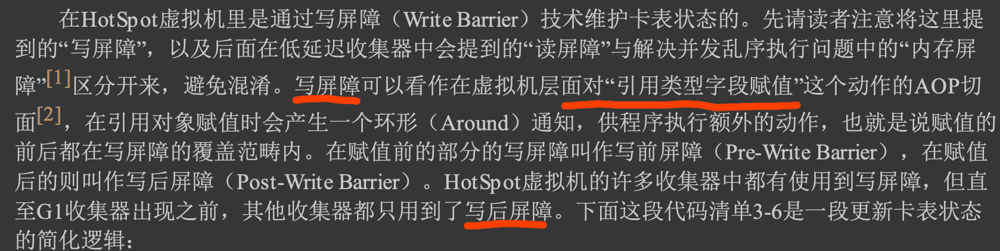

#临界知识
垃圾回收器演变
内存保护陷阱trap vs interrupt中断[z_cpu_中断系统_trap陷阱_硬中断_软中断_异常.md]

#标记算法
##可达性分析算法
```asp
通过 一系列称为“GC Roots”的根对象作为起始节点集，从这些节点开始，根据引用关系向下搜索，搜索过 程所走过的路径称为“引用链”(Reference Chain)，
如果某个对象到GC Roots间没有任何引用链相连， 或者用图论的话来说就是从GC Roots到这个对象不可达时，则证明此对象是不可能再被使用的
```
##GC ROOTS
固定可作为GC Roots的节点主要在全局性的引用(例如常量或类静态属性)与执行上下文(例如 栈帧中的本地变量表)中

```asp
System Class
Class loaded by bootstrap/system class loader. For example, everything from the rt.jar like java.util.* .
```

```asp
JNI Local
Local variable in native code, such as user defined JNI code or JVM internal code.

JNI Global
Global variable in native code, such as user defined JNI code or JVM internal code.
```

```asp
Thread
A started, but not stopped, thread.

Java Local
Local variable. For example, input parameters or locally created objects of methods that are still in the stack of a thread.
```


#分代管理理论
##新生代
大多数对象存活时间短，难以熬过垃圾收集过程，每次回收时只关注如何保留少量存活
##老年代
少数对象存活时间长，那把它们集中放在一块， 虚拟机便可以使用较低的频率来回收这个区域
##跨代引用假说(记忆集)
假如要现在进行一次只局限于新生代区域内的收集(Minor GC)，但新生代中的对象是完全有可 能被老年代所引用的，为了找出该区域中的存活对象，不得不在固定的GC Roots之外，再额外遍历整
个老年代中所有对象来确保可达性分析结果的正确性，反过来也是一样

对象不是孤立的，对象之间会存在跨代引用
```asp
这其实是可根据前两条假说逻辑推理得出的隐含推论:存在互相引用关系的两个对象，是应该倾
向于同时生存或者同时消亡的。举个例子，如果某个新生代对象存在跨代引用，由于老年代对象难以
消亡，该引用会使得新生代对象在收集时同样得以存活，进而在年龄增长之后晋升到老年代中，这时
跨代引用也随即被消除了。
依据这条假说，我们就不应再为了少量的跨代引用去扫描整个老年代，也不必浪费空间专门记录 每一个对象是否存在及存在哪些跨代引用，
只需在新生代上建立一个全局的数据结构(该结构被称 为“记忆集”，Remembered Set)，这个结构把老年代划分成若干小块，标识出老年代的哪一块内存会 
存在跨代引用。此后当发生Minor GC时，只有包含了跨代引用的小块内存里的对象才会被加入到GC Roots进行扫描。虽然这种方法需要在对象改变引用关系
(如将自己或者某个属性赋值)时维护记录数 据的正确性，会增加一些运行时的开销，但比起收集时扫描整个老年代来说仍然是划算的
```
#垃圾收集算法
##标记-清除算法(最基础,CM S收集器则是基于标记-清除算法,响应时间)
产生大 量不连续的内存碎片，空间碎片太多可能会导致当以后在程序运行过程中需要分配较大对象时无法找 到足够的连续内存而不得不提前触发另一次垃圾收集动作

##标记-复制算法(新生代,标记-整理的特例,90%可用,如果10%装不下,进行分配担保)

新生代中的对象有98%熬不过第一轮收集。因此 并不需要按照1∶1的比例来划分新生代的内存空间
把新生代分为一块较大的Eden空间和两块较小的 Survivor空间，每次分配内存只使用Eden和其中一块Survivor
发生垃圾搜集时，将Eden和Survivor中仍 然存活的对象一次性复制到另外一块Survivor空间上，然后直接清理掉Eden和已用过的那块Survivor空
间。HotSpot虚拟机默认Eden和Survivor的大小比例是8∶1，也即每次新生代中可用内存空间为整个新 生代容量的90%(Eden的80%加上一个Survivor的10%)
###为什么需要两个s区?
1.新生代基于标记-复制算法,至少需要两个区域,一个干净区域用于复制
2.理论上新生代中的对象有98%熬不过第一轮收集,干净区域可以只占10%,增大可使用区域
3.可使用区域未eden+from,干净区域为to,使得复制算法的利用率可以达到90%
[](https://www.nowcoder.com/discuss/595734?type=1&channel=-1&source_id=discuss_center_discuss_hot_nctrack)
###分配担保
```asp
98%的对象可被回收仅仅是“普通场景”下测得的数据，任何人都没有办法百分百 保证每次回收都只有不多于10%的对象存活，因此Appel式回收还有一个充当
罕见情况的“逃生门”的安 全设计，当Survivor空间不足以容纳一次Minor GC之后存活的对象时，就需要依赖其他内存区域(实 际上大多就是老年代)
进行分配担保(Handle Promotion)

内存的分配担保好比我们去银行借款，如果我们信誉很好，在98%的情况下都能按时偿还，于是 银行可能会默认我们下一次也能按时按量地偿还贷款，只需要
有一个担保人能保证如果我不能还款 时，可以从他的账户扣钱，那银行就认为没有什么风险了。内存的分配担保也一样，如果另外一块 Survivor空间没有
足够空间存放上一次新生代收集下来的存活对象，这些对象便将通过分配担保机制直 接进入老年代，这对虚拟机来说就是安全的。关于对新生代进行分配担保的内容
```
##标记-整理算法(老年代,移动式,Stop The World,Parallel Scavenge收集器是基于标记-整理算法,吞吐)
```asp
如果移动存活对象，尤其是在老年代这种每次回收都有大量对象存活区域，移动存活对象并更新
所有引用这些对象的地方将会是一种极为负重的操作，而且这种对象移动操作必须全程暂停用户应用程序才能进行[1]，
这就更加让使用者不得不小心翼翼地权衡其弊端了，像这样的停顿被最初的虚拟机 设计者形象地描述为“Stop The World”

但从整个程序的吞吐量来看，移动对象会更划
```


#算法实现
##根节点枚举(OopMap,加快根节点枚举)

###OopMap(记录代码中寄存器和栈中的对象指针)
```asp
一旦类加载动作完成的时候， HotSpot就会把对象内什么偏移量上是什么类型的数据计算出来，在即时编译(见第11章)过程中，也 会在特定的位置记录
下栈里和寄存器里哪些位置是引用。这样收集器在扫描时就可以直接得知这些信 息了，并不需要真正一个不漏地从方法区等GC Roots开始查找
```

##安全点
```asp
在OopMap的协助下，HotSpot可以快速准确地完成GC Roots枚举，但一个很现实的问题随之而 来:可能导致引用关系变化，或者说导致OopMap内容变化的指令非常多，
如果为每一条指令都生成 对应的OopMap，那将会需要大量的额外存储空间，这样垃圾收集伴随而来的空间成本就会变得无法 忍受的高昂。
```
###为啥需要安全点
```asp
实际上HotSpot也的确没有为每条指令都生成OopMap，前面已经提到，只是在“特定的位置”记录 了这些信息，这些位置被称为安全点(Safep oint)。
有了安全点的设定，也就决定了用户程序执行时 并非在代码指令流的任意位置都能够停顿下来开始垃圾收集，而是强制要求必须执行到达安全点后才 能够暂停。
因此，安全点的选定既不能太少以至于让收集器等待时间过长，也不能太过频繁以至于过 分增大运行时的内存负荷。
```
###哪些指令作为安全点
```asp
安全点位置的选取基本上是以“是否具有让程序长时间执行的特征”为标准 进行选定的，因为每条指令执行的时间都非常短暂，程序不太可能因为指令流长度太
长这样的原因而 长时间执行，“长时间执行”的最明显特征就是指令序列的复用，例如方法调用、循环跳转、异常跳转 等都属于指令序列复用，所以只有具有这些功能的指令才会产生安全点
```

###如何让JVM中所有线程跑到安全点(主动式中断,内存保护陷阱trap,X86 test指令逻辑与,自陷异常信号,陷阱处理程序)
```asp
test %eax,0x01b6d62d
```
[内存只读](https://blog.51cto.com/sunzeduo/1329134)
[陷阱](https://www.tl80.cn/article/202121)

[](https://time.geekbang.org/column/article/103717)
[z_cpu_中断系统_trap陷阱_硬中断_软中断_异常.md]

##安全区(用户线程处于Sleep 状态或者Blocked状态,用关系不会发生变化)
```asp
用户线程处于Sleep 状态或者Blocked状态，这时候线程无法响应虚拟机的中断请求，不能再走 到安全的地方去中断挂起自己，虚拟机也显然不可能持续
等待线程重新被激活分配处理器时间。对于 这种情况，就必须引入安全区域(Safe Region)来解决
```

##记忆集与卡表(稀疏记录,卡页)
```asp
所有涉及部分区域收集(Partial GC)行为的 垃 圾 收 集 器都需要记忆集
记忆集记录从非收集区域指向收集区域的指针集合的抽象数据结构
记录全部含跨代引用对象的实现方案，无论是空间占用还是维护成本都相当高昂
收集器只需要通过记忆集判断出某一块非收集区域是否存在有指向了收集区域的指针
就可以了，并不需要了解这些跨代指针的全部细节
```

```asp
卡表就是记忆集的一种具体实现，它定义了记忆集的记录精度、与堆内存的映射关系
关于卡表与记忆集的关系，读者不妨按照Java语言中HashMap与Map的关系来类比理解
一个卡页的内存中通常包含不止一个对象，只要卡页内有一个(或更多)对象的字段存在着跨代 指针，那就将对应卡表的数组元素的值标识为1，称为这个元素变脏(Dirty)，
没有则标识为0。在垃 圾收集发生时，只要筛选出卡表中变脏的元素，就能轻易得出哪些卡页内存块中包含跨代指针，把它 们加入GC Roots中一并扫描
```


##写屏障(卡表更新)

###解释器
假如是解释执行的字节码，那相对好处理，虚拟 机负责每条字节码指令的执行，有充分的介入空间
###编译执行JIT
经过即时编译后的代 码已经是纯粹的机器指令流了，这就必须找到一个在机器码层面的手段，把维护卡表的动作放到每一 个赋值操作之中。
###写屏障
卡表元素何时变脏的答案是很明确的——有其他分代区域中对象引用了本区域对象时，其对应的 卡表元素就应该变脏，变脏时间点原则上应该发生在引用类型字段赋值的那一刻。但问题是如何变 脏，即如何在对象赋值的那一刻去更新维护卡表呢

```asp
void oop_field_store(oop* field, oop new_value) { // 引用字段赋值操作
*field = new_value;
// 写后屏障，在这里完成卡表状态更新 
post_write_barrier(field, new_value);
}
```
```asp
应用写屏障后，虚拟机就会为所有赋值操作生成相应的指令，一旦收集器在写屏障中增加了更新 卡表操作，无论更新的是不是老年代对新生代对象的引用，
每次只要对引用进行更新，就会产生额外 的开销，不过这个开销与Minor GC时扫描整个老年代的代价相比还是低得多的
```
###伪共享

```asp
在JDK 7之后，HotSpot虚拟机增加了一个新的参数-XX:+UseCondCardMark，用来决定是否开启 卡表更新的条件判断。开启会增加一次额外判断的开销，
但能够避免伪共享问题，两者各有性能损 耗，是否打开要根据应用实际运行情况来进行测试权衡
```
##并发的可达性分析(三色标记,CMS是基于增量更新)
```asp
·赋值器插入了一条或多条从黑色对象到白色对象的新引用; 
·赋值器删除了全部从灰色对象到该白色对象的直接或间接引用。
```
###增量更新(CMS)
```asp
增量更新要破坏的是第一个条件，当黑色对象插入新的指向白色对象的引用关系时，就将这个新
插入的引用记录下来，等并发扫描结束之后，再将这些记录过的引用关系中的黑色对象为根，重新扫
描一次。这可以简化理解为，黑色对象一旦新插入了指向白色对象的引用之后，它就变回灰色对象
了
```
###原始快照()
无论引用关系删除与否，都会按照刚刚开始扫描那一刻的对象图快照来进行搜索

###为什么G1用SATB？CMS用增量更新
```asp
SATB相对增量更新效率会高(当然SATB可能造成更多的浮动垃圾)，因为不需要在重新标记阶段再次深度扫描被删除引用对象，而CMS对增量引用的根对象会做深度扫描，
G1因为很多对象都位于不同的region，CMS就一块老年代区域，重新深度扫描对象的话G1的代价会比CMS高，所以G1选择SATB不深度扫描对象，只是简单标记，等到下一轮GC再深度扫描。
```
#分代回收实现类型
##Minor GC(Young GC)
只是新生代的垃圾收集
##Major GC(Old GC)
指目标只是老年代的垃圾收集。目前只有CMS收集器会有单 独收集老年代的行为,按上下文区分到底是指老年代的收集还是整堆收集
##Mixed GC
目标是收集整个新生代以及部分老年代的垃圾收集。目前只有G1收 集器会有这种行为
##Full GC
收集整个Java堆和方法区的垃圾收集
#回收算法优化方向/考虑维度
##响应时间(延时)
##吞吐量
##并发执行
##并行执行
##局部回收理论
为了避免GC Roots包含过多对 象而过度膨胀，它们在实现上也做出了各种优化处理
##GC时间
[](https://cloud.tencent.com/developer/article/1491229)


#垃圾回收器
##Parallel Scavenge
Parallel Scavenge基于标记-整理算法
##CM S收集器
基于标记-清除算法&基于标记-整理算法
```asp
让虚 拟机平时多数时间都采用标记-清除算法，暂时容忍内存碎片的存在，直到内存空间的碎片化程度已经 大到影响对象分配时，再采用标记-整理算法收集一次，
以获得规整的内存空间。前面提到的基于标 记-清除算法的CM S收集器面临空间碎片过多时采用的就是这种处理办法
```
##ZGC
使用读屏障(Read Barrier)技术实现了整理过程与用户线程的并发 执行

#总结
##需要STOP THE WORLD的过程
###枚举根节点
```asp
但根节点枚举始终还 是必须在一个能保障一致性的快照中才得以进行——这里“一致性”的意思是整个枚举期间执行子系统 看起来就像被冻结在某个时间点上，
不会出现分析过程中，根节点集合的对象引用关系还在不断变化 的情况，若这点不能满足的话，分析结果准确性也就无法保证。这是导致垃圾收集过程必须停顿所有
用户线程的其中一个重要原因，即使是号称停顿时间可控，或者(几乎)不会发生停顿的CM S、G1、 ZGC等收集器，枚举根节点时也是必须要停顿的。
```
###标记-复制的复制过程(时间短)
###标记-整理的移动过程(时间长)
