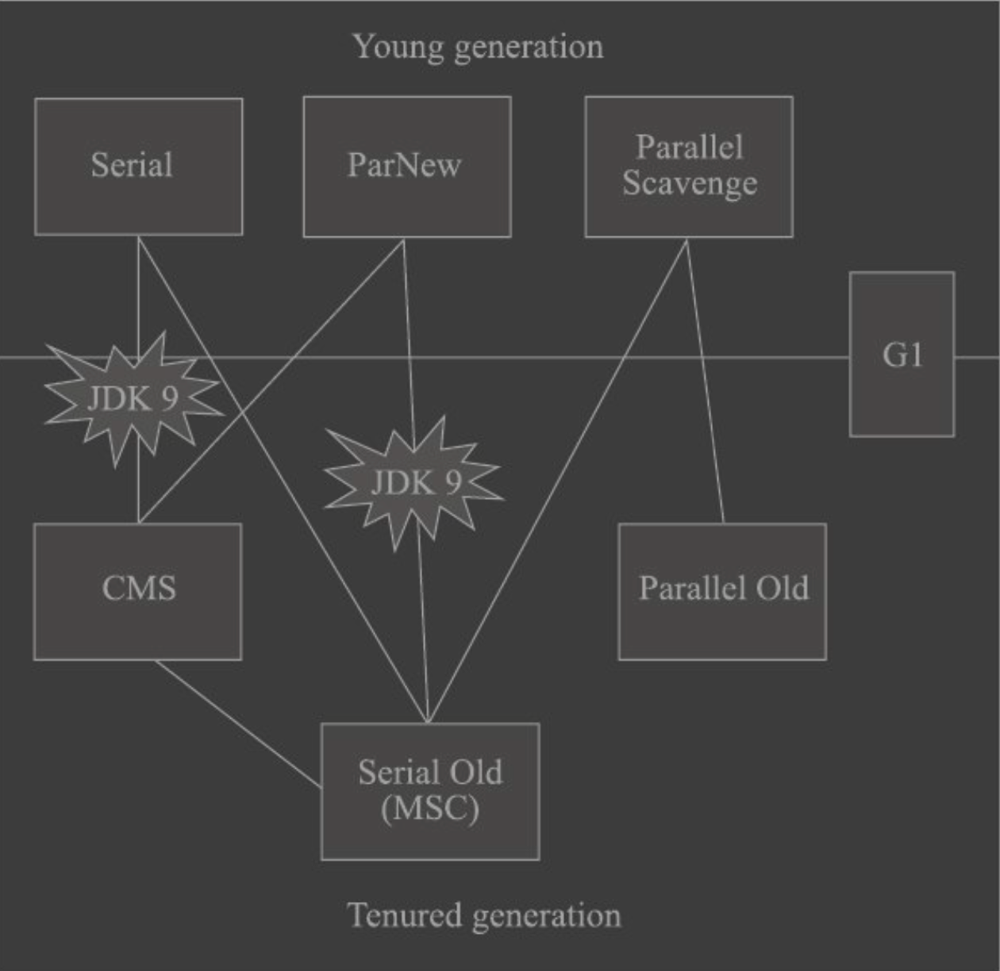
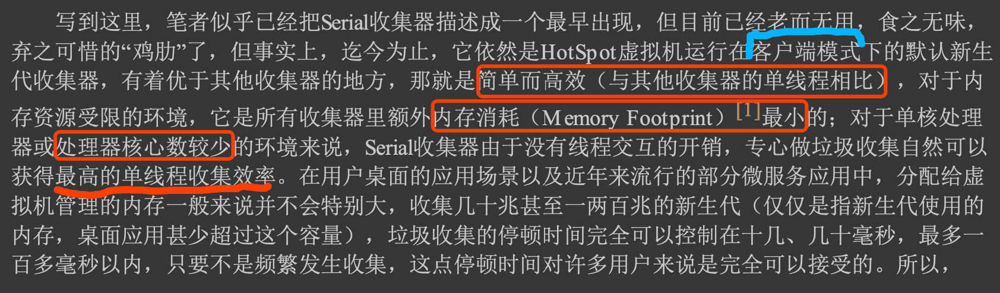
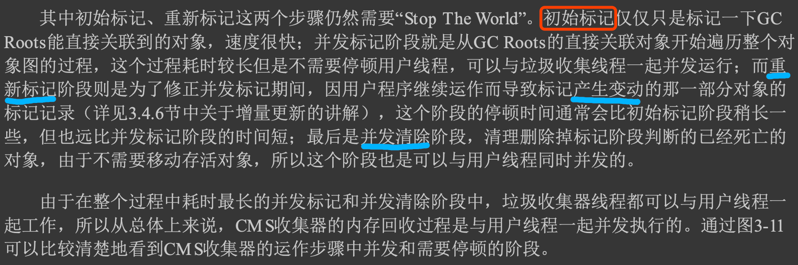
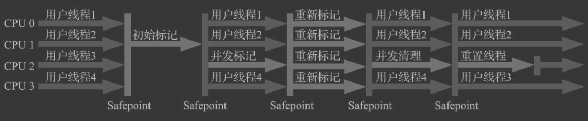
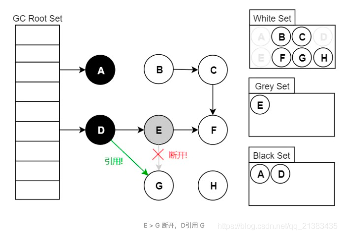
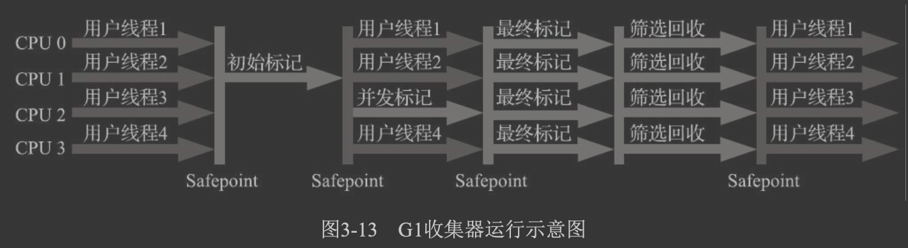
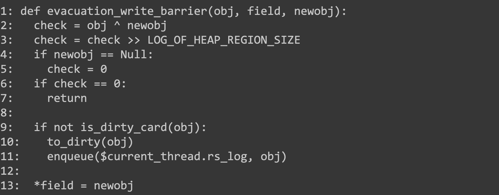
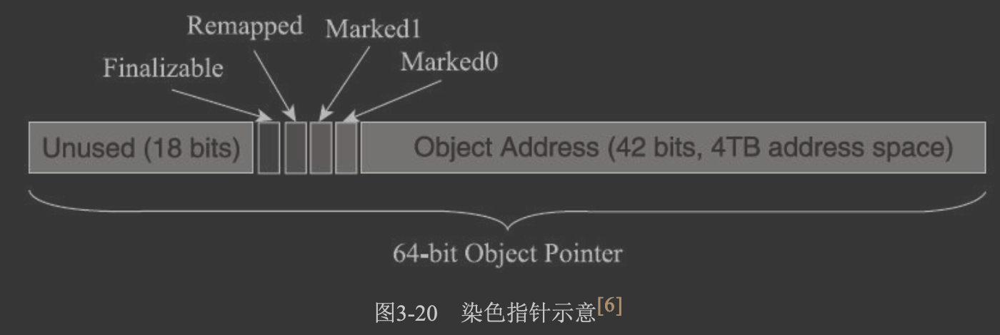
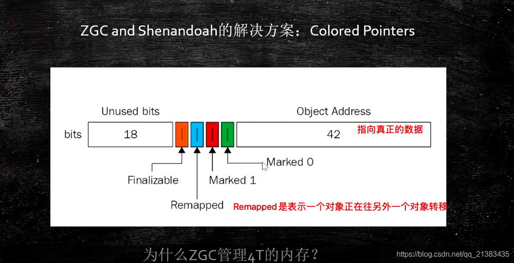

#临界知识
记忆集&卡表,卡页
标记过程并发化,复制过程并发化
安全点&安全区
并发标记(漏标)并发复制(),三色标记,颜色指针,读写屏障
ZGC支持NUMA机制
GC对象状态,serial/parNew/parallel/serial Old/parallel old对象头,G1 bitmap,zgc 颜色指针
cpu 64位,寻址范围48位, 4位颜色指针,44位地址4TB,mmap虚拟地址映射技术

#常用垃圾回收器组合
Serial + Serial Old
ParNew + CMS
PS +  Serial Old/
G1
#Serial收集器(标记-复制)
单线程工作的收集器,但它的“单线 程”的意义并不仅仅是说明它只会使用一个处理器或一条收集线程去完成垃圾收集工作，更重要的是强 调在它进行垃圾收集时，
必须暂停其他所有工作线程，直到它收集结束

它依然是HotSpot虚拟机运行在客户端模式下的默认新生 代收集器，有着优于其他收集器的地方，那就是简单而高效

Serial收集器对于运行在客户端模式下的虚拟机来说是一个很好的选择
#ParNew收集器(标记-复制)

ParNew收集器除了支持多线程并行收集之外，其他与Serial收集器相比并没有太多创新之处，但它 却是不少运行在服务端模式下的HotSpot虚拟机，
尤其是JDK 7之前的遗留系统中首选的新生代收集 器，其中有一个与功能、性能无关但其实很重要的原因是:除了Serial收集器外，目前只有它能与CM S 收集器配合工作
ParNew收集器在单核心处理器的环境中绝对不会有比Serial收集器更好的效果，甚至由于存在线程 交互的开销，该收集器在通过超线程(Hyper-Threading)技术实现的伪双核处理器环境中都不能百分
之百保证超越Serial收集器
#Parallel Scavenge(标记-复制)
吞吐量优先收集器,并行收集的多线程收集器
CM S等收集器的关注点是尽可能 地缩短垃圾收集时用户线程的停顿时间，而Parallel Scavenge收集器的目标则是达到一个可控制的吞吐 量(Throughput)。
所谓吞吐量就是处理器用于运行用户代码的时间与处理器总消耗时间的比值
#Serial Old收集器(标记-整理)

作为CM S 收集器发生失败时的后备预案，在并发收集发生Concurrent Mode Failure时使用
#Parallel Old(标记-整理)

#CMS收集器(标记-清除,标记-整理)
```asp
1)初始标记(CMS initial mark) 
2)并发标记(CM S concurrent mark) 
3)重新标记(CM S remark) 
4)并发清除(CM S concurrent sweep)
```




```asp
让虚 拟机平时多数时间都采用标记-清除算法，暂时容忍内存碎片的存在，直到内存空间的碎片化程度已经 大到影响对象分配时，再采用标记-整理算法收集一次，
以获得规整的内存空间。前面提到的基于标记-清除算法的CM S收集器面临空间碎片过多时采用的就是这种处理办法
```
##CPU敏感

##浮动垃圾
-XX:CMSInitiatingOccu-pancyFraction
##并发失败
要是CM S运行期间预留的内存无法满 足程序分配新对象的需要，就会出现一次“并发失败”(Concurrent M ode Failure)，这时候虚拟机将不 得不启动后备预案
:冻结用户线程的执行，临时启用Serial Old收集器来重新进行老年代的垃圾收集， 但这样停顿时间就很长了。
所以参数-XX:CMSInitiatingOccupancyFraction设置得太高将会很容易导致 大量的并发失败产生，性能反而降低
##大对象分配失败

##并发标记,跨代标记,老年代卡表(point out,增量更新,并发标记,漏标,三色标记,写屏障)
相比起来CM S的卡表就相当简单， 只有唯一一份，而且只需要处理老年代到新生代的引用，反过来则不需要
代价就是当CMS发生Old GC时(所有收集器中只有CMS有针对老年代的Old GC)，要把整个新生 代作为GC Roots来进行扫描
```asp
var G = objE.fieldG; 
objE.fieldG = null;  // 灰色E 断开引用 白色G 
objD.fieldG = G;  // 黑色D 引用 白色G
```

```asp
var G = objE.fieldG; // 1.读
objE.fieldG = null;  // 2.写
objD.fieldG = G;     // 3.写
```
[](https://blog.csdn.net/qq_21383435/article/details/106311542)
写屏障+增量更新
```asp
void post_write_barrier(oop* field, oop new_value) {  
  if($gc_phase == GC_CONCURRENT_MARK && !isMarkd(field)) {
      remark_set.add(new_value); // 记录新引用的对象
  }
}

```
#Garbage First(标记-复制,mixed gc,软实时)
JDK 8
[](https://tech.meituan.com/2016/09/23/g1.html)
[G1](https://blog.csdn.net/TZ845195485/article/details/118304807)

##停顿时间模型(最佳停顿时长200ms)
能够支持指定在一个长度为M毫秒的时间片段 内，消耗在垃圾收集上的时间大概率不超过N毫秒这样的目标
```asp
用户通过-XX:M axGCPauseM illis参数指定的停顿时间 只意味着垃圾收集发生之前的期望值，但G1收集器要怎么做才能满足用户的期望呢?
G1收集器会记 录每个Region的回收耗时、每个Region记忆集里的脏卡数量等各个可测量的步骤花费的成本，并分析得出平均值、标准差、置信度等统计信息
衰减均值,这里强调的“衰减平均值”是指它会比普通的平均值更容易 受到新数据的影响，平均值代表整体平均状态，但衰减平均值更准确地代表“最近的”平均状态。
换句 话说，Region的统计状态越新越能决定其回收的价值。然后通过这些信息预测现在开始回收的话，由 哪些Region组成回收集才可以在不超过期望停顿时间的约束下获得最高的收益
```
```asp
但如果我们把停顿时间调得非常低，譬如设置为二十毫秒，很可能出现的结 果就是由于停顿目标时间太短，导致每次选出来的回收集只占堆内存很小的一部分，
收集器收集的速 度逐渐跟不上分配器分配的速度，导致垃圾慢慢堆积。很可能一开始收集器还能从空闲的堆内存中获 得一些喘息的时间，但应用运行时间一长就不行了，
最终占满堆引发Full GC反而降低性能，所以通常 把期望停顿时间设置为一两百毫秒或者两三百毫秒会是比较合理的
```
```asp
优先级列表
让G1收集器去跟踪各个Region里面的垃 圾堆积的“价值”大小，价值即回收所获得的空间大小以及回收所需时间的经验值，然后在后台维护一个优先级列表，
每次根据用户设定允许的收集停顿时间(使用参数-XX:M axGCPauseM illis指定，默 认值是200毫秒)，优先处理回收价值收益最大的那些Region
```
```asp
衰减平均
```
##三种GC
###Young GC(新生代回收)
```asp
与其他JVM垃圾回收器一样,一旦发生一次新生代回收，整个新生代都会被回收
G1会根据预测时间动态改变新生代的大小。[插图]其他垃圾回收新生代的大小也可以动态变化，但这个变化主要是根据内存的使用情况进行的。
G1中则是以预测时间为导向，根据内存的使用情况调整新生代分区的数目
```
###Mixed GC
```asp
在任意时刻只有一部分老生代分区会被回收，并且，这部分老生代分区将在下一次增量回收时与所有的新生代分区一起被收集
```
###Full GC(serial old)

##内存分区&逻辑分代&Humongous区域
```asp
新生代分区:Eden和Survivor
大对象分区:大对象头分区和大对象连续分区
老生代分区
自由分区
```

G1不再坚持固定大小以及固定数量的 分代区域划分，而是把连续的Java堆划分为多个大小相等的独立区域(Region)，每一个Region都可以
根据需要，扮演新生代的Eden空间、Survivor空间，或者老年代空间。收集器能够对扮演不同角色的 Region采用不同的策略去处理，这样无论是新创建的
对象还是已经存活了一段时间、熬过多次收集的 旧对象都能获取很好的收集效果。
```asp
G1可以管理的最大内存为2048×32MB=64GB,可以配置heap region大小和heap region size

```


##卡表(point in,原始快照SATB,并发标记,原始快照,三色标记,写屏障)


```asp
void pre_write_barrier(oop* field) {
  // 处于GC并发标记阶段 且 该对象没有被标记（访问）过
  if($gc_phase == GC_CONCURRENT_MARK && !isMarkd(field)) { 
      oop old_value = *field; // 获取旧值
      remark_set.add(old_value); // 记录  原来的引用对象
  }
}
```
##回收过程


###初始标记(全局堆,STW)
###并发标记(全局堆,多线程并行,三色标记,写屏障)
写屏障

###最终标记(全局堆,STW)
###筛选回收(部分复制,STW)
##G1 VS CMS
```asp
cms标记清理,g1标记复制
内存占用g1更高,使用多个卡表
吞吐量cms更高,同样的程序g1执行时间更长
执行负载g1更改,使用了停顿预测模型,计算区域优先级列表

目前在小内存应用上CM S的表现大概率仍然要会优于G1，而在大内存应用上G1则大多能发挥其 优势，这个优劣势的Java堆容量平衡点通常在6GB至8GB之间
```
#ZGC(优化复制过程,使得复制过程可以并发,复制算法)
使用读屏障(Read Barrier)技术实现了整理过程与用户线程的并发 执行
[](https://www.bilibili.com/read/cv6083109?spm_id_from=333.999.0.0)
##gc标记
[](https://www.zhihu.com/question/458099423/answer/1874465032)
对象标记
bitmap标记
指针标记
##颜色指针

某个对象只有它的引用关系能决定它存活与否，对象上其他所有的属性都不能够 影响它的存活判定结果
##并发标记,读屏障,并发复制

```asp
oop oop_field_load(oop* field) {
    pre_load_barrier(field); // 读屏障-读取前操作
    return *field;
}
void pre_load_barrier(oop* field, oop old_value) {  
  if($gc_phase == GC_CONCURRENT_MARK && !isMarkd(field)) {
      oop old_value = *field;
      remark_set.add(old_value); // 记录读取到的对象
  }
}

```
