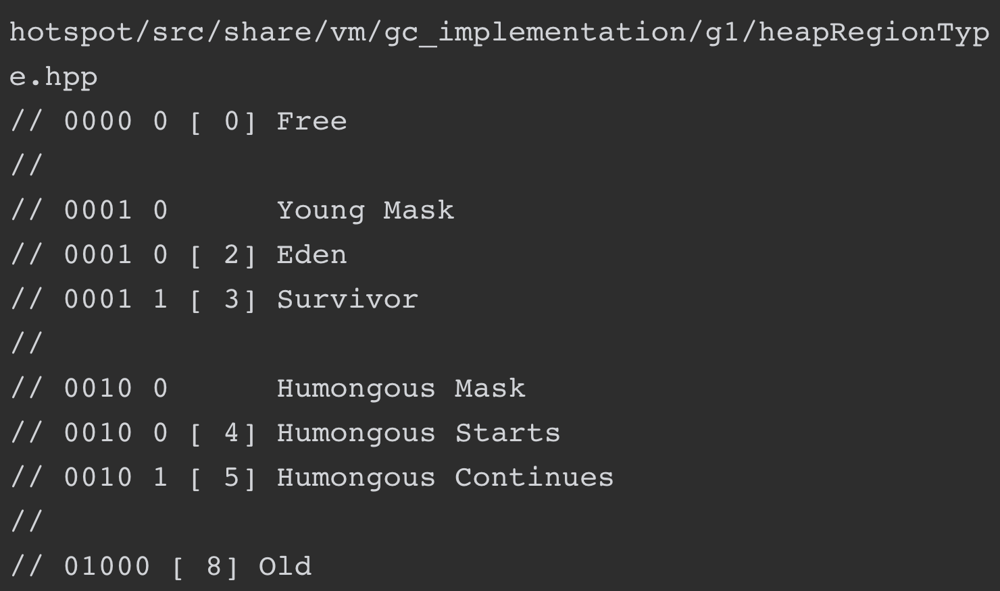
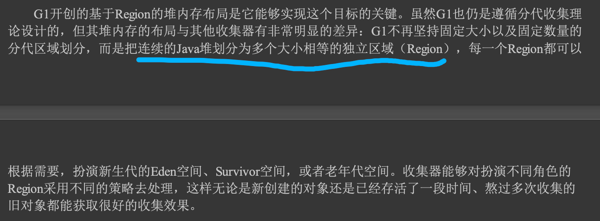
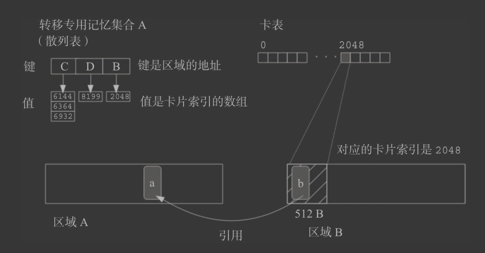
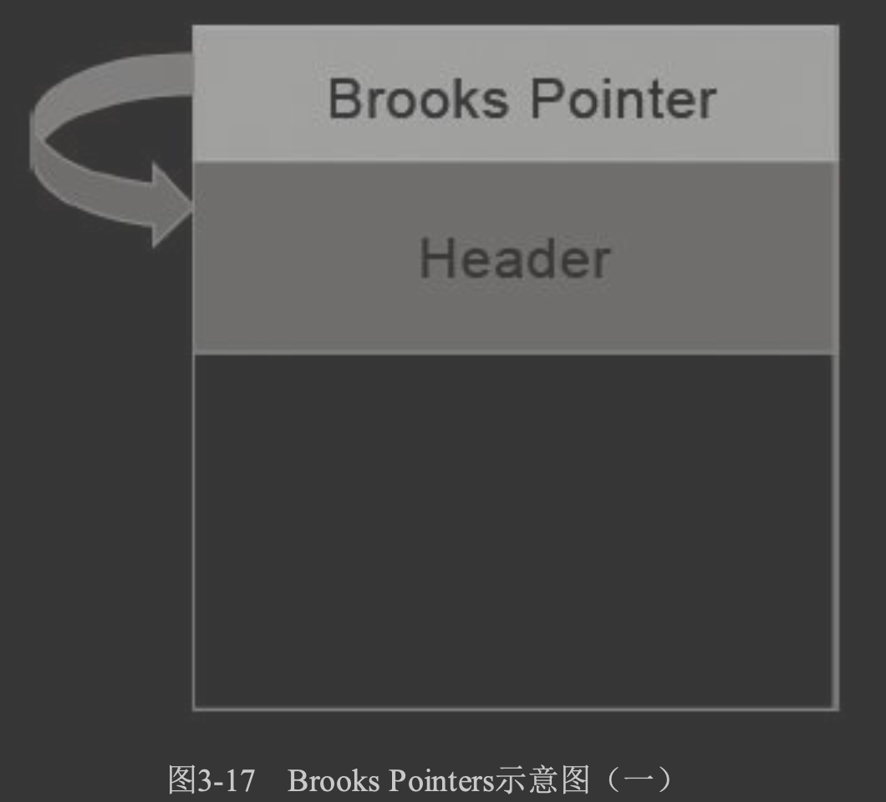
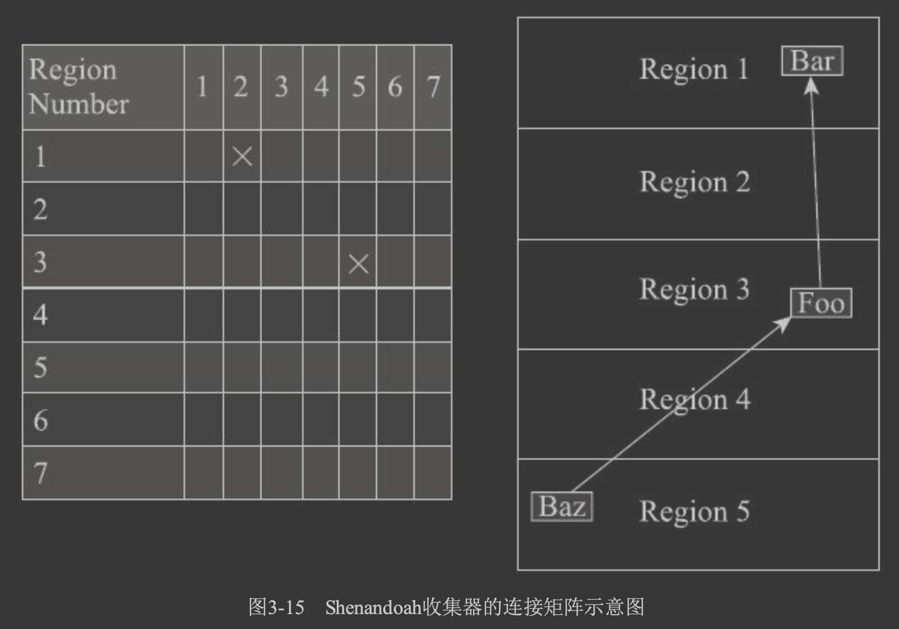
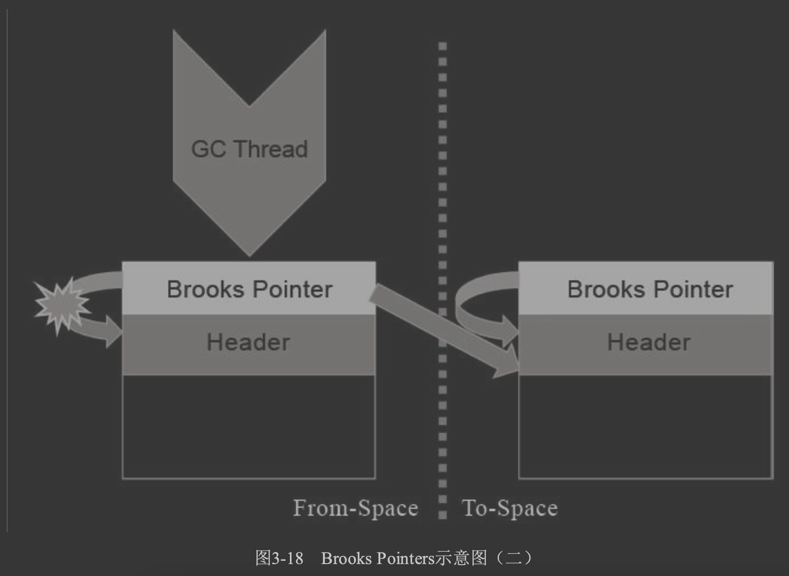
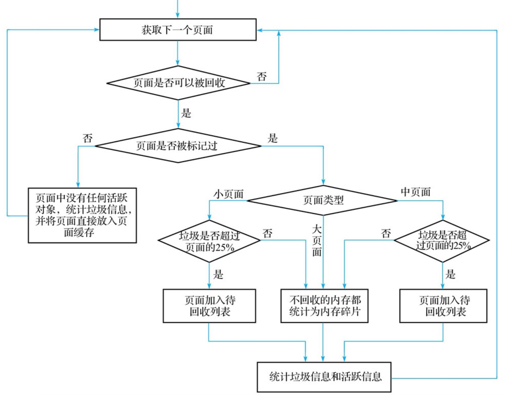
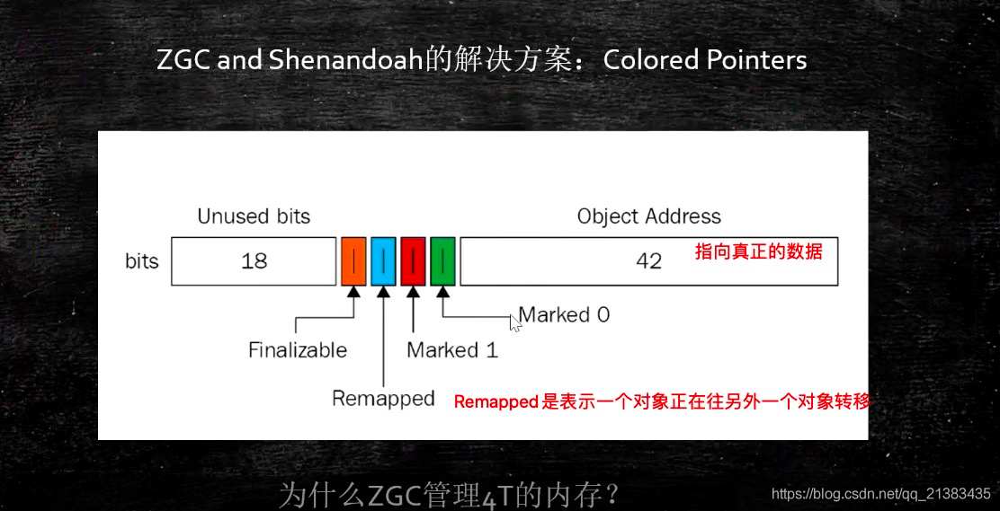
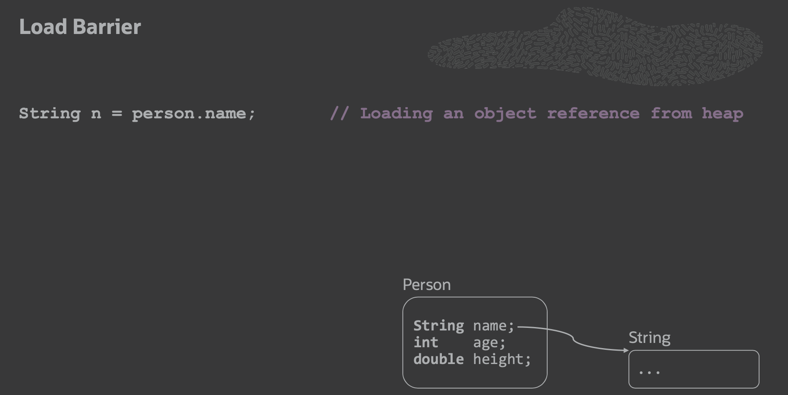
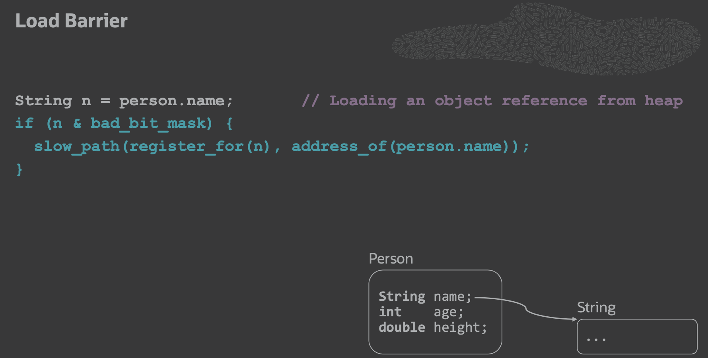

#临界知识
记忆集&卡表,卡页
标记过程并发化,复制过程并发化
安全点&安全区
并发标记(漏标)并发复制(),三色标记,颜色指针,读写屏障
ZGC支持NUMA机制
GC对象状态,serial/parNew/parallel/serial Old/parallel old对象头,G1 bitmap,zgc 颜色指针
cpu 64位,寻址范围46位, 4位颜色指针,42位地址4TB,mmap虚拟地址映射技术
G1伪共享问题
内存保护trap

#常用垃圾回收器组合&考虑因素
Serial + Serial Old
ParNew + CMS
PS +  Serial Old/
G1
```asp
吞吐量:数据分析、科学计算,flink job,使用PS +  Parallel Old
停顿时间:软实时服务,微服务,ParNew + CMS
客户端应用或者嵌入式应用:内存占用
```
#Serial收集器(标记-复制,gc标记在对象头,写屏障)
单线程工作的收集器,但它的“单线 程”的意义并不仅仅是说明它只会使用一个处理器或一条收集线程去完成垃圾收集工作，更重要的是强 调在它进行垃圾收集时，
必须暂停其他所有工作线程，直到它收集结束

它依然是HotSpot虚拟机运行在客户端模式下的默认新生 代收集器，有着优于其他收集器的地方，那就是简单而高效

Serial收集器对于运行在客户端模式下的虚拟机来说是一个很好的选择
#ParNew收集器(标记-复制,gc标记在对象头,写屏障)

ParNew收集器除了支持多线程并行收集之外，其他与Serial收集器相比并没有太多创新之处，但它 却是不少运行在服务端模式下的HotSpot虚拟机，
尤其是JDK 7之前的遗留系统中首选的新生代收集 器，其中有一个与功能、性能无关但其实很重要的原因是:除了Serial收集器外，目前只有它能与CM S 收集器配合工作
ParNew收集器在单核心处理器的环境中绝对不会有比Serial收集器更好的效果，甚至由于存在线程 交互的开销，该收集器在通过超线程(Hyper-Threading)技术实现的伪双核处理器环境中都不能百分
之百保证超越Serial收集器
#Parallel Scavenge(标记-复制,gc标记在对象头,写屏障)
吞吐量优先收集器,并行收集的多线程收集器
CM S等收集器的关注点是尽可能 地缩短垃圾收集时用户线程的停顿时间，而Parallel Scavenge收集器的目标则是达到一个可控制的吞吐 量(Throughput)。
所谓吞吐量就是处理器用于运行用户代码的时间与处理器总消耗时间的比值
#Serial Old收集器(标记-整理,gc标记在对象头,写屏障)

作为CM S 收集器发生失败时的后备预案，在并发收集发生Concurrent Mode Failure时使用
#Parallel Old(标记-整理,gc标记在对象头,写屏障)

#CMS收集器(标记-清除,标记-整理,gc标记在对象头,写屏障)
```asp
1)初始标记(CMS initial mark) 
2)并发标记(CM S concurrent mark) 
3)重新标记(CM S remark) 
4)并发清除(CM S concurrent sweep)
```


```asp
让虚 拟机平时多数时间都采用标记-清除算法，暂时容忍内存碎片的存在，直到内存空间的碎片化程度已经 大到影响对象分配时，再采用标记-整理算法收集一次，
以获得规整的内存空间。前面提到的基于标记-清除算法的CM S收集器面临空间碎片过多时采用的就是这种处理办法
```
##CPU敏感

##浮动垃圾
-XX:CMSInitiatingOccu-pancyFraction
##并发失败
要是CM S运行期间预留的内存无法满 足程序分配新对象的需要，就会出现一次“并发失败”(Concurrent M ode Failure)，这时候虚拟机将不 得不启动后备预案
:冻结用户线程的执行，临时启用Serial Old收集器来重新进行老年代的垃圾收集， 但这样停顿时间就很长了。
所以参数-XX:CMSInitiatingOccupancyFraction设置得太高将会很容易导致 大量的并发失败产生，性能反而降低
##大对象分配失败

##并发标记,跨代标记,老年代卡表(point out,增量更新,并发标记,漏标,三色标记,写屏障)
相比起来CM S的卡表就相当简单， 只有唯一一份，而且只需要处理老年代到新生代的引用，反过来则不需要
代价就是当CMS发生Old GC时(所有收集器中只有CMS有针对老年代的Old GC)，要把整个新生 代作为GC Roots来进行扫描
```asp
var G = objE.fieldG; 
objE.fieldG = null;  // 灰色E 断开引用 白色G 
objD.fieldG = G;  // 黑色D 引用 白色G
```

```asp
var G = objE.fieldG; // 1.读
objE.fieldG = null;  // 2.写
objD.fieldG = G;     // 3.写
```
[](https://blog.csdn.net/qq_21383435/article/details/106311542)
写屏障+增量更新
```asp
void post_write_barrier(oop* field, oop new_value) {  
  if($gc_phase == GC_CONCURRENT_MARK && !isMarkd(field)) {
      remark_set.add(new_value); // 记录新引用的对象
  }
}

```
##回收过程
#Garbage First(标记-复制,mixed gc,软实时,gc标记在BitMap.写屏障)
JDK 8
[深入理解jvm]
[](https://tech.meituan.com/2016/09/23/g1.html)
[G1](https://blog.csdn.net/TZ845195485/article/details/118304807)

##停顿时间模型(最佳停顿时长200ms)
能够支持指定在一个长度为M毫秒的时间片段 内，消耗在垃圾收集上的时间大概率不超过N毫秒这样的目标
```asp
用户通过-XX:M axGCPauseM illis参数指定的停顿时间 只意味着垃圾收集发生之前的期望值，但G1收集器要怎么做才能满足用户的期望呢?
G1收集器会记 录每个Region的回收耗时、每个Region记忆集里的脏卡数量等各个可测量的步骤花费的成本，并分析得出平均值、标准差、置信度等统计信息
衰减均值,这里强调的“衰减平均值”是指它会比普通的平均值更容易 受到新数据的影响，平均值代表整体平均状态，但衰减平均值更准确地代表“最近的”平均状态。
换句 话说，Region的统计状态越新越能决定其回收的价值。然后通过这些信息预测现在开始回收的话，由 哪些Region组成回收集才可以在不超过期望停顿时间的约束下获得最高的收益
```
```asp
但如果我们把停顿时间调得非常低，譬如设置为二十毫秒，很可能出现的结 果就是由于停顿目标时间太短，导致每次选出来的回收集只占堆内存很小的一部分，
收集器收集的速 度逐渐跟不上分配器分配的速度，导致垃圾慢慢堆积。很可能一开始收集器还能从空闲的堆内存中获 得一些喘息的时间，但应用运行时间一长就不行了，
最终占满堆引发Full GC反而降低性能，所以通常 把期望停顿时间设置为一两百毫秒或者两三百毫秒会是比较合理的
```
```asp
优先级列表
让G1收集器去跟踪各个Region里面的垃 圾堆积的“价值”大小，价值即回收所获得的空间大小以及回收所需时间的经验值，然后在后台维护一个优先级列表，
每次根据用户设定允许的收集停顿时间(使用参数-XX:M axGCPauseM illis指定，默 认值是200毫秒)，优先处理回收价值收益最大的那些Region
```
```asp
衰减平均
```
##三种GC
###Young GC(新生代回收)
```asp
与其他JVM垃圾回收器一样,一旦发生一次新生代回收，整个新生代都会被回收
G1会根据预测时间动态改变新生代的大小。[插图]其他垃圾回收新生代的大小也可以动态变化，但这个变化主要是根据内存的使用情况进行的。
G1中则是以预测时间为导向，根据内存的使用情况调整新生代分区的数目
```
###Mixed GC
```asp
在任意时刻只有一部分老生代分区会被回收，并且，这部分老生代分区将在下一次增量回收时与所有的新生代分区一起被收集
```
###Full GC(serial old)

##内存分区&逻辑分代&Humongous区域
```asp
新生代分区:Eden和Survivor
大对象分区:大对象头分区和大对象连续分区
老生代分区
自由分区
```

G1不再坚持固定大小以及固定数量的 分代区域划分，而是把连续的Java堆划分为多个大小相等的独立区域(Region)，每一个Region都可以
根据需要，扮演新生代的Eden空间、Survivor空间，或者老年代空间。收集器能够对扮演不同角色的 Region采用不同的策略去处理，这样无论是新创建的
对象还是已经存活了一段时间、熬过多次收集的 旧对象都能获取很好的收集效果。
```asp
G1可以管理的最大内存为2048×32MB=64GB,可以配置heap region大小和heap region size

```


##卡表(point in,原始快照SATB,并发标记,原始快照,三色标记,写屏障)


```asp
void pre_write_barrier(oop* field) {
  // 处于GC并发标记阶段 且 该对象没有被标记（访问）过
  if($gc_phase == GC_CONCURRENT_MARK && !isMarkd(field)) { 
      oop old_value = *field; // 获取旧值
      remark_set.add(old_value); // 记录  原来的引用对象
  }
}
```
##回收过程


###初始标记(全局堆,STW)
###并发标记(全局堆,多线程并行,三色标记,写屏障)
写屏障

###最终标记(全局堆,STW)
###筛选回收(部分复制,STW)
##G1 VS CMS
```asp
cms标记清理,g1标记复制
内存占用g1更高,使用多个卡表
吞吐量cms更高,同样的程序g1执行时间更长
执行负载g1更改,使用了停顿预测模型,计算区域优先级列表

目前在小内存应用上CM S的表现大概率仍然要会优于G1，而在大内存应用上G1则大多能发挥其 优势，这个优劣势的Java堆容量平衡点通常在6GB至8GB之间
```
#shenandoah(gc标记在BitMap,读写屏障)
##并发标记(写屏障)
##并发整理(转发指针,内存保护trap,读屏障,执行频率,吞吐下降)

转发指针,在原有对象布局结构的最前面统一增加一个新的引用字段，在正常不处于并发移动的情况下，该引用指向对象自己


全局数据结构来记录跨Region的引用关系，降低了处理跨代指针时的记忆集维护消耗，也降 低了伪共享问题(见3.4.4节)的发生概率

有了转发指针之后，有何收益暂且不论，所有间接对象访问技术的缺点都是相同的，也是非常显 著的——每次对象访问会带来一次额外的转向开销，尽管这个开销已经被优化到只有一行汇编指令的 程度
```asp
mov r13,QWORD PTR [r12+r14*8-0x8]
```
```asp
不过，毕竟对象定位会被频繁使用到，这仍是一笔不可忽视的执行成本，只是它比起内存保护陷
阱的方案已经好了很多。转发指针加入后带来的收益自然是当对象拥有了一份新的副本时，只需要修 改一处指针的值，即旧对象上转发指针的引用位置，
使其指向新对象，便可将所有对该对象的访问转 发到新的副本上。这样只要旧对象的内存仍然存在，未被清理掉，虚拟机内存中所有通过旧引用地址
访问的代码便仍然可用，都会被自动转发到新对象上继续工作
```

要覆盖全部对象访 问操作，Shenandoah不得不同时设置读、写屏障去拦截
除 此以外，为了实现Brooks Pointer，Shenandoah在读、写屏障中都加入了额外的转发处理，尤其是使用 读屏障的代价，这是比写屏障更大的。
代码里对象读取的出现频率要比对象写入的频率高出很多，读 屏障数量自然也要比写屏障多得多，所以读屏障的使用必须更加谨慎，不允许任何的重量级操作。

吞吐最小
##连接矩阵
##回收过程
###初始标记(STW)
###并发标记
###最终标记(STW)
###并发回收&并发更新引用

#ZGC(优化复制过程,使得复制过程可以并发,复制算法,gc标记在染色指针,读屏障)
使用读屏障(Read Barrier)技术实现了整理过程与用户线程的并发 执行
[](https://www.bilibili.com/read/cv6083109?spm_id_from=333.999.0.0)
##gc标记
[](https://www.zhihu.com/question/458099423/answer/1874465032)
对象标记
bitmap标记
指针标记
##颜色指针(虚拟内存映射)

```asp
尽管Linux下64位指针的高18位不能用来寻址，但剩余的46位指针所能支持的64T B内存在今天仍 然能够充分满足大型服务器的需要。鉴于此，
ZGC的染色指针技术继续盯上了这剩下的46位指针宽 度，将其高4位提取出来存储四个标志信息。通过这些标志位，虚拟机可以直接从指针中看到其引用对象
的三色标记状态、是否进入了重分配集(即被移动过)、是否只能通过finaliz e()方法才能被访问 到
```

```asp
remapped:已重映射,初始化状态,转移复制后状态
m0:前一次垃圾回收的标记阶段被标记过的活跃对象，对象在转移阶段未被转移
m1:为了区别前一次标记和当前标记,ZGC是部分内存垃圾回收,可能遗留上次标记后未转移的m0指针,m1用来标记本次垃圾回收中识别的活跃对象
```
[](https://weread.qq.com/web/reader/7e5327d071916d647e51559kd6432e00228d645920e3401)
##页面管理
全局标记,回收时并发回收局部页面,暂时不区分新生代老年代,所以没有卡表
[](https://weread.qq.com/web/reader/7e5327d071916d647e51559kc0c320a0232c0c7c76d365a)

##回收过程
###初始标记
###并发标记
当标记阶段结束后，ZGC使用对象活跃信息表（使用结构ZLiveMap存储，关于ZLiveMap的详细介绍请参考5.1.2节）记录所有活跃对象的地址，活跃对象的地址视图都是M0
###并发重分配(Relocate)
###并发重映射(Remap)
##并发标记(读屏障,如何处理漏标)
Remapped->m0,将Remapped标记为m0,清理remapped对象
```asp
这里的应用程序线程访问对象的访问操作主要指读操作。对于写操作来说，会对写操作的右值对象（等号操作符右边的对象）进行标记，所以也是读操作
```
[](https://weread.qq.com/web/reader/7e5327d071916d647e51559kd6432e00228d645920e3401)
##并发整理(读屏障)


```asp
oop oop_field_load(oop* field) {
    pre_load_barrier(field); // 读屏障-读取前操作
    return *field;
}
void pre_load_barrier(oop* field, oop old_value) {  
  if($gc_phase == GC_CONCURRENT_MARK && !isMarkd(field)) {
      oop old_value = *field;
      remark_set.add(old_value); // 记录读取到的对象
  }
}
```




##对NUMA的支持
[z_cpu_NUMA.md]
ZGC是支持NUMA的，在进行小页面分配时会优先从本地内存分配，当不能分配时才会从远端的内存分配。对于中页面和大页面的分配，ZGC并没有要求从本地内存分配，
而是直接交给操作系统，由操作系统找到一块能满足ZGC页面的空间。

#Epsilon收集器
A No-Op Garbage Collector,自动内存管理子系统
一个垃圾收集器除了垃圾收集这个本职工作之外，它还要负 责堆的管理与布局、对象的分配、与解释器的协作、与编译器的协作、与监控子系统协作等职责，
其 中至少堆的管理和对象的分配这部分功能是Java虚拟机能够正常运作的必要支持，是一个最小化功能 的垃圾收集器也必须实现的内容

