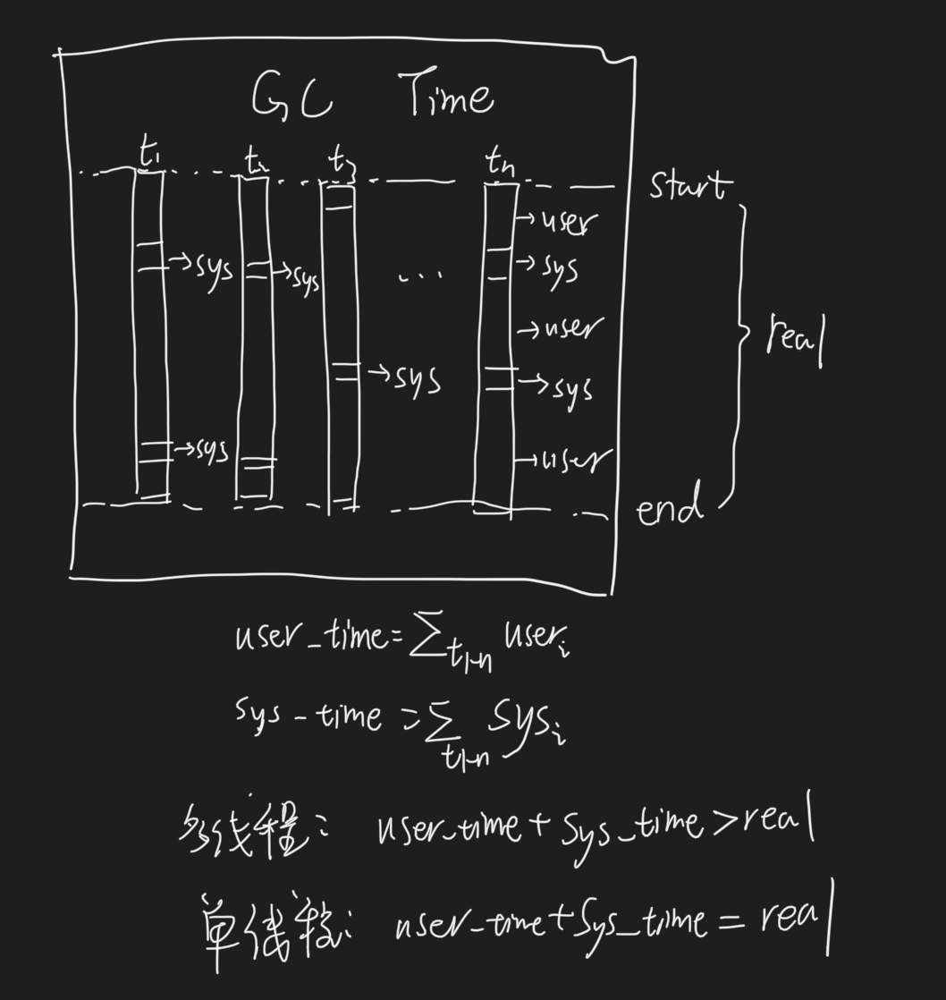
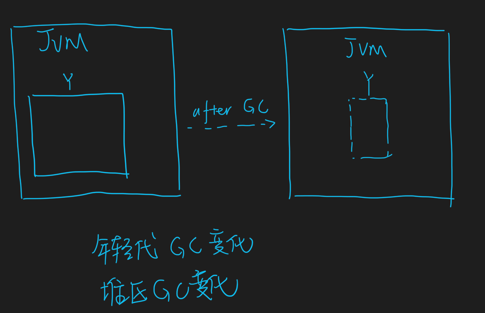
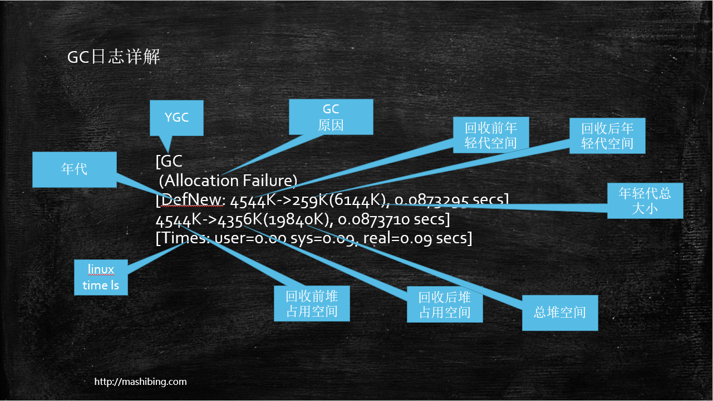
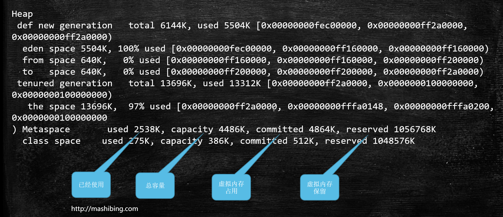

#临界知识
#GC时间
[](https://cloud.tencent.com/developer/article/1491229)

#gc日志模板
[深入理解java虚拟机3.7]
```asp
-Xlog[:[selector][:[output][:[decorators][:output-options]]]]
```
#CMS+ParNew日志
```asp
2021-09-20T10:33:17.500+0800: 31610.208: [GC (Allocation Failure) 2021-09-20T10:33:17.500+0800: 31610.208: [ParNew: 1685709K->7766K(1887488K), 0.0091217 secs] 2414678K->736977K(2936064K), 0.0093717 secs] [Times: user=0.08 sys=0.01, real=0.01 secs]
```




#ZGC日志
#GC调优
[](https://tech.meituan.com/2017/12/29/jvm-optimize.html)
