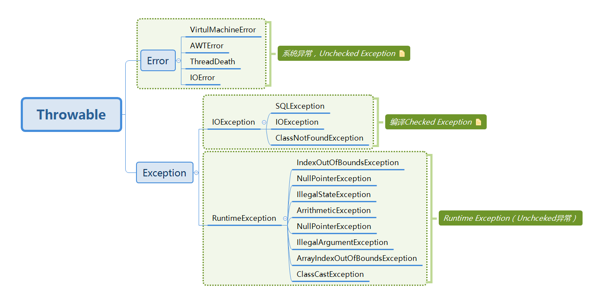
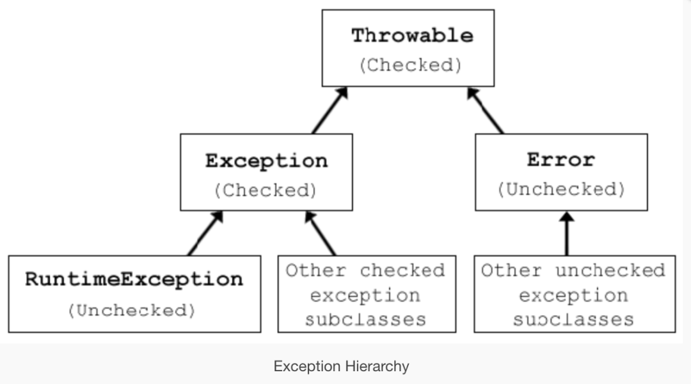

[](https://blog.csdn.net/weixin_40936211/article/details/97751272)
#运行时异常
Unchecked exception
运行时异常就是指只要代码不执行到这一行就不会出现问题
Unchecked Exception：指的是程序的瑕疵或逻辑错误，并且在运行时无法恢复，包括系统异常，语法上不需要声明抛出异常
#链接时异常
即使导致连接时异常的代码放 在一条根本无法被执行到的路径分支上，类加载时(第7章解释过Java的连接过程不在编译阶段，而在类加载阶段)也照样会抛出异常
#类型检查
Checked Exception 是必须在代码中进行恰当处理的 Exception，而且javac编译器会强制开发者对其进行处理，否则编译会不通过。
checked Exception：代表程序不能直接控制的无效外界情况（如用户输入，数据库访问，网络异常，文件访问和丢失等），除了Error和RuntimeException及其子类之外的异常， 需要try catch处理或throws声明抛出异常
Java原因对这两个定义很简单，将派生于Error和RuntimeException的异常称为unchecked异常，其余所有异常为checked异常

#设计checked exception 和unchcked exception的目的
[](https://www.zhihu.com/question/30428214/answer/852807268)
异常本就应该是函数签名的一部分，就像函数的返回类型一样
checked exception其实是union type
Union type是用来表示一个对象要么是A这个type的，要么是B这个type的。比如我们可以定义个一个Union type File | IOError，表示这个对象要么是一个File，要么是一个IOError
```asp
File|IOError result = FileUtil.open("somefile.txt");
switch (result) {
  case File file:
    //....
  case IOError err:
    //....
}
```
Java虽然不支持union type，但它的CE其实就是union type的一种特殊实现。比如我们完全可以这样定义：
```asp
public class FileUtil {
  // 想象中的union type的写法
  public File|IOError open(String filename);
  // Java的写法
  public File open(String filename) throws IOError;
}
```
[](https://www.zhihu.com/question/30428214/answer/604073047)
而对于CE的try..catch..其实就是pattern matching的一种语法糖。
如果不提供union type（或者不提供CE），人们会用更差的方法错误处理，导致更加严重的问题。
比如使用tuple（File, IOError）当作函数返回值。tuple的含义就是这个函数可以同时给你一个File和IOError，也可以既不给你File也不给你IOError。或者更严重地，使用null表示失败，从而导致各种NPE。

runtime exception才是真正的exception
