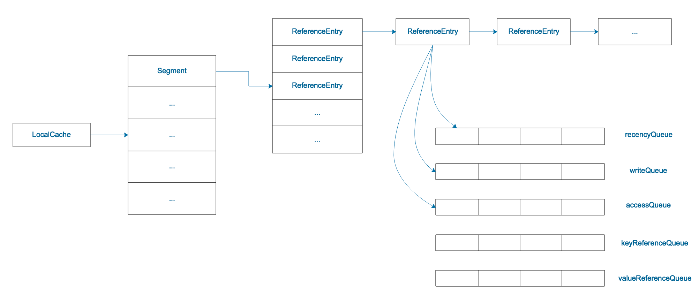
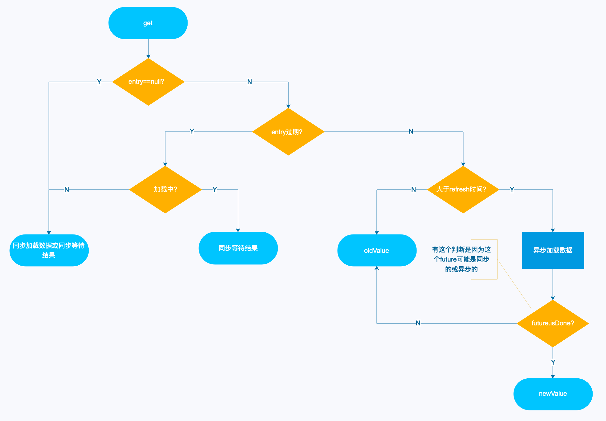
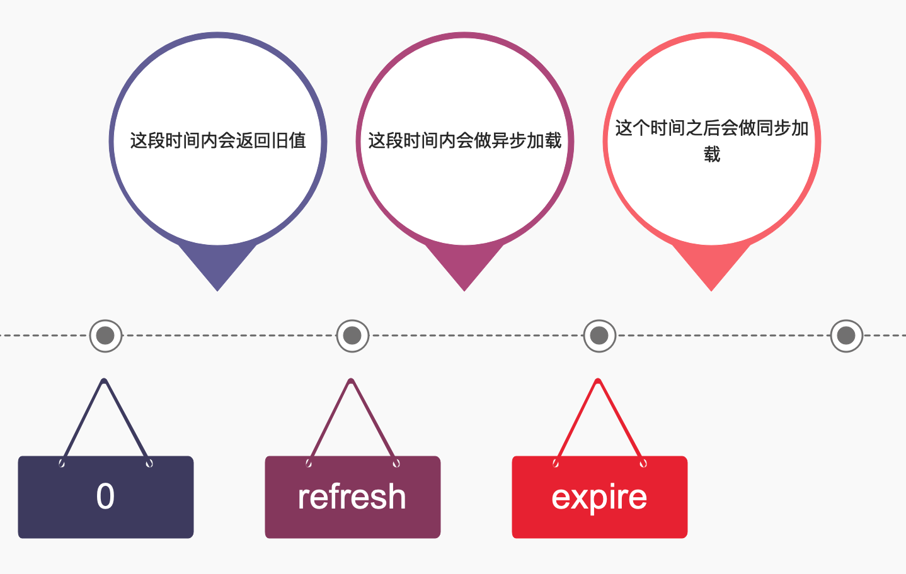

#临界知识
缓存击穿,缓存雪崩
guava缓存过期/异步机制
guava数据结构
#LRU ConcurrentHashMap



#缓存击穿问题
##背景
如果对缓存设置过期时间，在高并发下同时执行get操作，而此时缓存值已过期了，如果没有保护措施，则会导致大量线程同时调用生成缓存值的方法，
比如从数据库读取，对数据库造成压力，这也就是我们常说的“缓存击穿”
##guava方案
```asp
而Guava cache则对此种情况有一定控制。当大量线程用相同的key获取缓存值时，只会有一个线程进入load方法，而其他线程则等待，直到缓存值被生成
这样也就避免了缓存击穿的危险。这两个配置的区别前者记录写入时间，后者记录写入或访问时间，内部分别用writeQueue和accessQueue维护
```
#缓存雪崩问题
##背景
单个key并发下，使用refreshAfterWrite，虽然不会阻塞了，但是如果恰巧同时多个key同时过期，还是会给数据库造成压力，这就是我们所说的“缓存雪崩”。
##guava方案
这时就要用到异步刷新，将刷新缓存值的任务交给后台线程，所有的用户请求线程均返回旧的缓存值。

方法是覆盖CacheLoader的reload方法，使用线程池去异步加载数据
PS：只有重写了 reload 方法才有“异步加载”的效果。默认的 reload 方法就是同步去执行 load 方法。
#过期/刷新机制

##expireAfterWrite(同步阻塞+过期时间队列)
Guava Cache是没有定时器或额外的线程去做清理或加载操作的，都是通过get来触发的，目的是降低复杂性和减少对系统的资源消耗。
使用 expireAfterWrite 会导致其他线程阻塞

writeQueue和accessQueue
##refreshAfterWrite(异步刷新队列)

允许一个线程进去load方法，其他线程返回旧的值
在上一点基础上做成异步，即回源线程不是请求线程。异步刷新是用线程异步加载数据，期间所有请求返回旧的缓存值
###刷新问题
refreshAfterWrite刷新后expireAfterWrite过期时间不变
#最佳实践
推荐的设置是 refresh < expire,1:3
[](https://community.jiguang.cn/article/464216)
