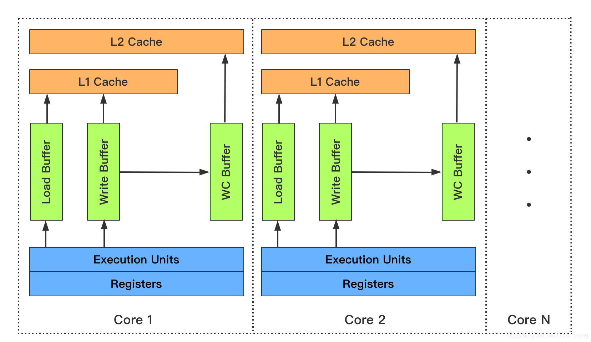

============index:cpu缓存_cacheline_mesi一致性_内存屏障_volatile_synchronized模型=============
##MESI一致性协议


[图解一致性协议](https://zhuanlan.zhihu.com/p/123926004)
cpu0请求read+invalid时，需要等到其他cpu将自己的缓存行置为invalid然后返回invalid OK,才能更新自己
请求端会阻塞等到invalid OK,返回端需要同步执行万invalid才返回invalid OK,两端都是同步处理,导致
多核cpu执行效率很低,如果请求端和返回端都可以异步处理就可以提高效率

##异步请求store buffer&写屏障指令

[MESI异步请求分析](https://zhuanlan.zhihu.com/p/125549632)

为了异步加速,a存入storebuffer并发送read invalid后就执行接下来的指令,此时cpu1中的a不一定失效了
b执行直到assert结束时,a的请求read invalid都未达到cpu1.
迟到的read invalid导致CPU1使用了失效的a==0

效率上看起来
```
void foo() {
    b = 1;
    a = 1;
}
```
方案是引入写屏障指令,发现store buffer有待处理的缓存行a,则把b也放入store buffer，保证b在a之后执行
cpu0 看到 smp_wmb()内存屏障，它会标记当前 store buffer 中的所有条目  
cpu0 执行 b=1，尽管 b 已经存在在 cache 中(Exclusive)，但是由于 store buffer 中还存在被标记的条目，因此 b 不能直接写入，只能先写入 store buffer 中
```
void foo() {
    a = 1;
    smp_wmb()
    b = 1;
}
void bar() {
    while (b == 0) continue;
    assert(a == 1)
}
```
写屏障指令将a后续的操作一并缓存在store buffer
##异步响应invalid queue&&读屏障指令
为了提高响应效率,cpu1使用异步响应,cpu1收到read invalid立刻返回ACK,并将失效消息缓存在cpu1中的invalid queue后续再处理,
执行到CPU1中的a时,为处理invalid queue，导致cpu1中a还是有效状态,assert异常

```
void foo() {
    a = 1;
    smp_wmb()
    b = 1;
}
void bar() {
    while (b == 0) continue;
    assert(a == 1)
}
```
方案是引入读屏障指令,在处理a之前将CPU1中invalid queue全部处理完成.
```
void foo() {
    a = 1;
    smp_wmb()
    b = 1;
}
void bar() {
    while (b == 0) continue;
    smp_rmb()
    assert(a == 1)
}
```
读屏障指令，处理a之前将invalid queue中消息处理完
##cpu缓存行体系对象图store buffer,invalid queue关系图


## 四种抽象内存屏障
smp_wmb(StoreStore)：执行后需等待 Store Buffer 中的写入变更 flush 完全到缓存后，后续的写操作才能继续执行，保证执行前后的写操作对其他 CPU 而言是顺序执行的；

smp_rmb(LoadLoad)：执行后需等待 Invalidate Queue 完全应用到缓存后，后续的读操作才能继续执行，保证执行前后的读操作对其他 CPU 而言是顺序执行的；

```
LoadLoad屏障：对于这样的语句Load1; LoadLoad; Load2，在Load2及后续读取操作要读取的数据被访问前，保证Load1要读取的数据被读取完毕。
StoreStore屏障：对于这样的语句Store1; StoreStore; Store2，在Store2及后续写入操作执行前，保证Store1的写入操作对其它处理器可见。
LoadStore屏障：对于这样的语句Load1; LoadStore; Store2，在Store2及后续写入操作被刷出前，保证Load1要读取的数据被读取完毕。
StoreLoad屏障：对于这样的语句Store1; StoreLoad; Load2，在Load2及后续所有读取操作执行前，保证Store1的写入对所有处理器可见。它的开销是四种屏障中最大的。        
在大多数处理器的实现中，这个屏障是个万能屏障，兼具其它三种内存屏障的功能
```
[](https://shipilev.net/blog/2014/on-the-fence-with-dependencies/)
[](http://gee.cs.oswego.edu/dl/jmm/cookbook.html)

## 内存一致性模式TSO
store和load的组合有4种。分别是store-store，store-load，load-load和load-store。TSO模型中，只存在store-load存在乱序，另外3种内存操作不存在乱序。
X86使用TSO模式
[](https://zhuanlan.zhihu.com/p/141655129)
```
Hardware
These barriers are treated by compilers as the intentions to break the harmful re-orderings. When it comes to hardware, it turns out some hardware already guarantees quite a lot. For example, one could open Intel Software Developer Manual, and read that in most x86 implementations:

Reads are not reordered with other reads. [Translation: LoadLoad can be no-op]

Writes are not reordered with older reads. [Translation: LoadStore can be no-op]

Writes to memory are not reordered with other writes…​ [Translation: StoreStore can be no-op]

— Intel Software Development Manual; Vol 3A; 8.2.1
Therefore, it turns out, after we are done treating the barriers in compilers, the only barrier we need to communicate to x86 hardware (= emit in the machine code) is StoreLoad. And this is where it starts to get funny. x86 declares the handy rules:
```
jvm内存屏障是抽象的概念,lock指令是底层cpu实现方式

lock前缀指令为实现内存屏障的一种方式

x86 的 store buffer 被设计成了 FIFO，纵然在同一个线程中执行多次写入 buffer 的操作，最终依旧是严格按照 FIFO 顺序 dequeue 并写回到内存里
x86-TSO 模型下是没有 invalidate queue 的，因此也不需要读屏障（LoadLoad）

##几种内存屏障实现

```
1. lfence，是一种Load Barrier 读屏障。在读指令前插入读屏障，可以让高速缓存中的数据失效，重新从主内存加载数据

2. sfence, 是一种Store Barrier 写屏障。在写指令之后插入写屏障，能让写入缓存的最新数据写回到主内存

3. mfence, 是一种全能型的屏障，具备ifence和sfence的能力

4. lock前缀指令

```

```
enum Membar_mask_bits {
    StoreStore = 1 << 3,
    LoadStore  = 1 << 2,
    StoreLoad  = 1 << 1,
    LoadLoad   = 1 << 0
  };
​
  // Serializes memory and blows flags
  void membar(Membar_mask_bits order_constraint) {
    if (os::is_MP()) {
      // We only have to handle StoreLoad
      if (order_constraint & StoreLoad) {
        lock();
        addl(Address(rsp, offset), 0);// Assert the lock# signal here
      }
    }
  }
```


##为啥StoreLoad 开销是这四种屏障中最大的？
storestore 使用FIFO方式在store buffer中执行
storeload 需要将store buffer中缓存全部刷入内存

loadload，loadstore无需内存屏障,x86默认支持


##编译器指令优化
[](https://www.zhihu.com/question/23572082)

##volatile与内存屏障

```
int t = x; // volatile load
[LoadLoad]
[LoadStore]
<other ops>
```
```
<other ops>
[StoreStore]
[LoadStore]
x = 1; // volatile store
```

Linux内核使用lock; addl $0x0(%%esp)作为全屏障，表示将数值0加到esp寄存器中，而该寄存器指向栈顶的内存单元。加上一个0，esp寄存器的数值依然不变。即这是一条无用的汇编指令。
在此利用这条无价值的汇编指令来配合lock指令，在__asm__,__volatile__,memory的作用下，用作cpu的内存屏障。

指令“lock; addl $0,0(%%esp)”表示加锁，把0加到栈顶的内存单元，该指令操作本身无意义，但这些指令起到内存屏障的作用，让前面的指令执行完成。

```
lock addl $0x0,(%rsp
```

###volatile i++


```
k++;

8 getstatic #9 <concurrent/T07_Volatile_i_add_const.k>
11 iconst_1
12 iadd
13 putstatic #9 <concurrent/T07_Volatile_i_add_const.k>
```
i++实际为load、Increment、store、Memory Barriers 四个操作
寄存器A中保存的是中间值，没有直接修改i，因此其他线程并不会获取到这个自增1的值

volatile i++ 不能保证原子性:在寄存器赋值cpu缓存=2时，缓存行状态变成E,并将store buffer回写,
但i++前面的load指令并不是E状态,其他cpu也可以访问,而原子指令xadd就是在load时就已经是E状态了
[](https://www.zhihu.com/question/329746124)

## 原子指令原理
lock指令前缀
read-modify-write

On modern CPUs, the LOCK prefix locks the cache line so that the read-modify-write operation is logically atomic. These are oversimplified, but hopefully they'll give you the idea.
```
Unlocked increment:

Acquire cache line, shareable is fine. Read the value.
Add one to the read value.
Acquire cache line exclusive (if not already E or M) and lock it.
Write the new value to the cache line.
Change the cache line to modified and unlock it.
```
```
Locked increment:

Acquire cache line exclusive (if not already E or M) and lock it.
Read value.
Add one to it.
Write the new value to the cache line.
Change the cache line to modified and unlock it.

Notice the difference? In the unlocked increment, the cache line is only locked during the write memory operation, just like all writes. In the locked increment, the cache line is held across the entire instruction, 
all the way from the read operation to the write operation and including during the increment itself.
```
[](https://stackoverflow.com/questions/29880015/lock-prefix-vs-mesi-protocol)
[](https://zhuanlan.zhihu.com/p/115355303)
##合并写技术

[](http://ifeve.com/writecombining/)
[](https://www.cnblogs.com/liushaodong/p/4777308.html)
