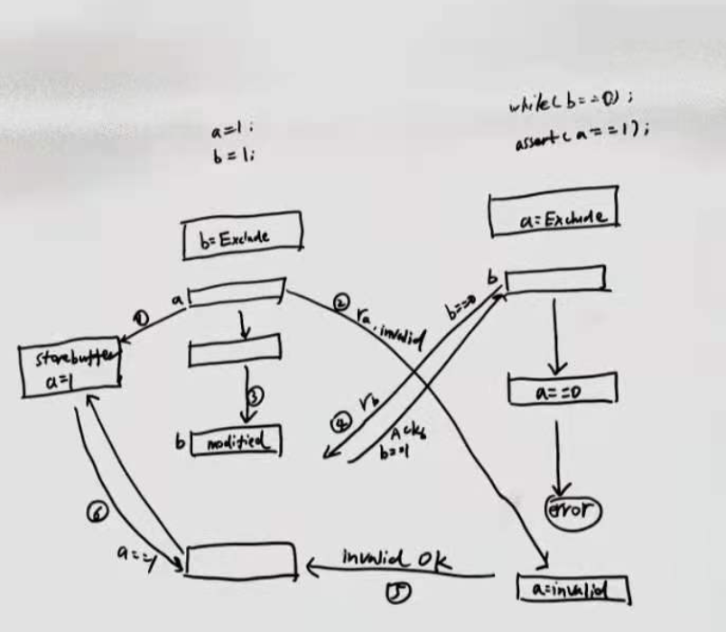

============index:cpu缓存_cacheline_mesi一致性_内存屏障_volatile_synchronized模型=============
##MESI一致性协议


[图解一致性协议](https://zhuanlan.zhihu.com/p/123926004)
cpu0请求read+invalid时，需要等到其他cpu将自己的缓存行置为invalid然后返回invalid OK,才能更新自己
请求端会阻塞等到invalid OK,返回端需要同步执行万invalid才返回invalid OK,两端都是同步处理,导致
多核cpu执行效率很低,如果请求端和返回端都可以异步处理就可以提高效率

##异步请求store buffer&写屏障指令

[MESI异步请求分析](https://zhuanlan.zhihu.com/p/125549632)

为了异步加速,a存入storebuffer并发送read invalid后就执行接下来的指令,此时cpu1中的a不一定失效了
b执行直到assert结束时,a的请求read invalid都未达到cpu1.
迟到的read invalid导致CPU1使用了失效的a==0

效率上看起来
```
void foo() {
    b = 1;
    a = 1;
}
```
方案是引入写屏障指令,发现store buffer有待处理的缓存行a,则把b也放入store buffer，保证b在a之后执行
cpu0 看到 smp_wmb()内存屏障，它会标记当前 store buffer 中的所有条目  
cpu0 执行 b=1，尽管 b 已经存在在 cache 中(Exclusive)，但是由于 store buffer 中还存在被标记的条目，因此 b 不能直接写入，只能先写入 store buffer 中
```
void foo() {
    a = 1;
    smp_wmb()
    b = 1;
}
void bar() {
    while (b == 0) continue;
    assert(a == 1)
}
```
写屏障指令将a后续的操作一并缓存在store buffer
##异步响应invalid queue&&读屏障指令
为了提高响应效率,cpu1使用异步响应,cpu1收到read invalid立刻返回ACK,并将失效消息缓存在cpu1中的invalid queue后续再处理,
执行到CPU1中的a时,为处理invalid queue，导致cpu1中a还是有效状态,assert异常

```
void foo() {
    a = 1;
    smp_wmb()
    b = 1;
}
void bar() {
    while (b == 0) continue;
    assert(a == 1)
}
```
方案是引入读屏障指令,在处理a之前将CPU1中invalid queue全部处理完成.
```
void foo() {
    a = 1;
    smp_wmb()
    b = 1;
}
void bar() {
    while (b == 0) continue;
    smp_rmb()
    assert(a == 1)
}
```
读屏障指令，处理a之前将invalid queue中消息处理完
##cpu缓存行体系对象图store buffer,invalid queue关系图


##内存屏障vs lock指令
jvm内存屏障是抽象的概念,lock指令是底层cpu实现方式
```
LoadLoad屏障：对于这样的语句Load1; LoadLoad; Load2，在Load2及后续读取操作要读取的数据被访问前，保证Load1要读取的数据被读取完毕。
StoreStore屏障：对于这样的语句Store1; StoreStore; Store2，在Store2及后续写入操作执行前，保证Store1的写入操作对其它处理器可见。
LoadStore屏障：对于这样的语句Load1; LoadStore; Store2，在Store2及后续写入操作被刷出前，保证Load1要读取的数据被读取完毕。
StoreLoad屏障：对于这样的语句Store1; StoreLoad; Load2，在Load2及后续所有读取操作执行前，保证Store1的写入对所有处理器可见。它的开销是四种屏障中最大的。        
在大多数处理器的实现中，这个屏障是个万能屏障，兼具其它三种内存屏障的功能
```
lock前缀指令为实现内存屏障的一种方式

## StoreStore/LoadLoad屏障空操作含义
x86 的 store buffer 被设计成了 FIFO，纵然在同一个线程中执行多次写入 buffer 的操作，最终依旧是严格按照 FIFO 顺序 dequeue 并写回到内存里
x86-TSO 模型下是没有 invalidate queue 的，因此也不需要读屏障（LoadLoad）

##几种内存屏障指令
```
1. lfence，是一种Load Barrier 读屏障。在读指令前插入读屏障，可以让高速缓存中的数据失效，重新从主内存加载数据

2. sfence, 是一种Store Barrier 写屏障。在写指令之后插入写屏障，能让写入缓存的最新数据写回到主内存

3. mfence, 是一种全能型的屏障，具备ifence和sfence的能力

4. lock前缀指令

```

```
enum Membar_mask_bits {
    StoreStore = 1 << 3,
    LoadStore  = 1 << 2,
    StoreLoad  = 1 << 1,
    LoadLoad   = 1 << 0
  };
​
  // Serializes memory and blows flags
  void membar(Membar_mask_bits order_constraint) {
    if (os::is_MP()) {
      // We only have to handle StoreLoad
      if (order_constraint & StoreLoad) {
        lock();
        addl(Address(rsp, offset), 0);// Assert the lock# signal here
      }
    }
  }
```


