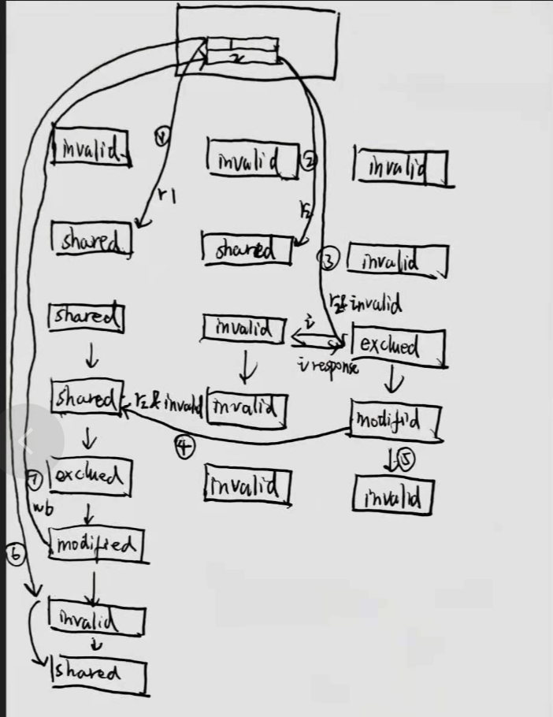
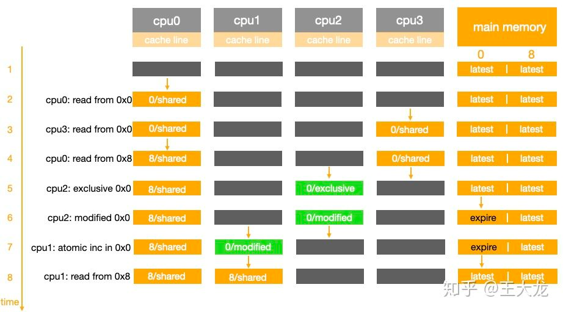
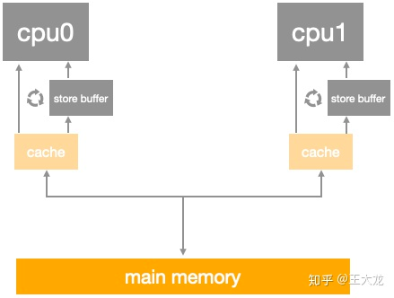
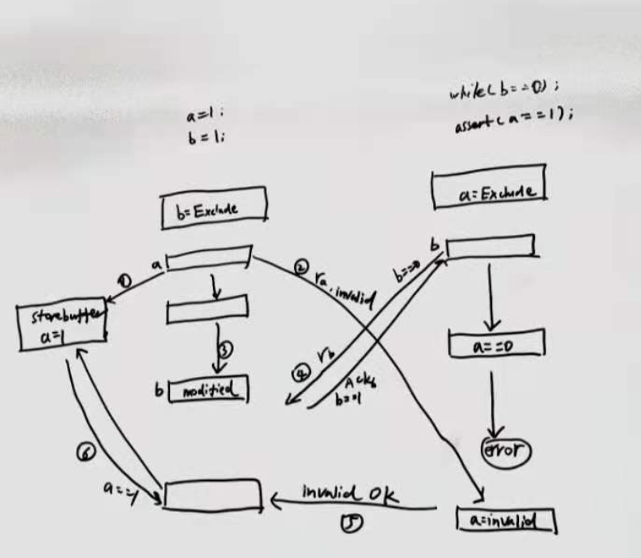
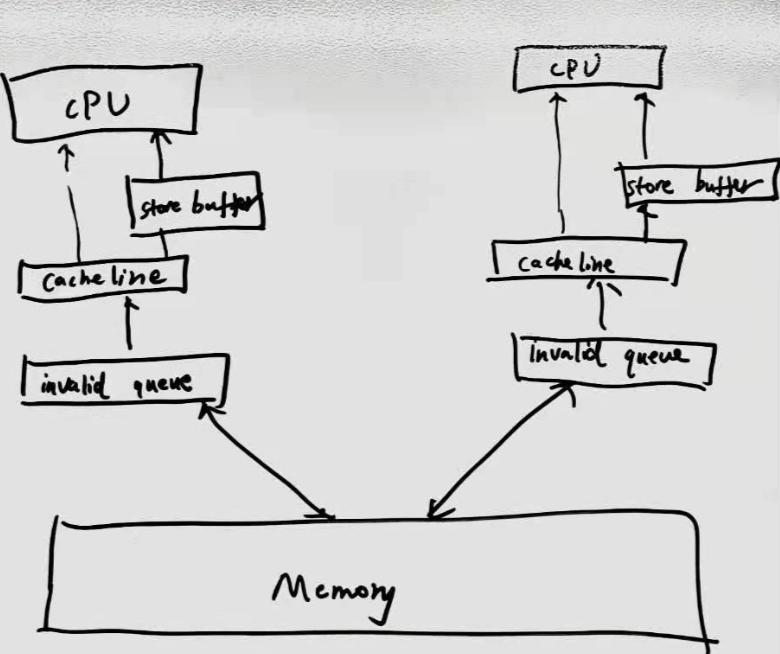
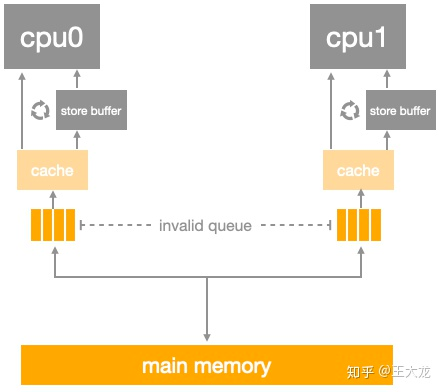

============index:cpu缓存_cacheline_mesi一致性_内存屏障_volatile_synchronized模型=============
##MESI一致性协议


[图解一致性协议](https://zhuanlan.zhihu.com/p/123926004)
cpu0请求read+invalid时，需要等到其他cpu将自己的缓存行置为invalid然后返回invalid OK,才能更新自己
请求端会阻塞等到invalid OK,返回端需要同步执行万invalid才返回invalid OK,两端都是同步处理,导致
多核cpu执行效率很低,如果请求端和返回端都可以异步处理就可以提高效率

##异步请求store buffer&写屏障指令

[MESI异步请求分析](https://zhuanlan.zhihu.com/p/125549632)

为了异步加速,a存入storebuffer并发送read invalid后就执行接下来的指令,此时cpu1中的a不一定失效了
b执行直到assert结束时,a的请求read invalid都未达到cpu1.
迟到的read invalid导致CPU1使用了失效的a==0

效率上看起来
```
void foo() {
    b = 1;
    a = 1;
}
```
方案是引入写屏障指令,发现store buffer有待处理的缓存行a,则把b也放入store buffer，保证b在a之后执行
```
void foo() {
    a = 1;
    smp_wmb()
    b = 1;
}
void bar() {
    while (b == 0) continue;
    assert(a == 1)
}
```
写屏障指令将a后续的操作一并缓存在store buffer
##异步响应invalid queue&&读屏障指令
为了提高响应效率,cpu1使用异步响应,cpu1收到read invalid立刻返回ACK,并将失效消息缓存在cpu1中的invalid queue后续再处理,
执行到CPU1中的a时,为处理invalid queue，导致cpu1中a还是有效状态,assert异常

```
void foo() {
    a = 1;
    smp_wmb()
    b = 1;
}
void bar() {
    while (b == 0) continue;
    assert(a == 1)
}
```
方案是引入读屏障指令,在处理a之前将CPU1中invalid queue全部处理完成.
```
void foo() {
    a = 1;
    smp_wmb()
    b = 1;
}
void bar() {
    while (b == 0) continue;
    smp_rmb()
    assert(a == 1)
}
```
读屏障指令，处理a之前将invalid queue中消息处理完
##cpu缓存行体系对象图store buffer,invalid queue关系图


