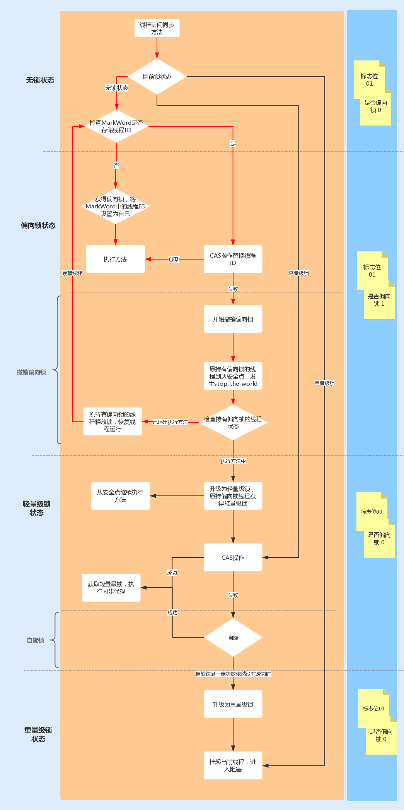

1.synchronized原理，mutex
2.synchronized对象模型
3.几种实现
2.synchronized优化偏向锁，自旋锁
3.内核底层原理
4.cpu锁总线，锁缓存
5.cache总线

6.无锁

https://www.cnblogs.com/aspirant/p/11470858.html

https://cloud.tencent.com/developer/article/1082708


##synchronized对象模型


wait

        
singal


signalAll()方法，相当于对等待队列中的每个节点均执行一次signal()方法，
效 果就是将等待队列中所有节点全部移动到同步队列中，并唤醒每个节点的线程


##synchronized锁升级模型


1.第二个线程仍是偏向锁,是在第一个线程释放偏向锁之后,第二个线程CAS无锁->偏向锁

2.偏向锁升级/取消偏向锁,是第二个线程CAS无锁—>偏向锁 失败,需要在safepoint处对相关线程stop the world,因为要获取每个线程使用锁的状态以及运行状态
这个时候如果JVM需要对stack和heap做一些操作该怎么办呢？
比如JVM要进行GC操作，或者要做heap dump等等，这时候如果线程都在对stack或者heap进行修改，那么将不是一个稳定的状态。
GC直接在这种情况下操作stack或者heap，会导致线程的异常。

safepoint就是一个安全点，所有的线程执行到安全点的时候就会去检查是否需要执行safepoint操作，如果需要执行，那么所有的线程都将会等待，直到所有的线程进入safepoint。


3.轻量锁升级发生在自旋一定次数后仍未获取锁.


###Mutex Lock实现
底层使用linux互斥锁,获取锁需要用户态,内核态切换,获得锁后需要挂起原来的线程,因此要内核态切换
[](https://bbs.csdn.net/topics/399061558)
```asp
if (Thread::is_interrupted(thread, false) || pthread_mutex_trylock(_mutex) != 0) {
  //如果线程被中断，或者是在尝试给互斥变量加锁的过程中，加锁失败，比如被其它线程锁住了，直接返回
    return;
  }
```
###偏向锁
1.JDK6中引入的一项锁优化,它的目的是消除数据在无竞争情况下的同步原语，进一步提高程序的运行性能 ,
2.偏向锁会偏向于第一个获得它的线程，如果在接下来的执行过程中，该锁没有被其他的线程获取，则持有偏向锁的线程将永远不需要同步。大多数情况下，
锁不仅不存在多线程竞争，而且总是由同一线程多次获得，为了让线程获得锁的代价更低而引入了偏向锁
3.当锁对象第一次被线程获取的时候，线程使用CAS操作把这个锁的线程ID记录再对象Mark Word之中，同时置偏向标志位1。以后该线程在进入和退出同步块
时不需要进行CAS操作来加锁和解锁，只需要简单地测试一下对象头的Mark Word里是否存储着指向当前线程的偏向锁。如果测试成功，表示线程已经获得了锁。
###偏向锁与hashcode能共存吗？
[](https://blog.csdn.net/Saintyyu/article/details/108295657)
[](https://blog.51cto.com/u_15127686/2832598)
1.此处的hashcode是native hashcode,object的hashcode
2.如果调用object native hashcode方法,需要将hashcode存放在markword的hashcode中,此时偏向锁不能与native hashcode共存
2.一般对象会复写object的hashcode,例如String,ArrayList,不会调用object native hashcode,此时能共存

###轻量级锁
1.如果线程使用CAS操作时失败则表示该锁对象上存在竞争并且这个时候另外一个线程获得偏向锁的所有权。当到达全局安全点（safepoint，这个时间点上没有
正在执行的字节码）时获得偏向锁的线程被挂起，膨胀为轻量级锁（涉及Monitor Record，Lock Record相关操作，这里不展开），同时被撤销偏向锁的线程继续往下执行同步代码
###线程栈帧中的Lock Record
###自旋锁
###重量级锁ObjectMonitor
JVM会为每个对象都关联一个监视器Monitor对象,这个监视器对象随着对象的创建而创建，随着对象的销毁而销毁，这个监视器对象就是用来保证在同一时刻，只有一个线程可以访问临界资源
###等待队列
###同步队列
###线程安全点
###对象加锁 vs class加锁
0.问清楚是加this,class的区别吗?
1.对象复写了hashcode后,偏向锁和hashcode可以共存
2.class类使用ojbect hashcode，不能与偏向锁共存

##对象头实战
[](https://www.cnblogs.com/LemonFive/p/11246086.html)
##safepoint
[安全点排查](https://blog.csdn.net/superfjj/article/details/107855767)
[安全点实战](https://www.pianshen.com/article/36071068168/)

-XX:+PrintSafepointStatistics

```
  0x0000000114cac061: test   %eax,-0x6cb3f67(%rip)        # 0x000000010dff8100
                                                ;   {poll_return}
```
##stop the world

##逃逸分析


##不能用string,integer,long,,null
string可能值相等但不是同一个对象,如果是同一个对象，范围是整个jvm，其他库也可能使用了string
integer,long包装类，-128~127,全局唯一,但是128是不同对象，如果每个线程都是128，其实是锁住不同线程
syn锁使用null会空指针,找不到引用的对象，monitor锁需要操作对象头
[](https://stackoverflow.com/questions/10195054/synchronized-object-set-to-null)
