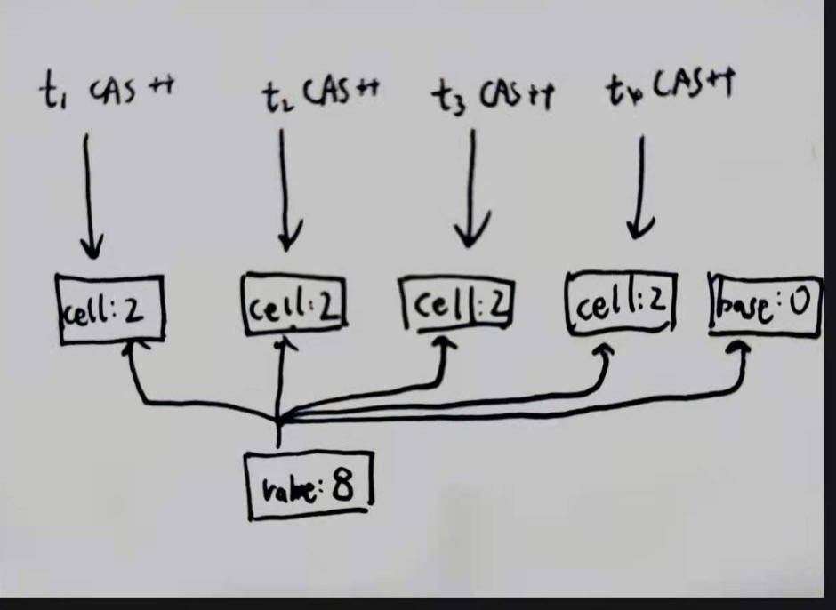
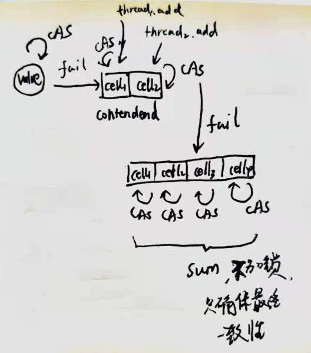

## CAS原子性
lock CMPXCHG指令

## incrementAndGet自旋
```
public final int getAndAddInt(Object var1, long var2, int var4) {
    int var5;
    do {
      var5 = this.getIntVolatile(var1, var2);
    } while(!this.compareAndSwapInt(var1, var2, var5, var5 + var4));

    return var5;
  }

```

##ABA问题
atomicStampReference


##longAddr

[longAddr原理](https://juejin.cn/post/6844904155061075975)

atomic cas ++失败会自旋,如果100个线程都cas ++,太多线程失败，导致大量线程自旋,浪费cpu
1.如何优化效率:创建几个bucket,每个线程都hash到其中一个bucket,然后这个线程对这个bucket(cell)的值进行cas加
2.中途求和sum值会不准确,但确保最终一致性


##基准测试BenchMark
[benchMark使用](https://blog.csdn.net/adalf90/article/details/86260402)
[BenchMark可视化](http://deepoove.com/jmh-visual-chart/)
