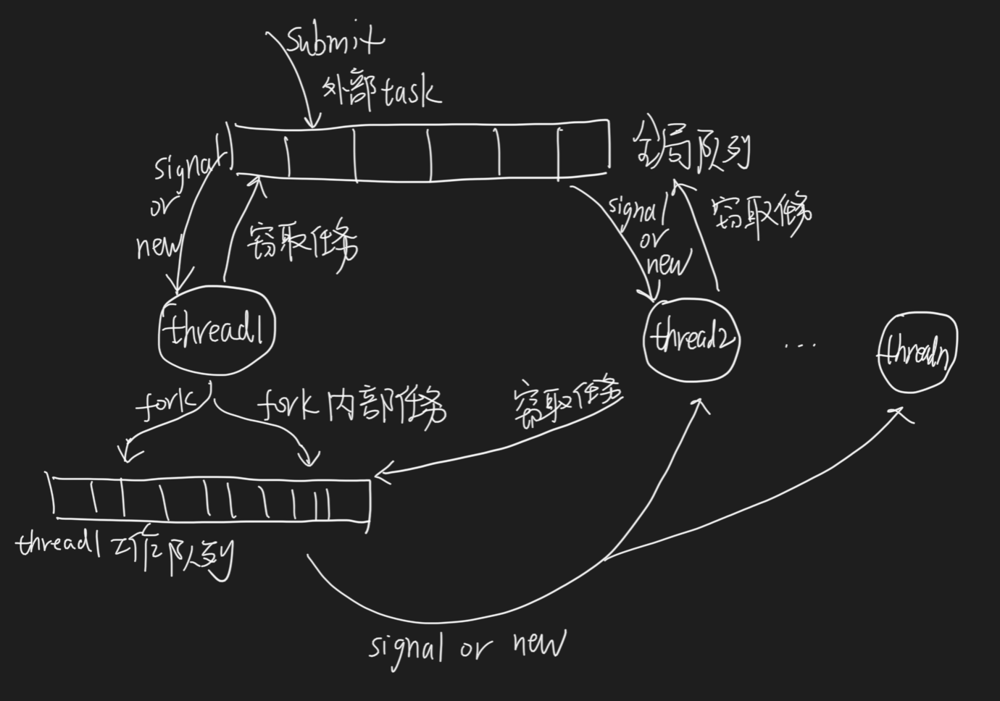
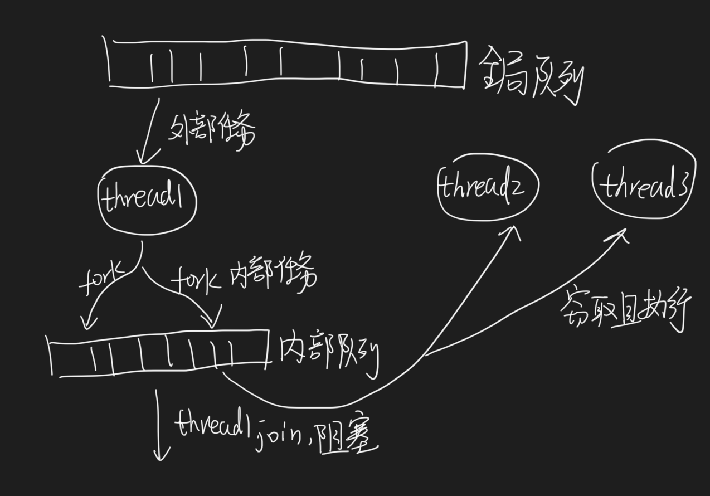
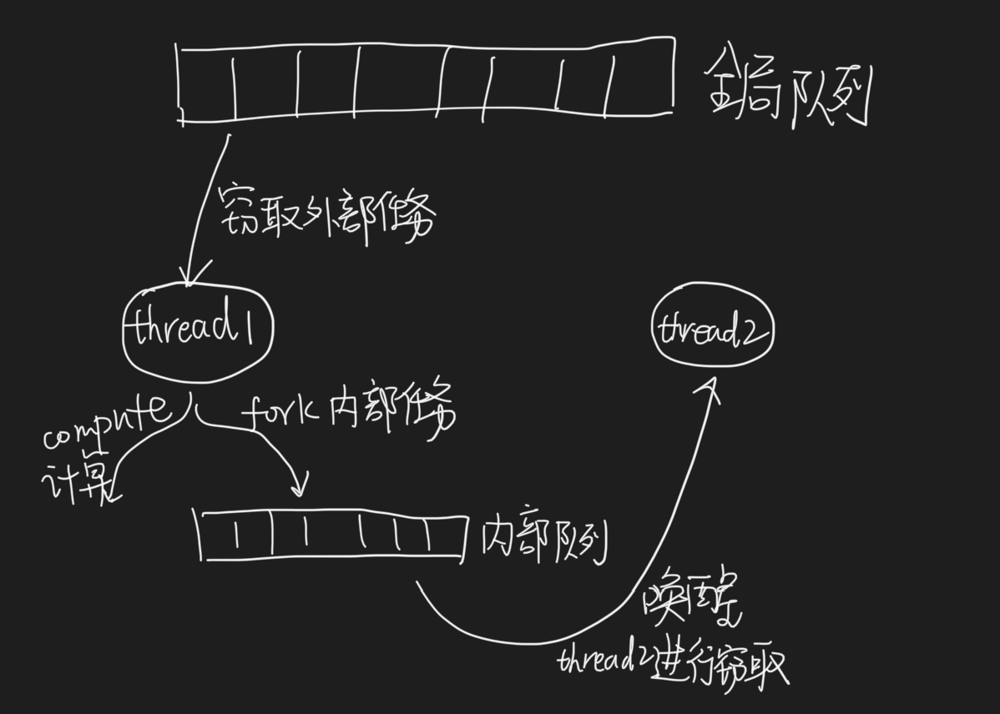

##1.对象模型
线程,队列,任务

##2.核心:
submit:创建外部任务放入全局队列  
fork:创建内部任务放入工作队列  
join:等待任务完成
invokeAll:把传入的任务的第一个交给当前线程来执行，其他的任务都fork加入工作队列  
工作窃取算法:线程空闲阻塞前,对工作队列和全局队列进行窃取  

##3.实现:
两类任务:外部任务,内部任务,方便并发处理，对应两类队列:工作队列，全局队列  
任务入队列，有阻塞线程唤醒&线程开始窃取，无阻塞线程开始创建线程执行  
线程执行完队列任务后再窃取一次,窃取不到才阻塞  
队列满扩容  

##4.invokeAll vs fork fork vs fork compute

###fork fork

fork1   
fork2   

join1   
join2  
fork1,fork2将任务加入当前线程工作队列,唤醒其他线程窃取任务,
然后当前线程阻塞,等待其他线程返回结果,因此当前线程被空闲浪费了
###fork compute
唤醒一个线程,留一个任务自己处理

###invokeAll
invokeAll会把传入的任务的第一个交给当前线程来执行，其他的任务都fork加入工作队列

