##对象模型

[参考](https://juejin.cn/post/6844904062324834318)
##reentrantlock锁关键问题
###获得锁过程
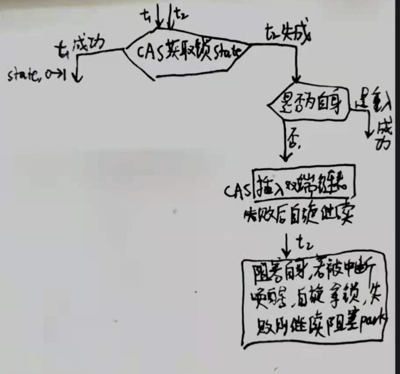

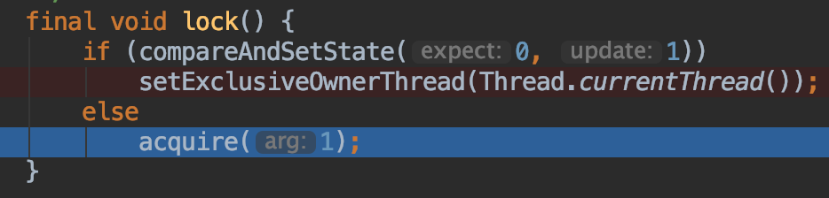
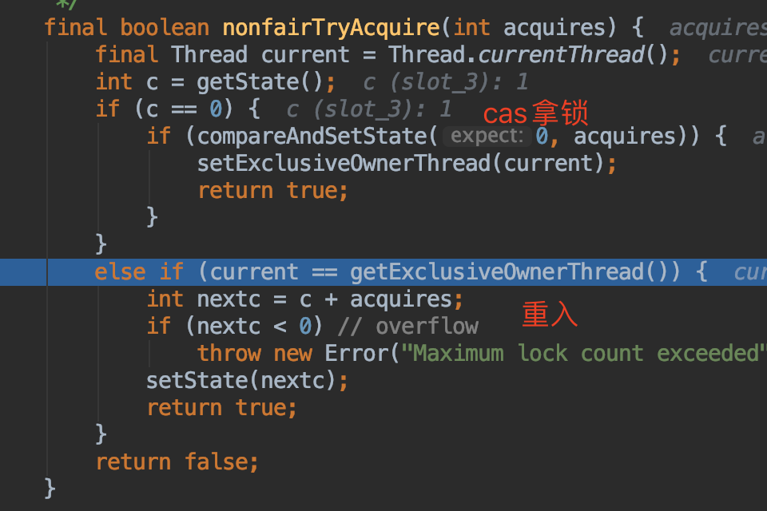
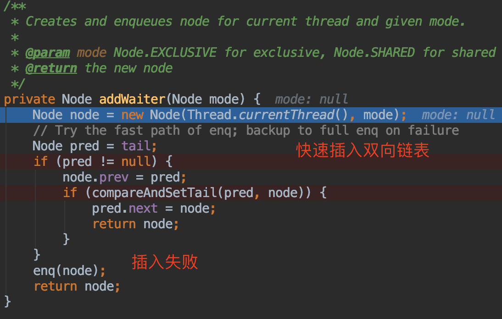
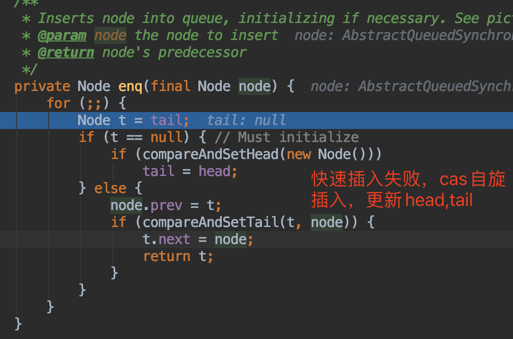
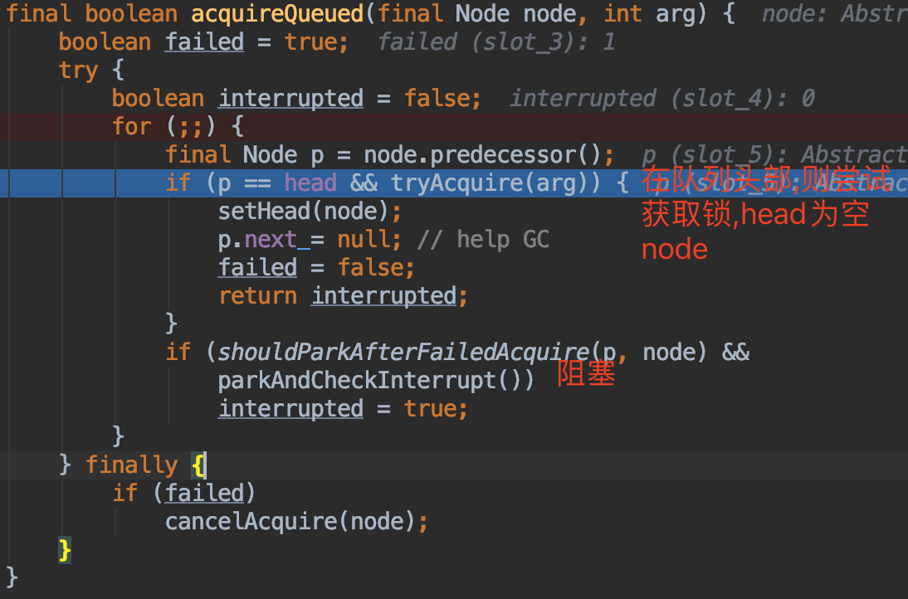
###释放锁过程
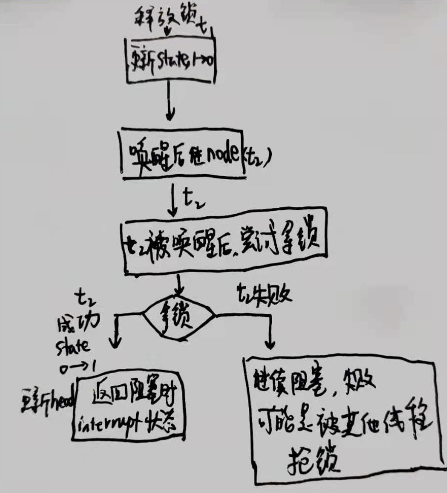
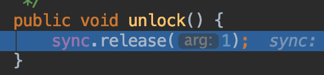
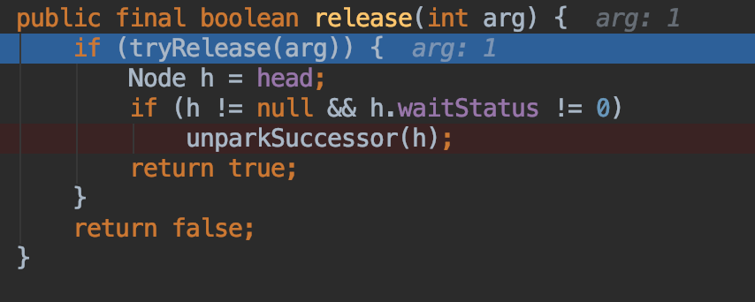
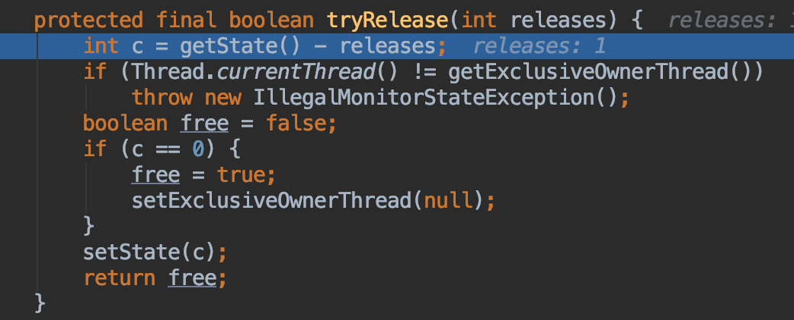
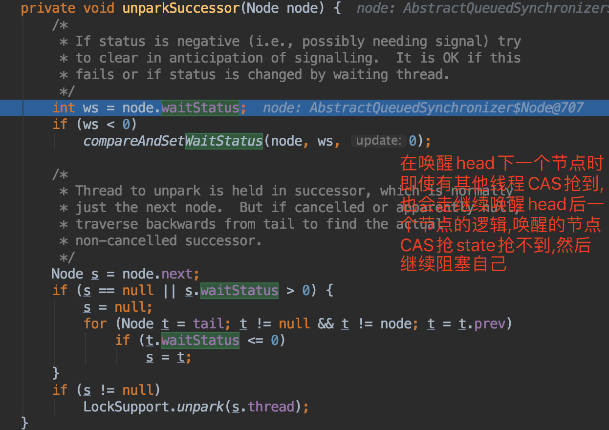
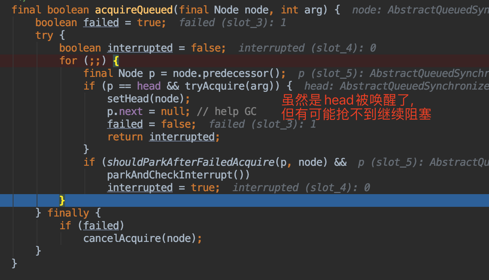
###锁中断过程
锁中断:t1阻塞过程中被t2中断,抛异常还是继续阻塞
###非公平过程
锁释放时(state 1->0),t1唤醒阻塞队列后继节点t2时,t3 cas获得了锁,导致t2唤醒后继续阻塞
###可重入过程
获得锁时,发现是自己,则state+1

##为什么异常&中断需要释放锁
异常&中断进入非正常流程,需要释放锁

## 