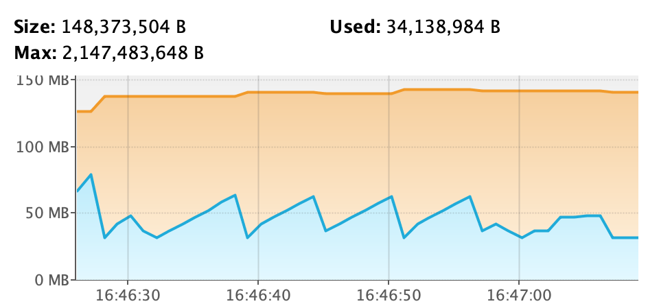
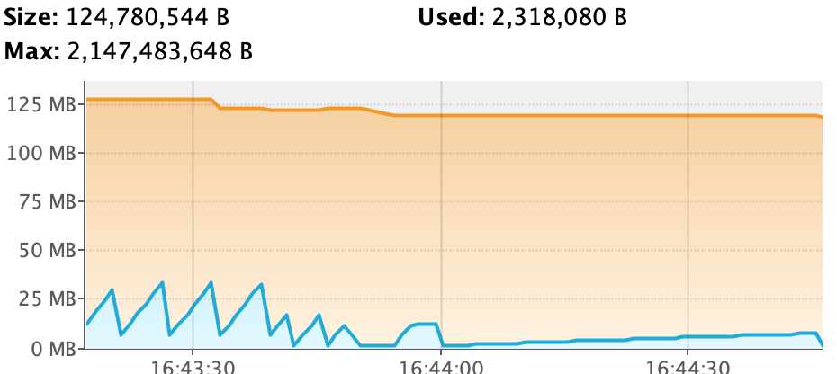
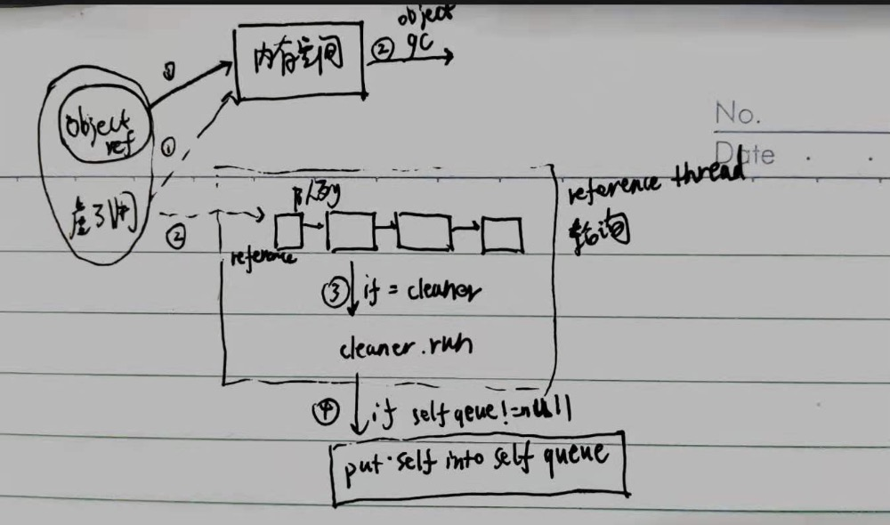

##强引用
==null才会被gc回收

场景:普通对象
##软引用
内存不足才会回收,适合缓存

场景:map缓存
##弱引用
每次gc都回收,避免内存泄露，

场景:Threadlocal弱引用key,但Threadlocal v是强引用容易内存泄露,使用remove移除
leak

remove not leak

##虚引用

虚引用获取不到对象,不影响对象回收,对象回收后会插入到虚引用队列中，并唤醒reference线程执行队列中虚引用元素

每个虚引用元素如果有自己的队列，则将虚引用元素加入到自己的队列

场景:直接内存回收DirectByteBuffer，cleaner虚引用指向DirectByteBuffer，DirectByteBuffer回收后,jvm会唤醒
reference线程执行，reference线程判断是cleaner对象会执行cleaner.run进行直接内存回收

