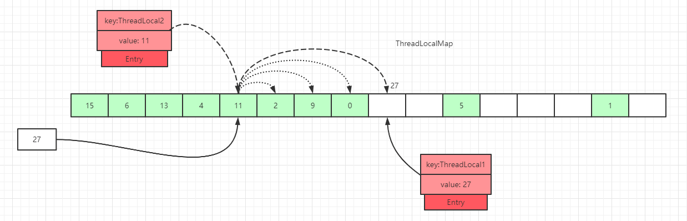
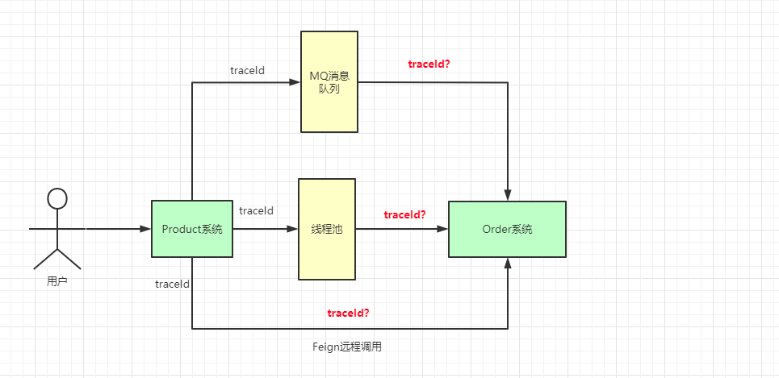

##threadlocal 模型

[](https://www.cnblogs.com/Ccwwlx/p/13581004.html)

##threadlocal内存泄露问题?
##threadlocal为啥不把value搞成弱引用?
[](https://cloud.tencent.com/developer/article/1769423#:~:text=%E3%80%8C%E4%B8%8D%E8%AE%BE%E7%BD%AE%E4%B8%BA%E5%BC%B1%E5%BC%95%E7%94%A8,%E5%85%B6%E8%AE%BE%E7%BD%AE%E4%B8%BA%E5%BC%BA%E5%BC%95%E7%94%A8%E3%80%82%E3%80%8D)
不设置为弱引用，是因为不清楚这个Value除了map的引用还是否还存在其他引用，如果不存在其他引用，当GC的时候就会直接将这个Value干掉了，
而此时我们的ThreadLocal还处于使用期间，就会造成Value为null的错误，所以将其设置为强引用
##threadlocal为啥static
static 防止无意义多实例
[](https://www.zhihu.com/question/35250439)
##hash算法(线性定址法)
槽位数据不为空，往后遍历过程中，在找到Entry为null的槽位之前，没有遇到key过期的Entry：
遍历散列数组，线性往后查找，如果找到Entry为null的槽位，则将数据放入该槽位中，或者往后遍历过程中，遇到了key 值相等的数据，直接更新即可

```asp
什么情况下桶才是可以使用的呢？
k = key 说明是替换操作，可以使用
碰到一个过期的桶，执行替换逻辑，占用过期桶
查找过程中，碰到桶中Entry=null的情况，直接使用
```
##扩容

##探测式数据清理
散列数组下标为 7 位置对应的Entry数据key为null，表明此数据key值已经被垃圾回收掉了，此时就会执行replaceStaleEntry()方法，该方法含义是
替换过期数据的逻辑，以index=7位起点开始遍历，进行探测式数据清理工作
探测式清理是以当前Entry 往后清理，遇到值为null则结束清理，属于线性探测清理
##启发式清理

##InheritableThreadLocal实现原理
子线程默认拷贝父线程的方式是浅拷贝，如果需要使用深拷贝，如果需要使用深拷贝，需要使用自定义ThreadLocal，继承InheritThreadLocal并重写childValue方法
[](https://blog.csdn.net/w172087242/article/details/83375022)
[线程threadlocal继承原理分析](https://www.cnblogs.com/54chensongxia/p/12015443.html)
##threadlocal在线程池中的传递问题
[传递问题的解决](https://blog.csdn.net/w172087242/article/details/83375022)
##应用场景
###日志链路
traceId

线程池traceId
[](https://juejin.cn/post/6844904118062956557)
