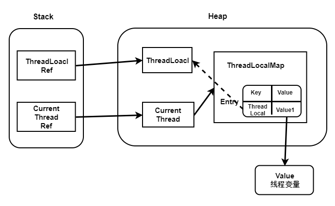

##threadlocal 模型

##threadlocal内存泄露问题?
##threadlocal为啥不把value搞成弱引用?

不设置为弱引用，是因为不清楚这个Value除了map的引用还是否还存在其他引用，如果不存在其他引用，当GC的时候就会直接将这个Value干掉了，
而此时我们的ThreadLocal还处于使用期间，就会造成Value为null的错误，所以将其设置为强引用
##threadlocal为啥static
static 防止无意义多实例

