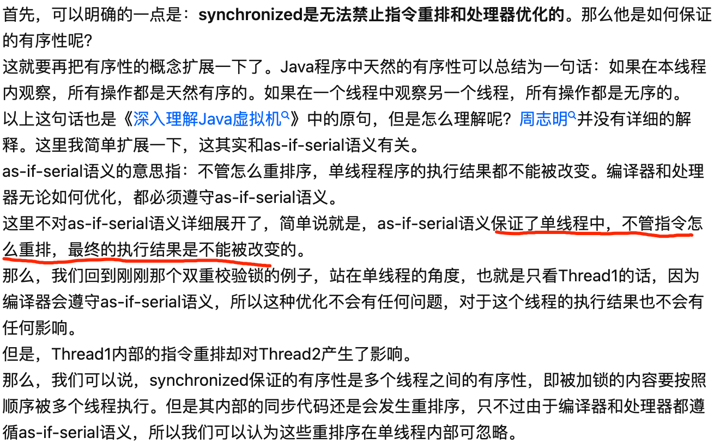
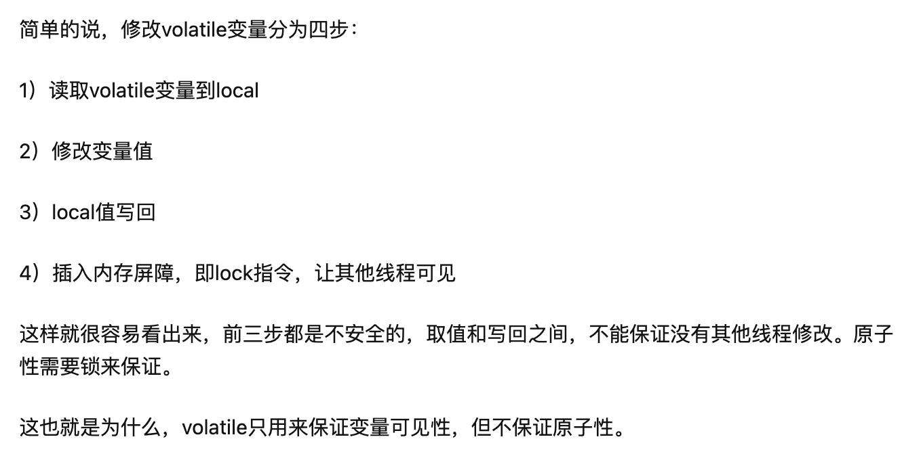
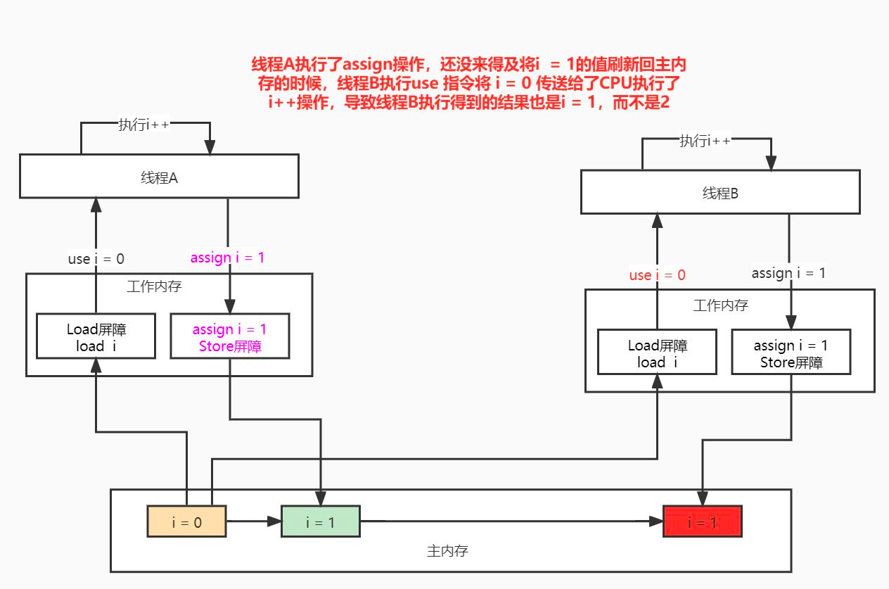

##
[参考cpu缓存_cacheline_一致性_volatile_synchronized_final内存屏障模型.md]
#可见性
不保证原子性
#指令重排
ACL锁
synchronized是无法禁止指令重排和处理器优化的,

volatile可以避免指令重排
#MESI
#读屏障
#写屏障
#lock指令
#1主存2缓存3寄存器
#store buffer ,invalid queue
#i++问题

什么是原子操作？比如i++，本质上是cpu取出主内存的i值到寄存器，然后加1，再把结果写入主内存……volatile是在最后一步结束后才起作用的！
现在想想如果两个线程分别在两个cpu核上运行，同时取i值，加1，再写入，然后再执行lock指令……结果如何？

线程A执行 i++ 结果后将 i = 1 赋值给工作内存；但是这个时候还没来的将最新的结果刷新回主内存的时候，
线程B就使用读取主内存的旧值 i = 0 ，然后执行use指令将 i = 0的值传递给线程B去进行操作了。

线程A的 i ++ 结果， 也就是 i = 1还没刷回主内存；线程B就执行 use指令将 i = 0传递给cpu了 ，
导致线程B使用的就旧的值 i = 0去进行操作，得到结果是错的

老王：如果要保证原子性的话，落到底层实际还是需要进行加锁的，需要保证任意时刻只能有一个线程能执行成功。
比如在硬件层次或者对总线进行加锁，使得某一时刻只能有一个线程能执行i++操作，这样才能是不被中断的，才是原子性的。现在现在这种情况，
相当于就是两个线程同时进行了 i++操作，线程A的 i++操作还没结束；线程B的 i++操作就也同时进行着，这种情况不是原子的。

