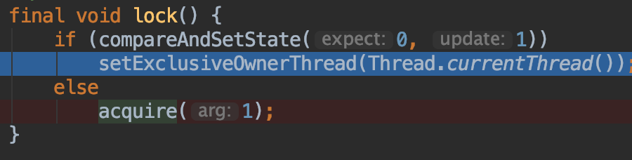
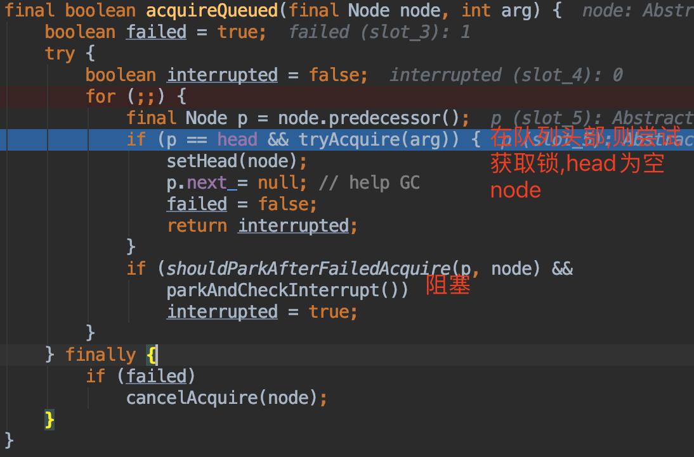
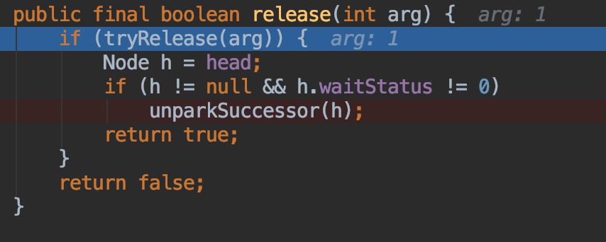
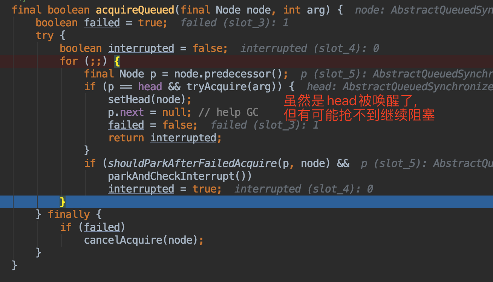

##对象模型

[参考](https://juejin.cn/post/6844904062324834318)
##互斥锁
###获得锁过程





###释放锁过程






###锁中断过程
锁中断:t1阻塞过程中被t2中断,抛异常还是继续阻塞
```
private void doAcquireInterruptibly(int arg)
        throws InterruptedException {
        final Node node = addWaiter(Node.EXCLUSIVE);
        boolean failed = true;
        try {
            for (;;) {
                final Node p = node.predecessor();
                if (p == head && tryAcquire(arg)) {
                    setHead(node);
                    p.next = null; // help GC
                    failed = false;
                    return;
                }
                if (shouldParkAfterFailedAcquire(p, node) &&
                    parkAndCheckInterrupt())
                    throw new InterruptedException();
            }
        } finally {
            if (failed)
                cancelAcquire(node);
        }
    }
```
```
private final boolean parkAndCheckInterrupt() {
        LockSupport.park(this);
        return Thread.interrupted();
    }

```
###非公平过程
锁释放时(state 1->0),t1唤醒阻塞队列后继节点t2时,t3 cas获得了锁,导致t2唤醒后继续阻塞
###可重入过程
获得锁时,发现是自己,则state+1
发现自己:ThreadId==currentThreadId
##为什么异常&中断需要释放锁
异常&中断进入非正常流程,需要释放锁

##读写锁
```asp
公平性选择：支持公平与非公平（默认）的锁获取方式，吞吐量非公平优先于公平。
可重入：读线程获取读锁之后可以再次获取读锁，写线程获取写锁之后可以再次获取写锁
可降级：写线程获取写锁之后，其还可以再次获取读锁，然后释放掉写锁，那么此时该线程是读锁状态，也就是降级操作
```
从ReentrantReadWriteLock的构造函数中可以发现ReadLock与WriteLock使用的是同一个Sync，具体怎么实现同一个队列既可以为共享锁
###case
读读
读写读
写读
[](https://juejin.cn/post/6844903988169555975#heading-9)
###唤醒方式
push,释放锁的线程唤醒其他线程
