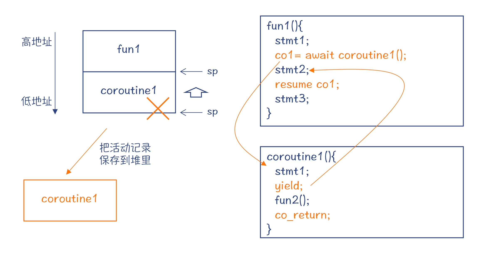
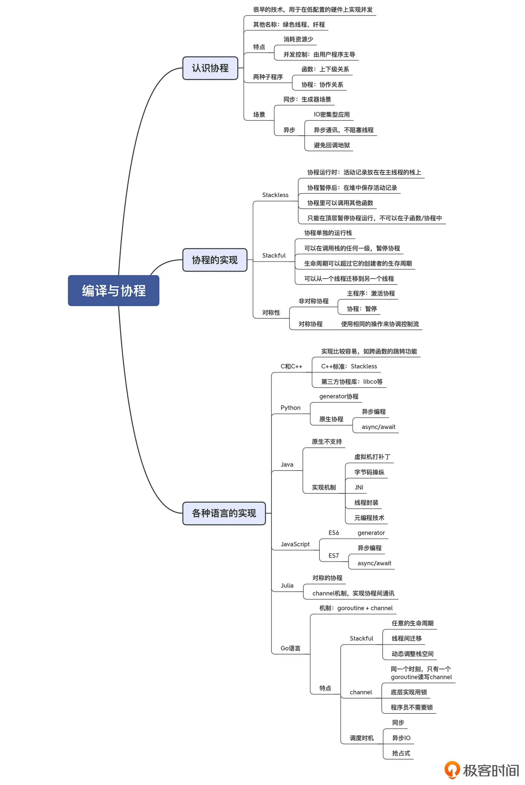
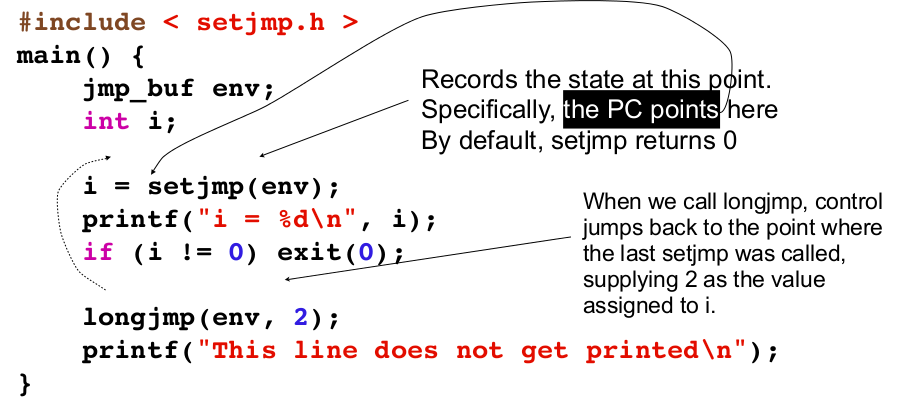
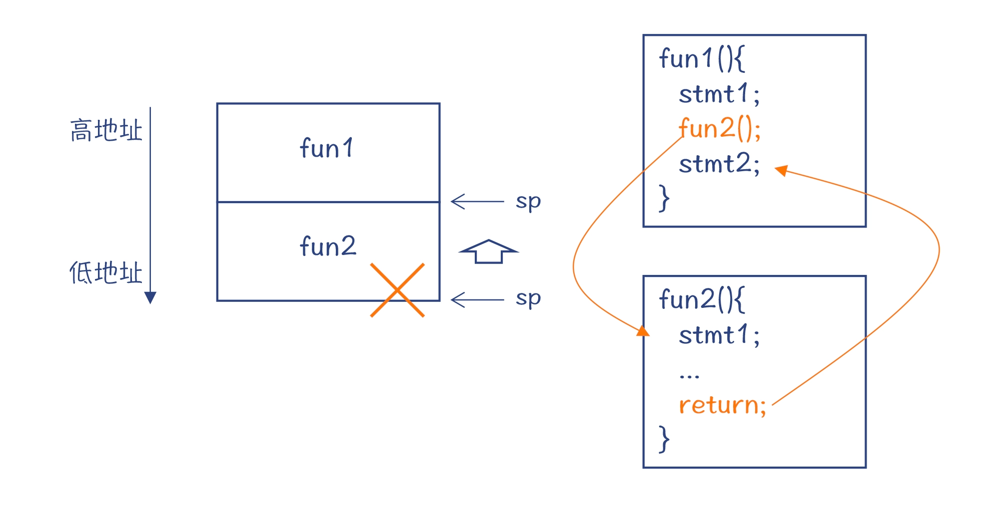
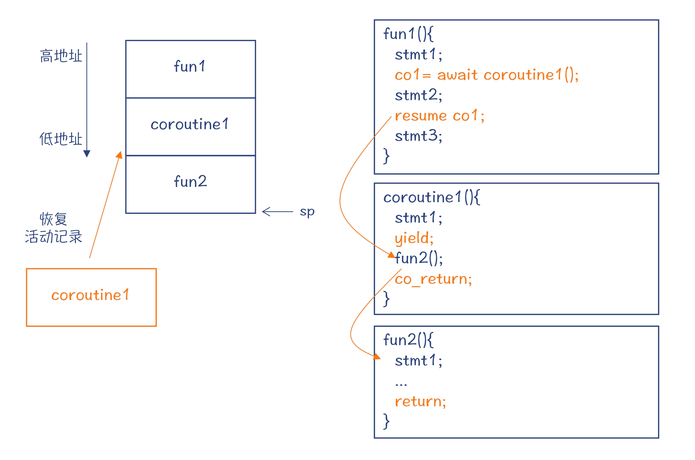
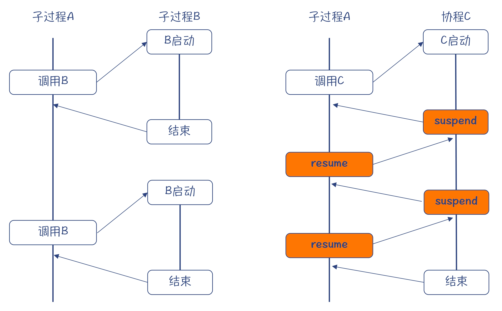
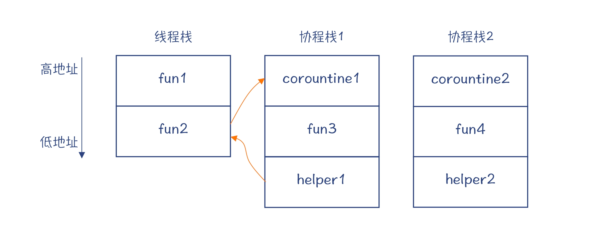

#临界知识
上下文理解
协程特点,cpu,栈,是否有状态
协程适合场景(异步io),不适合 cpu密集计算
go语言中协程的实现
#谈谈对协程的理解


线程执行上下文=寄存器栈顶栈底指针+函数参数+下一条指令
协程=协程的栈帧+堆内存记录协程的本地变量&程序计数器的值
协程调度=yield(让出cpu调度,将cpu寄存器和线程栈上的上下文保存在堆中)+resume(调度某个协程,将协程上下文恢复到cpu寄存器和线程栈)
```asp
协程 vs 函数
都是由一个主程序调用，运行一段时间以后再把控制流交回给主程序；
都使用栈来管理本地变量和参数等信息，只不过协程在没有完全运行完毕时，要用堆来保存活动记录；
在协程里也可以调用其他的函数
```
协程 VS 线程=用户态调度(用户态线程栈) 内核态调度(用户态线程栈->内核态线程栈)
#上下文实现
```asp
setjmp/longjmp的原理非常简单，它做的事情就两点：
保存当前的寄存器上下文到jmp_buf结构体。
通过函数调用堆栈顶部的返回地址更换来实现指令跳转
```
```asp
struct stack_ctx {
    
    unsigned long rax;
    unsigned long rbx;
    unsigned long rcx;
    unsigned long rdx;
    unsigned long rdi;
    unsigned long rsi;
    unsigned long rsp;
    unsigned long rbp;
    unsigned long rip;
};

寄存器	16位	32位	64位	说明
累加寄存器	ax	eax	rax	
基址寄存器	bx	ebx	rbx	
计数寄存器	cx	ecx	rcx	
数据寄存器	dx	edx	rdx	
目的变址寄存器	di	edi	rdi	
堆栈基指针	bp	ebp	rbp	存放栈底指针
源变址寄存器	si	esi	rsi	
堆栈顶指针	sp	esp	rsp	存放栈顶指针
指令	ip	eip	rip	存放下一条指令
而这些就是协程运行的上下文。由于这个例子是基于64位的，所以我们使用了r前缀的变量。关于为什么是r,文末[3]中进行了讨论，r的意思是register，与r1，r2,r3等含义相同


一个函数在执行的时候，某一时刻的状态，就主要靠这些寄存器来描述。同理，如果想恢复一个函数此前的状态，恢复这些寄存器即可
```
##setjmp
[](https://www.i4k.xyz/article/dog250/89742140)
[](https://www.cxyzjd.com/article/niu91/112106896)
setjmp
longjmp
非本地跳转,实现跨函数跳转
setjmp 函数的功能是将函数在此处的上下文保存在 上下文jmp_buf 结构体中，以供 longjmp 从此结构体中恢复

[](https://www.cnblogs.com/hazir/p/c_setjmp_longjmp.html)
```asp
void set_jmp(struct stack_ctx* ctx) {
    
    asm volatile(
        "movq %%rax,0(%%rdi)\n\t"
        "movq %%rbx,8(%%rdi)\n\t"
        "movq %%rcx,16(%%rdi)\n\t"
        "movq %%rdx,24(%%rdi)\n\t"
        "movq %%rdi,32(%%rdi)\n\t"
        "movq %%rsi,40(%%rdi)\n\t"
        "movq %%rbp,%%rbx\n\t"
        "add $16,%%rbx\n\t"
        "movq %%rbx,48(%%rdi)\n\t"
        "movq 0(%%rbp),%%rbx\n\t"
        "movq %%rbx,56(%%rdi)\n\t"
        "movq 8(%%rbp),%%rbx\n\t"
        "movq %%rbx,64(%%rdi)\n\t"
        :
        :);
}
```
```asp
"movq %%rbx,64(%%rdi)\n\t"；将rbx寄存器的数据传送到rdi寄存器
这个函数的作用就是，把寄存器组中的值保存到ctx指向的内存中
%rdi 用作函数第一个参数，即ctx
```
##longjmp
```asp
void long_jmp(struct stack_ctx* ctx) {
    
    asm volatile(
        "movq 0(%%rdi), %%rax\n\t"
        "movq 16(%%rdi), %%rcx\n\t"
        "movq 24(%%rdi), %%rdx\n\t"
        "movq 48(%%rdi), %%rsp\n\t"
        "movq 56(%%rdi), %%rbp\n\t"
        "movq 64(%%rdi), %%rbx\n\t"
        "pushq %%rbx\n\t"
        "movq 8(%%rdi), %%rbx\n\t"
        "movq 32(%%rdi), %%rdi\n\t"
        "movq 40(%%rdi), %%rsi\n\t"
        "ret\n\t"
        :
        :);
}
```
```asp
这个函数的作用就是使用ctx所指向的内存数据恢复寄存器组
```
#协程原理
##线程入栈出栈

##协程入栈出栈

```asp
程序可以从堆里申请一块内存，保存协程的活动记录，包括本地变量的值、程序计数器的值（当前执行位置）等等。
这样，当下次再激活这个协程的时候，可以在栈帧和寄存器中恢复这些信息

fun1 通过 resume 语句，让协程继续运行。这个时候，协程会去调用一个普通函数 fun2，而 fun2 的栈帧也会加到栈上
```


#协程特点
[](https://time.geekbang.org/column/article/435493)

[](https://time.geekbang.org/column/article/280269)
##互相协作(生产者和消费者模式)
yield让出cpu  
resume恢复协程寄存器状态
##IO 密集型(异步编程模型)
用同步的编程风格来实现异步的功能
协程可以让你用自己熟悉的命令式编程的风格，来编写异步的程序
```asp
requestHandler(){
  ...;
  await getDataFromApp2();
  ...;
  sendBack(); 
}
```
#协程种类
[](https://time.geekbang.org/column/article/280269)
##Stackful

需要一个辅助的栈来运行协程的机制，叫做 Stackful Coroutine
可以在协程栈的任意一级，暂停协程的运行。从这个角度看，Stackful 的协程像是一个线程，不管有多少级的调用，随时可以让这个协程暂停，交出控制权
Stackful 的协程，可以从一个线程脱离，附加到另一个线程上
Stackful 的协程的生命周期，可以超过它的创建者的生命周期
##Stackless
在主栈上运行协程的机制，叫做 Stackless Coroutine
如果这个协程调用了其他函数或者协程，必须等它们返回后，才能去执行暂停协程的操作。从这种角度看，Stackless 的特征更像一个函数
Stackless 的协程用的是主线程的栈，也就是说它基本上会被绑定在创建它的线程上
##对称
##非对称

#各语言实现
##C++
setjmp
longjmp
Stackless 模式
co_await、co_yield 和 co_return 三个新的关键字
##微信
libco
Stackful
共享栈的机制
##Python
##Java
##Go 语言
Stackful,协程的生命周期可以超过其创建者，以及协程可以从一个线程转移到另一个线程
为了避免这种尴尬，Goroutine 的调度程序会把被阻塞的线程上的其他 Goroutine 迁移到其他线程上
对称的协程机制
多个协程可以通过 channel 通讯,channel 提供了 Goroutine 之间互相通讯，从而能够协调行为的机制
