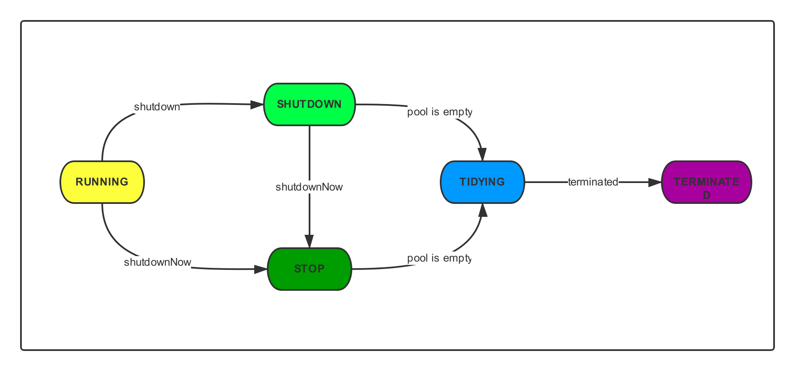
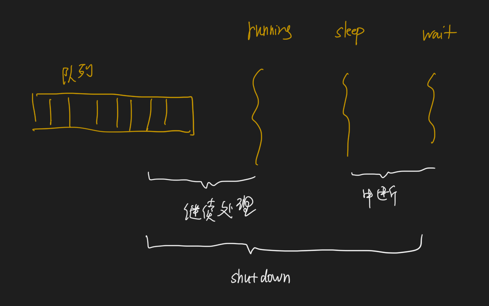
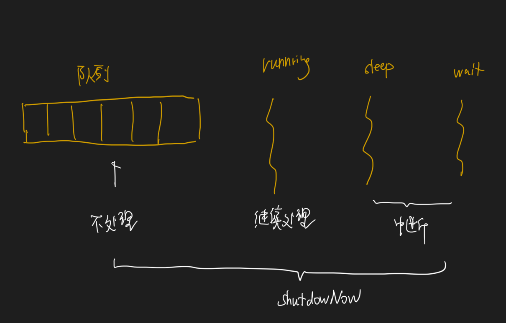
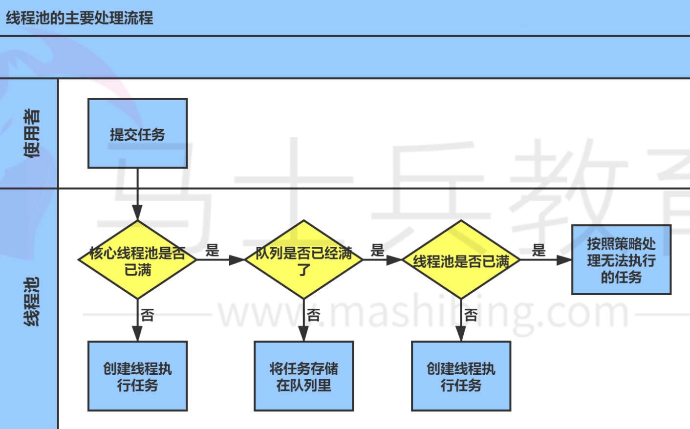

#临界知识
项目中线程池配置和场景
线程池工作流程
线程池优缺点
线程池拓扑对象,任务,有界队列(ArrayBlockingQueue,LinkedBlockingQueue,PriorityBlockingQueue)
线程池如何配置大小,cpu密集,io密集
如何等待子线程完成?join,futuretask,阻塞队列,CountDownLanch
#线程池对象模型&拓扑

##两级调度模型
##一对一映射
JAVA线程被一对一映射为本地操作系统线程。JAVA线程启动时会创建一个本地操作系统线程，当JAVA线程终止时，对应的操作系统线程也被销毁回收，而操作系统会调度所有线程并将它们分配给可用的CPU
在上层，JAVA程序会将应用分解为多个任务，然后使用应用级的调度器（Executor）将这些任务映射成固定数量的线程；在底层，操作系统内核将这些线程映射到硬件处理器上。
##任务Callable、Future、FutureTask
Runnable和Callable是工作单元（也就是俗称的任务）
###Runnable
###Callable
###Future
Future表示异步计算的结果，提供了以下方法，主要是判断任务是否完成、中断任务、获取任务执行结果
###FutureTask
可取消的异步计算，此类提供了对Future的基本实现，仅在计算完成时才能获取结果，如果计算尚未完成，则阻塞get方法

FutureTask不仅实现了Future接口，还实现了Runnable接口，所以不仅可以将FutureTask当成一个任务交给Executor来执行，还可以通过Thread来创建一个线程
##阻塞队列(ArrayBlockingQueue,LinkedBlockingQueue,PriorityBlockingQueue)
```asp
首先看一下新任务进入时线程池的执行策略：
如果运行的线程少于corePoolSize，则 Executor始终首选添加新的线程，而不进行排队。（如果当前运行的线程小于corePoolSize，则任务根本不会存入queue中，而是直接运行）
如果运行的线程大于等于 corePoolSize，则 Executor始终首选将请求加入队列，而不添加新的线程。
如果无法将请求加入队列，则创建新的线程，除非创建此线程超出 maximumPoolSize，在这种情况下，任务将被拒绝。
主要有3种类型的BlockingQueue：
```
###无界队列
队列大小无限制，常用的为无界的LinkedBlockingQueue，使用该队列做为阻塞队列时要尤其当心，当任务耗时较长时可能会导致大量新任务在队列中堆积最终导致OOM。最近工作中就遇到因为采用LinkedBlockingQueue作为阻塞队列，部分任务耗时80s＋且不停有新任务进来，导致cpu和内存飙升服务器挂掉
###有界队列
常用的有两类，一类是遵循FIFO原则的队列如ArrayBlockingQueue与有界的LinkedBlockingQueue，另一类是优先级队列如PriorityBlockingQueue。PriorityBlockingQueue中的优先级由任务的Comparator决定。
使用有界队列时队列大小需和线程池大小互相配合，线程池较小有界队列较大时可减少内存消耗，降低cpu使用率和上下文切换，但是可能会限制系统吞吐量
##执行机制
而执行机制由Executor来提供。这样一来Executor是基于生产者消费者模式的，提交任务的操作相当于生成者，执行任务的线程相当于消费者
##ExecutorService,submit,execute
主要提供了关闭线程池和submit方法

#线程池的优点
```asp
1、线程是稀缺资源，使用线程池可以减少创建和销毁线程的次数，每个工作线程都可以重复使用

2、可以根据系统的承受能力，调整线程池中工作线程的数量，防止因为消耗过多内存导致服务器崩溃
```
#线程池关闭

shutDown:不能再往线程池中添加任何任务，否则将会抛出RejectedExecutionException异常。但是，此时线程池不会立刻退出，直到添加到线程池中的任务都已经处理完成，才会退出

shutdownNow:执行该方法，线程池的状态立刻变成STOP状态，并试图停止所有正在执行的线程，不再处理还在池队列中等待的任务，当然，它会返回那些未执行的任务
它试图终止线程的方法是通过调用Thread.interrupt()方法来实现的，但是大家知道，这种方法的作用有限，如果线程中没有sleep 、wait、Condition、定时锁等应用, interrupt()方法是无法中断当前的线程的。
所以，ShutdownNow()并不代表线程池就一定立即就能退出，它可能必须要等待所有正在执行的任务都执行完成了才能退出

[](https://www.cnblogs.com/aspirant/p/10265863.html)
isShutDown
isTerminated
awaitTermination
[](https://segmentfault.com/a/1190000038258152)

[](https://segmentfault.com/a/1190000021302247)
##优雅关闭线程池
```asp
threadPool.shutdown(); // Disable new tasks from being submitted
        // 设定最大重试次数
        try {
            // 等待 60 s
            if (!threadPool.awaitTermination(60, TimeUnit.SECONDS)) {
                // 调用 shutdownNow 取消正在执行的任务
                threadPool.shutdownNow();
                // 再次等待 60 s，如果还未结束，可以再次尝试，或则直接放弃
                if (!threadPool.awaitTermination(60, TimeUnit.SECONDS))
                    System.err.println("线程池任务未正常执行结束");
            }
        } catch (InterruptedException ie) {
            // 重新调用 shutdownNow
            threadPool.shutdownNow();
}
```
#线程池的创建
```asp
public ThreadPoolExecutor(int corePoolSize,
                               int maximumPoolSize,
                               long keepAliveTime,
                               TimeUnit unit,
                               BlockingQueue<Runnable> workQueue,
                               RejectedExecutionHandler handler) 
```
```asp
corePoolSize：线程池核心线程数量

maximumPoolSize:线程池最大线程数量

keepAliverTime：当活跃线程数大于核心线程数时，空闲的多余线程最大存活时间

unit：存活时间的单位

workQueue：存放任务的队列

handler：超出线程范围和队列容量的任务的处理程序
```

```asp
***corePoolSize\***- 池中所保存的线程数，包括空闲线程。需要注意的是在初创建线程池时线程不会立即启动，直到有任务提交才开始启动线程并逐渐时线程数目达到corePoolSize。若想一开始就创建所有核心线程需调用prestartAllCoreThreads方法。
***maximumPoolSize\***-池中允许的最大线程数。需要注意的是当核心线程满且阻塞队列也满时才会判断当前线程数是否小于最大线程数，并决定是否创建新线程。
***keepAliveTime\*** - 当线程数大于核心时，多于的空闲线程最多存活时间
***unit\*** - keepAliveTime 参数的时间单位。
***workQueue\*** - 当线程数目超过核心线程数时用于保存任务的队列。主要有3种类型的BlockingQueue可供选择：无界队列，有界队列和同步移交。将在下文中详细阐述。从参数中可以看到，此队列仅保存实现Runnable接口的任务。
*threadFactory* - 执行程序创建新线程时使用的工厂。
*handler* - 阻塞队列已满且线程数达到最大值时所采取的饱和策略。java默认提供了4种饱和策略的实现方式：中止、抛弃、抛弃最旧的、调用者运行。将在下文中详细阐述。
```
#工作流程
```asp
提交一个任务到线程池中，线程池的处理流程如下：

1、判断**线程池里的核心线程**是否都在执行任务，如果不是（核心线程空闲或者还有核心线程没有被创建）则创建一个新的工作线程来执行任务。如果核心线程都在执行任务，则进入下个流程。

2、线程池判断工作队列是否已满，如果工作队列没有满，则将新提交的任务存储在这个工作队列里。如果工作队列满了，则进入下个流程。

3、判断**线程池里的线程**是否都处于工作状态，如果没有，则创建一个新的工作线程来执行任务。如果已经满了，则交给饱和策略来处理这个任务。
```

```asp
 **刚开始都是在创建新的线程，达到核心线程数量5个后，新的任务进来后不再创建新的线程，而是将任务加入工作队列，任务队列到达上线5个后，
 新的任务又会创建新的普通线程，直到达到线程池最大的线程数量10个，后面的任务则根据配置的饱和策略来处理。我们这里没有具体配置，使用的是默认的配置AbortPolicy:直接抛出异常。**
```
#饱和策略
```asp
1、AbortPolicy：直接抛出异常

2、CallerRunsPolicy：只用调用所在的线程运行任务

3、DiscardOldestPolicy：丢弃队列里最近的一个任务，并执行当前任务。

4、DiscardPolicy：不处理，丢弃掉。
```
在某些重要的场景下，可以采用记录日志或者存储到数据库中，而不应该直接丢弃。
#线程类型
##SingleThreadExecutor
```asp
public static ExecutorService newSingleThreadExecutor() {
        return new FinalizableDelegatedExecutorService
            (new ThreadPoolExecutor(1, 1,
                                    0L, TimeUnit.MILLISECONDS,
                                    new LinkedBlockingQueue<Runnable>()));
    }
```
##FixedThreadExecutor
##CachedThreadPool
```asp
无界线程池意味着没有工作队列，任务进来就执行，线程数量不够就创建，与前面两个的区别是：空闲的线程会被回收掉，空闲的时间是60s。这个适用于执行很多短期异步的小程序或者负载较轻的服务器
```
#项目中的线程池(使用场景,参数)
##bpmn预加载
```asp
1.kie jar资源:数据库加载kie jar二进制资源
2.项目流程资源预热,项目重启后从redis获取规则groupId，artifactId，version
3.ExecutorService executorService = new ThreadPoolExecutor(20, 40, 0L, TimeUnit.SECONDS, new LinkedBlockingQueue<>(1024), namedThreadFactory, new ThreadPoolExecutor.AbortPolicy());
```
##流程节点统计监控（异步)
```asp
1.redis计数,每小时节点使用量,异步统计,最终计数落库
2.每个key监控打点
```
```asp
private final ThreadPoolExecutor threadPoolExecutor = new ThreadPoolExecutor(10, 10, 0L, TimeUnit.MILLISECONDS, new ArrayBlockingQueue<>(1024),
      new ThreadFactoryBuilder().setNameFormat("experiment-pool-%d").build());
```
##线上实验流程查看效果(异步)
```asp
private final ThreadPoolExecutor threadPoolExecutor = new ThreadPoolExecutor(10, 10, 0L, TimeUnit.MILLISECONDS, new ArrayBlockingQueue<>(1024),
      new ThreadFactoryBuilder().setNameFormat("experiment-pool-%d").build());
```
##异步实时任务执行
```asp
this.executor = new ThreadPoolTaskExecutor();
this.executor.setCorePoolSize(1);
this.executor.setMaxPoolSize(Integer.MAX_VALUE);
this.executor.setQueueCapacity(0);
this.executor.setWaitForTasksToCompleteOnShutdown(true);
this.executor.setAwaitTerminationSeconds(60);
this.executor.setThreadNamePrefix();
```
##异步保存运行节点信息
```asp
executor = new ThreadPoolTaskExecutor();
executor.setCorePoolSize(20);
executor.setMaxPoolSize(200);
executor.setQueueCapacity(500);//LinkedBlockingQueue
executor.setWaitForTasksToCompleteOnShutdown(true);
executor.setAwaitTerminationSeconds(60);
```
talos
kafka
mysql
redis
##线程池配置大小?
[线程数配置,队列数配置](https://www.modb.pro/db/65544)
CPU密集型、IO密集型、混合型，任务类型不同，设置的方式也不一样
###CPU密集型
尽量使用较小的线程池，一般Cpu核心数+1

因为CPU密集型任务CPU的使用率很高，若开过多的线程，只能增加线程上下文的切换次数，带来额外的开销
###IO密集型
可以使用较大的线程池，一般CPU核心数 * 2
IO密集型CPU使用率不高，可以让CPU等待IO的时候处理别的任务，充分利用cpu时间
线程等待时间所占比例越高，需要越多线程。线程CPU时间所占比例越高，需要越少线程
比如平均每个线程CPU运行时间为0.5s，而线程等待时间（非CPU运行时间，比如IO）为1.5s，CPU核心数为8，那么根据上面这个公式估算得到：((0.5+1.5)/0.5)*8=32。这个公式进一步转化为：
**最佳线程数目 = （线程等待时间与线程CPU时间之比 + 1）\* CPU数目**

##线程池等待子线程执行完成
futuretask.get
countdownlatch
