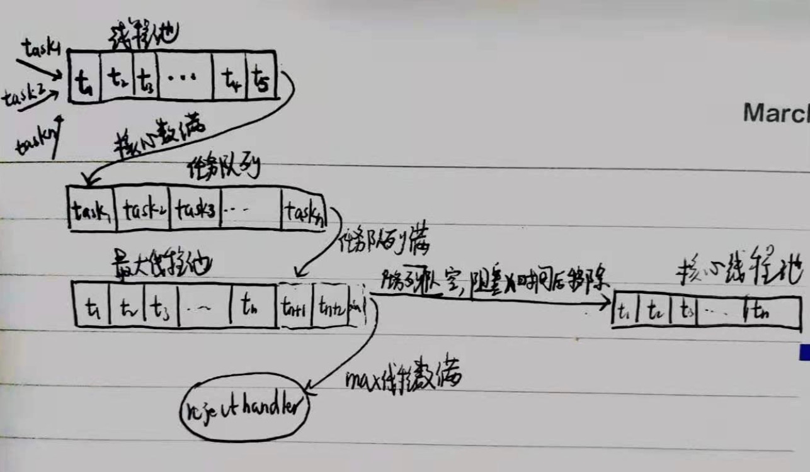
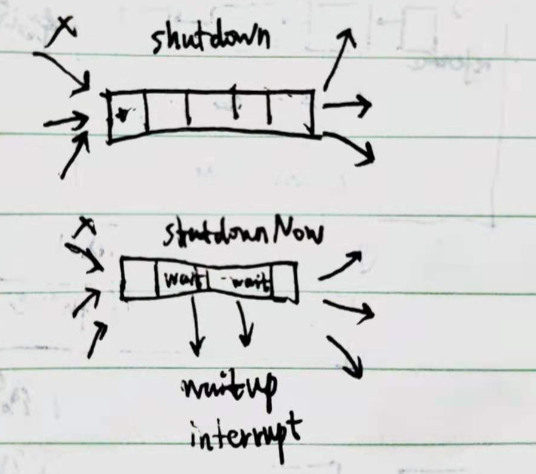

##线程池对象模型

##线程池问题模型
1.线程池如何启动
2.任务如何入队列?
3.任务总数?

4.任务空阻塞？

5.任务满如何调用?

6.线程池创建销毁

7.线程

8.future


线程(核心/非核心)，队列,任务

1.线程<核心,任务执行
2.线程>=核心,队列<n,任务入队列
3.队列>=n,线程<max,任务执行
4.线程>=max,任务入队列?入线程?先入队列,队列满然后入线程

##线程池maxpool后,什么时候释放空闲线程?如何释放空闲线程?
当任务队列无任务时,线程开始阻塞,如果是max中的线程,则使用定时阻塞,超时返回后任务列队仍为空
则从线程池剔除该线程
```
private Runnable getTask() {
        boolean timedOut = false; // Did the last poll() time out?

        for (;;) {
            int c = ctl.get();
            int rs = runStateOf(c);
            ...

            int wc = workerCountOf(c);

            // Are workers subject to culling?
            boolean timed = allowCoreThreadTimeOut || wc > corePoolSize;
            ...
            try {
                Runnable r = timed ?
                    workQueue.poll(keepAliveTime, TimeUnit.NANOSECONDS) :
                    workQueue.take();
                if (r != null)
                    return r;
                timedOut = true;
            } catch (InterruptedException retry) {
                timedOut = false;
            }
        }
    }
```
##线程池停止
shutdown
shutdownNow



