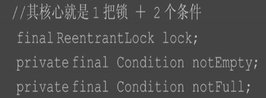
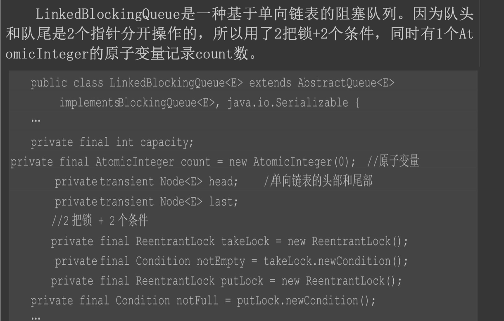

##cow

###方案
丢失一定的实时性,保证读线程最终一致性

###为什么需要复制数组呢？ 
如果将 array 数组设定为 volitile 的， 对 volatile 变量写 happens-before 读，读线程不是能够感知到 volatile 变量的变化
原因是，这里 volatile 的修饰的仅仅只是数组引用，数组中的元素的修改是不能保证可见性的。因此 COW 采用的是新旧两个数据容器，
通过第 5 行代码将数组引用指向新的数组。

##blocking queue
###ArrayBlockingQueue

###LinkedBlockingQueue

###linux如何实现阻塞指定时间?
###PriorityQueque

##ConcurrentHashMap
