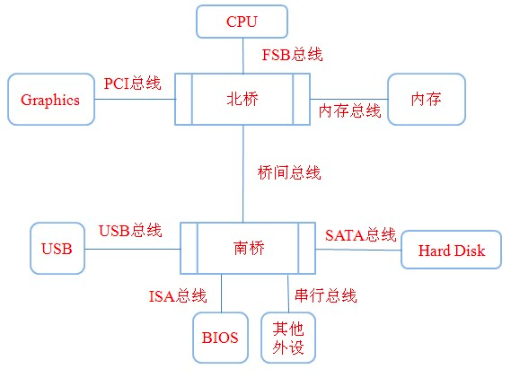

#64位cpu
目前32位和64位是指CPU的通用寄存器位宽（数据总线的位宽），所以64位的CPU数据处理位宽是32位CPU的2倍
一个 CPU，联系外部的数据总线与地址总线，可能有不同的宽度；术语“64位”也常用于描述这些总线的大小。不过这一术语也可能指电脑指令集的指令长度，
或其它的数据项。去掉进一步的条件，“64位”电脑架构一般具有 64 位宽的整数型寄存器，它可支持 64 位“区块”的整数型数据。
```asp
数据处理能力增强：64 位 CPU 通用寄存器的位宽增加一倍，这也就意味着 64 位 CPU 可以一次性处理 64bit 的整形数据；
内存寻址能力增强：如果是 32 位 CPU 的话，它的地址总线最多不会超过 32，那么它所能达到的寻址范围也就不会超过 2 的 32 次方字节（存储单元以字节为单位），
也就是 4GB，而如果是 64 位处理器的话，它所能达到的寻址范围理论上就会是 2 的 64 次方字节（上亿 GB）
```
#64位操作系统
对于 32 位的操作系统，其逻辑地址编码采用的地址位数是 32 位，那么操作系统所提供的逻辑地址寻址范围就是 4GB。从这个方面来说，纵使你的 CPU 实际寻址能力为 2 的 64 次方，由于操作系统只提供 4GB 的逻辑地址，那 CPU 透过操作系统所能访问到的内存大小也就只有4GB了
[](https://blog.csdn.net/sores/article/details/88216185?utm_medium=distribute.pc_relevant.none-task-blog-2~default~baidujs_title~default-0.queryctrv2&spm=1001.2101.3001.4242.1&utm_relevant_index=3)
#南桥北桥总线

